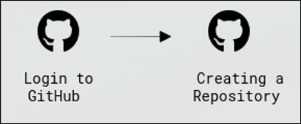
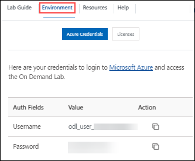

# Getting Started with GitHub Copilot

### Overall Estimated Duration: 3 hours

## Overview
 
Welcome to your Github-Copilot workshop! We've prepared a seamless environment for you to explore and learn about Azure services. Let's begin by making the most of this experience:

## Objective 

## Prerequisites
## Architecture
## Architecture Diagram

 

## Explanation of Components

The architecture for this lab involves the following key components:

## **Accessing Your Lab Environment**
 
Once you're ready to dive in, your virtual machine and lab guide will be right at your fingertips within your web browser.
 
 

### **Virtual Machine & Lab Guide**
 
Your virtual machine is your workhorse throughout the workshop. The lab guide is your roadmap to success.
 
## **Exploring Your Lab Resources**
 
To get a better understanding of your lab resources and credentials, navigate to the **Environment** Details tab.
 
   
 
## **Utilizing the Split Window Feature**
 
For convenience, you can open the lab guide in a separate window by selecting the **Split Window** button from the Top right corner.

 
   

