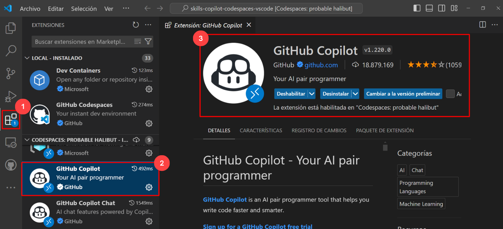

#  Lab 2: Using GitHub Codespaces
Duration: 30 minutes

GitHub Copilot is an AI pair programmer designed to make writing code easier and faster. It draws context from comments and code to suggest individual lines and whole functions instantly. GitHub Copilot is powered by OpenAI Codex, a generative pre-trained language model created by OpenAI.

**Copilot is compatible with a wide range of code editors, such as Neovim, JetBrains IDE, Visual Studio, and VS Code.**

Additionally, GitHub Copilot is trained in every language that can be found in public repositories. The amount and variety of training data for each language may have an impact on the quality of recommendations you obtain.

**GitHub Codespace** is a development environment that's hosted in the cloud. You can customize your project for GitHub Codespaces by committing configuration files to your repository (often known as Configuration-as-Code), which creates a repeatable codespace configuration for all users of your project.

Using Copilot inside a Codespace shows just how easy it is to get up and running with GitHub's suite of [Collaborative Coding](https://github.com/features#features-collaboration) tools.

In this lab, you will create a development container and define specific extensions or configurations that will be used or installed in your codespace. You will create this development container and add Copilot to the list of extensions.

## Task 1: Enable Copilot inside a Codespace

1. Now, right-click on your profile icon in the top right and click on **Your Repositories**.
    
   

1. Click on the repository named **skills-copilot-codespaces-vscode**

1. In the home page of your repository, click on **Code** **(1)** tab of your repository, click the **Add file** **(2)** drop-down button, and then select `Create new file` **(3)**.

    

    >**Note**: If you're unable to see the **Add file** option, click the **+** symbol located next to the **Code** tab.
    
1. Type or paste the following in the empty text field prompt to name your file **(1)**.

   ```
   .devcontainer/devcontainer.json
   ```

1. In the body of the new **.devcontainer/devcontainer.json** file, add the following content **(2)** and click on **Commit changes** **(3)**:

   ```
   {
       // Name this configuration
       "name": "Codespace for Skills!",
       "customizations": {
           "vscode": {
               "extensions": [
                   "GitHub.copilot"
               ]
           }
       }
   }
   ```

   
   
1. Select the option to **Commit directly to the `main` branch**, and then click the **Commit changes** button.

    

1. Navigate back to the home page of your repository by clicking the **Code** **(1)** tab located at the top left of the screen. Click the **Code** **(2)** button located in the middle of the page.

    

1. Click the **Codespaces (1)** tab on the box that pops up and then click the **Create codespace on main (2)** button.

    

   >**Note**: If in case pop-up prompt doesn't appear in the browser to open Visual Studio code, manually launch Visual Studio code from the desktop and close it. Next, return to the 
    browser, refresh the page and launch the codespace that was previously created.

1. You will encounter a pop-up prompt. Click **Open** to proceed. Subsequently, another pop-up window will appear within Visual Studio Code (VS Code), where you should once again select **Install Extension and Open URI** to continue.

   

   

1. At the bottom right corner, you will get a prompt to sign in to GitHub.

   

   > **Note**: If you face an issue with **Sign in to GitHub**, copy the sigin URL from browser and login to the copied URL from InPrivate browser.
 
      

   > **Note**: If you encounter with error **No access to GitHub Copilot found**, please reach out to `cloudlabs-support@spektrasystems.com` for further assistance.
 
      

1. Next, once you get the popup, click on **Allow**

   

   >**Note**: Wait about 2 minutes for the codespace to spin itself up.

1. Click **Authorize Visual-Studio-Code** once the Authorize GitHub for VS code tab appears in the browser.

1. Verify your codespace is running. Make sure the VS code looks as shown below:

   

1. Click on **Extensions** **(1)** from the left menu, and the **GitHub Copilot** **(2)** extension should show up in the VS Code extension list. Click the Copilot extension and verify 
   its installation as shown below:

   

   >**Note**: If the GitHub Copilot extension is not installed, click on Install.
 
> **Congratulations** on completing the task! Now, it's time to validate it. Here are the steps:
> - If you receive a success message, you can proceed to the next task.
> - If not, carefully read the error message and retry the step, following the instructions in the lab guide. 
> - If you need any assistance, please contact us at labs-support@spektrasystems.com. We are available 24/7 to help you out.

<validation step="849cb95a-fd22-4cd0-a173-83ab070325d4" />
 
### Summary

In this lab, you have created a development container and added Copilot to the list of extensions.

