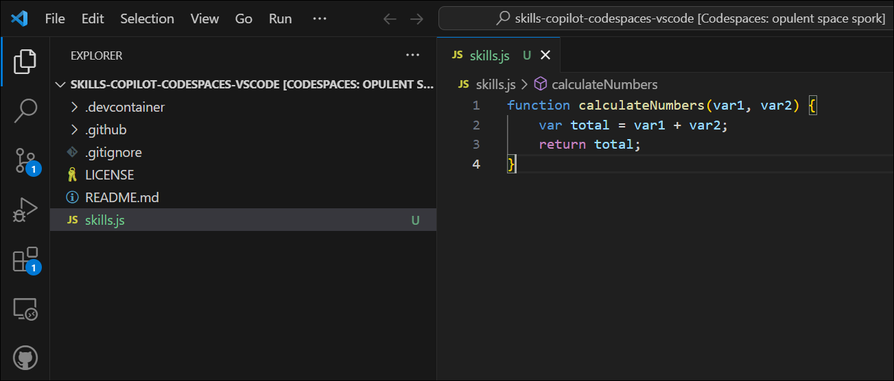
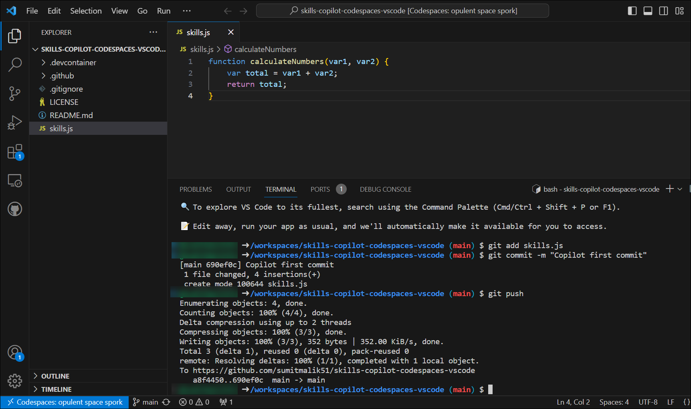
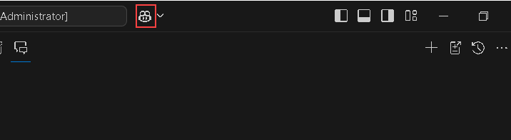
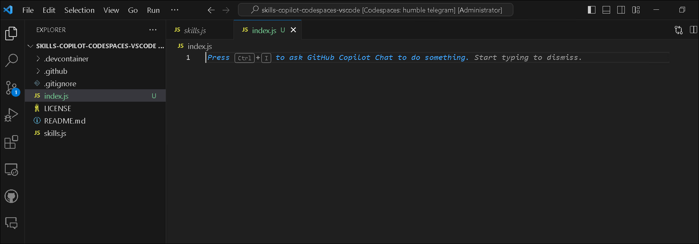
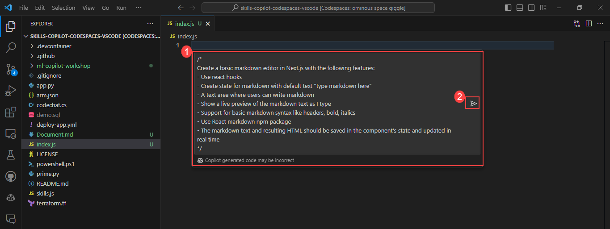

# Lab 3: Code Suggestions with GitHub Copilot in Codespaces using VS Code

Duration: 30 minutes

While GitHub Copilot offers recommendations for many languages and frameworks, it excels in particular when it comes to Python, JavaScript, TypeScript, Ruby, Go, C#, and C++. The samples below are in JavaScript, but they should also work in other languages.

In this lab, you will have the opportunity to experiment with and apply JavaScript with the assistance of GitHub Copilot and GitHub Copilot Chat.

>**Disclaimer**: A whole function body will be automatically suggested by GitHub Copilot in gray text. Here's an example of what you are likely to see; however, the precise recommendation could vary.If you do not see code recommendation, try adding a space after the code. 

## Task 1: Add a JavaScript file and start writing code.

1. From the VS Code Explorer window, create a New File.

   

2. Name the file `skills.js` and verify your new file looks as shown below:

   

3. In the `skills.js` file, type the following function header:

   ```
   function calculateNumbers(var1, var2)
   ```
   
   > **Note**: A whole function body will be automatically suggested by GitHub Copilot in gray text. Here's an example of what you are likely to see; however, the precise recommendation could vary. If you do not see code recommendation, try adding a space after the code. 

   

4. Press `Tab` to accept the suggestion and then press `Ctrl + S` to save the file.

   

## Task 2: Push code to your repository from the codespace

In this task, you will use the VS Code terminal to add the `skills.js` file to the GitHub repository.

1. Open VS Code Terminal by clicking on **Ellipsis (...)** **(1)**, select **Terminal** **(2)** and click on **New Terminal** **(3)**.

   

2. Run the below command to add the `skills.js` file to the GitHub repository.

   ```
   git add skills.js
   ```

3. Next, from the VS Code terminal stage, commit the changes to the repository:

   ```
   git commit -m "Copilot first commit"
   ```

4. Finally, from the VS Code terminal, push the code to the repository:

   ```
   git push
   ```

   

   >**Note**: Wait about 60 seconds, then refresh your GitHub repository landing page for the next step.


## Task 3: Best practices to use GitHub Copilot

### Verify GitHub Copilot Chat extension in VS Code

1. To Verify the GitHub Copilot Chat extension, the following steps are to be performed within Visual Studio Code:
    - Click on the **Extensions (1)** icon in the activity bar present on the left side of the Visual Studio Code Window.
    - In the "Search Extensions in Marketplace" search box, type and search for the **GitHub Copilot Chat (2)** extension.
    - Select **GitHub Copilot Chat (3)** from the list of results that show up, and verify that **GitHub Copilot Chat** has been installed.
    - If not, click on the **Install (4)** button.

      

1. Once the installation is complete, you will able to see the icon for GitHub Copilot chat as shown below. Click on the dropdown next to the icon to view the different options available.

   

## Task 3.1- Example: Set the stage with a high-level goal

This is most helpful if you have a blank file or an empty codebase. In other words, it can be quite helpful to set the stage for the AI pair programmer if GitHub Copilot has no idea what you want to build or achieve. It helps to prime GitHub Copilot with a big-picture description of what you want it to generate—before you jump in with the details.

When prompting GitHub Copilot, think of the process as having a conversation with someone: How should I break down the problem so we can solve it together? How would I approach pair programming with this person?

1. From the VS Code Explorer window, create a New File.

   

2. Name the file `index.js` and verify your new file looks as shown below:

   

3. Now press `Ctrl + I` to open the GitHub Copilot Chat and paste the following **comments (1)** to create a basic markdown editor and click on **Make request (Enter) (2)** button.

   ```
   /*
   Create a basic markdown editor in Next.js with the following features:
   - Use react hooks
   - Create a state for markdown with the default text "type markdown here"
   - A text area where users can write markdown 
   - Show a live preview of the markdown text as I type
   - Support for basic markdown syntax like headers, bold, and italics 
   - Use React markdown npm package 
   - The markdown text and resulting HTML should be saved in the component's state and updated in real-time 
   */
   ```

   

   >**Note:** If you don't achieve the desired output, please remove the /* and */ symbols and try again.

4. This will prompt GitHub Copilot to generate the following code in the image and produce a very simple, unstyled, but functional markdown editor.You can either Accept or Discard the suggestion the GitHub Copilot suggests.Review the code and click on **Accept**

   


## Task 3.2- Example: Aim to receive a short output from GitHub Copilot for a simple and specific ask

After you've explained your primary objective to the AI pair programmer, explain the reasoning and procedures it must take to reach that objective. This will help GitHub Copilot gain a clearer understanding of your intended outcome when you break things down. For example, imagine you’re writing a recipe. Rather than writing a paragraph outlining the food you intend to make, you would break down the cooking procedure into distinct parts.
So, instead of asking GitHub Copilot to generate a large amount of code at once, let it generate the code after each step.

1. In the same index.js file, enter the below step-by-step instructions for reversing a sentence.

    ```
      // take a sentence as input
      // reverse the input sentence
      // the start of the sentence must start with a capital
      // for javascript
    ```

2. The generated outcome would look similar to the below image.Review the code and we can click on **Accept** if the provided suggestion is correct.Else click on **Discard**

   


3. Save the changes by pressing `Ctrl + S`. Open the **New Terminal** **(3)** to push the code.

4. Run the below command to pull the latest changes.

   ```
   git pull
   ```

5. Run the below command to add the `index.js` file to the GitHub repository.
   
   ```
   git add index.js
   ```

6. Next from the VS Code terminal, commit the changes to the repository:

   ```
   git commit -m "Copilot commit"
   ```

7. Finally, from the VS Code terminal, push the code to the repository:

   ```
   git push
   ```

   >**Note**: Wait about 60 seconds, then refresh your GitHub repository landing page for the next step.

> **Congratulations** on completing the task! Now, it's time to validate it. Here are the steps:
> - If you receive a success message, you can proceed to the next task.
> - If not, carefully read the error message and retry the step, following the instructions in the lab guide. 
> - If you need any assistance, please contact us at labs-support@spektrasystems.com. We are available 24/7 to help you out.

<validation step="8a55bd72-560d-4d18-ad97-4dfd336658db" />
 
### Summary

In this lab, you have successfully generated JavaScript code and other best practices using GitHub Copilot and GitHub Copilot Chat.

## You have successfully completed this lab. 

