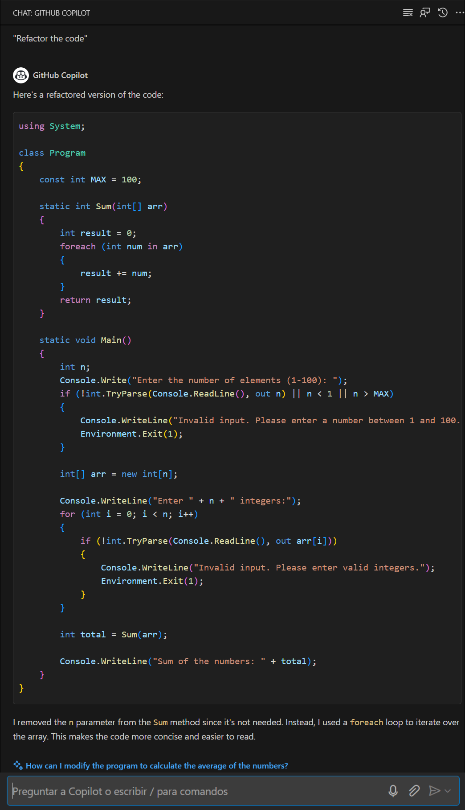

# Lab 5: Code Refactoring
Duration: 60 minutes

GitHub code refactoring refers to the process of restructuring and improving the quality of code in a GitHub repository without changing its external behaviour. Code refactoring aims to enhance readability, maintainability, and performance while reducing technical debt and potential bugs. 

In this exercise, you will participate in a learning or practice activity where your main goal will be to use GitHub Copilot for code refactoring using the C# programming language. You will also be generating unit test functions using GitHub Copilot Chat.

>**Disclaimer**: GitHub Copilot will automatically suggest an entire function body or code in gray text. Examples of what you'll most likely see in this lab, but the exact suggestion may vary.

## Task 1: Understand the code already available for you.

### Installing C Sharp (C#) extension in VS Code

1. To install the C Sharp (C#) extension, the following steps are to be performed within Visual Studio Code:
    - Click on the **Extensions** **(1)** icon in the activity bar present on the left side of the Visual Studio Code Window.
    - In the "Search Extensions in Marketplace" search box, type and search for the **C#** **(2)** extension.
    - Select **C#** **(3)** from the list of results that show up.
    - Click on the **Install** **(4)** button.

      

      >**Note**: If you get a pop-up for Update Visual Studio, go to the **Settings (1)** icon from the left navigation pane and choose **Install update (2)** and wait until updates complete then when **Restart Visual Studio Code to apply the latest update** prompted select **Update Now (3)** and close and open Visual studio then proceed with above step.

      
   
      

1. To demonstrate the GitHub code refactor, let us take an example of a poorly written code and analyze it. The below code is written using the C# programming language.
    
   ```
   using System;

   class Program
   {
       const int MAX = 100;

        static int Sum(int[] arr, int n)
        {
            int result = 0;
            for (int i = 0; i < n; i++)
            {
                result += arr[i];
            }
            return result;
        }

        static void Main()
        {
            int n;
            Console.Write("Enter the number of elements (1-100): ");
            if (!int.TryParse(Console.ReadLine(), out n) || n < 1 || n > MAX)
            {
                Console.WriteLine("Invalid input. Please provide a digit ranging from 1 to 100.");
                Environment.Exit(1);
            }

            int[] arr = new int[n];

            Console.WriteLine("Enter " + n + " integers:");
            for (int i = 0; i < n; i++)
            {
                if (!int.TryParse(Console.ReadLine(), out arr[i]))
                {
                    Console.WriteLine("Invalid input. Please enter valid integers.");
                    Environment.Exit(1);
                }
            }

            int total = Sum(arr, n);

            Console.WriteLine("Sum of the numbers: " + total);

            // No need to free memory in C#, as it's managed by the runtime.
        }
    }      
   ```

1. This code is a poorly written example of a program that prompts the user for the number of elements to sum and takes those integers as input. It employs dynamic memory allocation for the integer array and handles allocation failures with an error message. Here are a few code-related issues:
    - The code begins with the inclusion of the System namespace for essential input and output operations.
    - It defines a constant MAX with a value of 100 to represent the maximum number of elements allowed.
    - The Sum method calculates the sum of elements in an array.
    - In the Main method:
      - It prompts the user to enter the number of elements (between 1 and 100) and validates the input.
      - Allocates an array 'arr' to store the entered integers.
      - Prompts the user to enter the specified number of integers and validates each input.
      - Calculates the sum of the entered integers using the Sum method.
      - Outputs the sum to the console.
      - There's no need to manually free memory in C# because it manages memory automatically.
  
## Task 2: Use GitHub Copilot to refactor the code

1. Now, let's use the **GitHub Copilot Chat** feature to refactor the above code.

1. Click on the **Chat** extension icon from the activity bar in the left navigation pane. This opens the GitHub Copilot Chat window into which the above code is to be **pasted**.

1. Type the prompt `Refactor the code` at the end of the code and then press **enter**.

1. The GitHub Copilot Chat will give the response as shown below.

   

## Task 3: Review the refactored code and understand how it works.

1. The newly generated code will look as shown below:

     ```
     using System;

     class Program
     {
        const int MAX = 100;

        static int Sum(int[] arr)
        {
            int result = 0;
            foreach (int num in arr)
            {
                result += num;
            }
            return result;
        }

        static void Main()
        {
            int n;
            Console.Write("Enter the number of elements (1-100): ");
            if (!int.TryParse(Console.ReadLine(), out n) || n < 1 || n > MAX)
            {
                Console.WriteLine("Invalid input. Please enter a number between 1 and 100.");
                Environment.Exit(1);
            }

            int[] arr = new int[n];

            Console.WriteLine("Enter " + n + " integers:");
            for (int i = 0; i < n; i++)
            {
                if (!int.TryParse(Console.ReadLine(), out arr[i]))
                {
                    Console.WriteLine("Invalid input. Please enter valid integers.");
                    Environment.Exit(1);
                }
            }

            int total = Sum(arr);

            Console.WriteLine("Sum of the numbers: " + total);
        }
    }
    ```

1. Now, let's analyze the changes made to the code by GitHub Copilot Chat
   - Here, GitHub Copilot removed the `n` parameter from the Sum method since it's not needed. Instead, the Copilot used a for-each loop to iterate over the array. As a result, the code is easier to comprehend and more concise.
   - This includes the system namespace for input and output operations.
   - Defines a constant MAX with a value of 100 for the maximum number of elements allowed in an array.
   - The Sum method calculates the sum of elements in an integer array using a for-each loop.
   - In the Main method:
     - Asks the user to input the number of elements and validate it.
     - Creates an integer array to store user-entered values.
     - Prompts the user to enter integers, validates the input, and stores them in the array.
     - Calculates the sum of the integers using the Sum method.
     - Shows the sum on the console.
     - The code includes input validation and provides the sum of user-entered integers.

1. Notice that now the code is more modular, readable, and easier to understand.

   >**Note**: It's essential to carefully review copilot suggestions before applying them.

## Task 4: Use GitHub Copilot Chat with code to refactor the code 

In this task, you will demonstrate the chat with code feature of GitHub Copilot. With this feature, developers can engage in real-time conversations with Copilot directly through code comments, making it feel like they are collaborating with a coding partner.

1. From the codespace in the VS Code Explorer window, create a new file.

    

1. Name the file `codechat.cs` and you will see a recommendation to install the `C#` extension. Click on Install.

   

1. Copy and paste the code given below in the newly created file, i.e., `codechat.cs`.

    ```
    using System;

    class Program
    {
        static void Main()
        {
            int health = 100;
            int score = 0;

            Console.WriteLine("Welcome to the Adventure Game!");
            Console.WriteLine("You are in a dark forest.");

            while (health > 0)
            {
                Console.WriteLine("\nOptions:");
                Console.WriteLine("1. Go deeper into the forest.");
                Console.WriteLine("2. Rest by the campfire.");
                Console.WriteLine("3. Quit the game.");

                int choice;
                Console.Write("Enter your choice: ");
                if (int.TryParse(Console.ReadLine(), out choice))
                {
                    switch (choice)
                    {
                        case 1:
                            Console.WriteLine("You go farther into the forest and discover a treasure chest!");
                            score += 10;
                            break;
                        case 2:
                            Console.WriteLine("You rest by the campfire and regain 20 health.");
                            health += 20;
                            break;
                        case 3:
                            Console.WriteLine($"Thanks for playing! Your score: {score}");
                            return;
                        default:
                            Console.WriteLine("Invalid choice. Try again.");
                            break;
                    }

                    health -= 10;
                    if (health <= 0)
                    {
                        Console.WriteLine($"Game over. Your score: {score}");
                    }
                }
                else
                {
                    Console.WriteLine("Invalid input. Please enter a valid number.");
                }
            }
        }
    }
    ```

1. Let's ask Copilot to use if else statements instead of the switch statement.

1. Identify the section of code where the switch statement is present and select it.

1. Right-click on the code window and click on the **Copilot** **(1)** option. From the following list of options in Copilot, select **Start in Editor** **(2)**.
 
     

1. Now type the prompt "Use if-else statements instead of the switch statement" **(1)** to make the code more understandable and click `>` or press `Enter` **(2)**. Copilot will give a response, and you can review it and click **Accept** **(3)**. Also, you can **Discard** the suggestion as depicted in the image below.

    

     >**Note:** It's essential to carefully review copilot suggestions before applying them.

## Task 5: Create unit test functions

1. From the codespace in the VS Code Explorer window, create a new file.

    

1. Name the file `test.js` as shown below:  

   

1. Now, navigate to the GitHub Copilot Chat and give the prompt **Compose a full JavaScript program for constructing a calculator**.

1. GitHub Copilot Chat will generate code based on the prompt you provide, as shown below.

   

   >**Note**: The code shown in the screenshot may be different for you.

1. Copy and paste the code in the file named **test.js** that you just created.

1. Now, to generate test cases for each function, select the function for which the test case has to be generated, and back in the GitHub Copilot Chat window, type **/tests** and hit enter.

   

1. It will generate a test case for the add function.

   

### Task 5: Push code to your repository from the codespace

1. Use the VS Code terminal to add files to the repository. Open VS Code Terminal if it's not opened yet.

1. Run the below command to add the `codechat.cs`, `test.js`  files to the repository:

   ```
   git add codechat.cs test.js
   ```

1. Next, from the VS Code terminal stage, commit the changes to the repository:

   ```
   git commit -m "Copilot third commit"
   ```

1. Finally, from the VS Code terminal, push to code to the repository:

   ```
   git push
   ```

   

    > **Congratulations** on completing the lab! Now, it's time to validate it. Here are the steps:
    > - On GitHub, locate your profile photo at the top right corner of the screen.
    > - Copy your GitHub username.

     
   
    > - Hit the Validate button for the corresponding task. Paste your GitHub username into the required field and click on submit.

     

   > - If you receive a success message, you can proceed to the next task.
   > - If not, carefully read the error message and retry the step, following the instructions in the lab guide. 
   > - If you need any assistance, please contact us at cloudlabs-support@spektrasystems.com. We are available 24/7 to help you out.
   
   <validation step="51bde804-17ac-4535-a41d-0b9ea8162227" />

## Summary

In this lab, you have successfully employed GitHub Copilot to carry out code refactoring tasks and created unit test functions. Code refactoring with Copilot's assistance will make your coding projects more efficient and collaborative.

