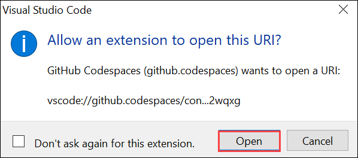

# Exercise 1: Leverage Codespaces with VS Code for Copilot

GitHub Copilot is an AI pair programmer that helps you write code faster and with less work. It draws context from comments and code to suggest individual lines and whole functions instantly. GitHub Copilot is powered by OpenAI Codex, a generative pretrained language model created by OpenAI.

**Copilot works with many code editors including VS Code, Visual Studio, JetBrains IDE, and Neovim.**

Additionally, GitHub Copilot is trained on all languages that appear in public repositories. For each language, the quality of suggestions you receive may depend on the volume and diversity of training data for that language.

Using Copilot inside a Codespace shows just how easy it is to get up and running with GitHub's suite of [Collaborative Coding](https://github.com/features#features-collaboration) tools.

In this exercise, you will create a development container and define specific extensions or configurations that will be used or installed in your codespace. You will create this development container and add copilot to the list of extensions.

## Task 1: Enable Copilot inside a Codespace

1. From the **Code** **(1)** tab of your repository, click the **Add file** **(2)** drop-down button, and then click `Create new file` **(3)**.

    

1. Type or paste the following in the empty text field prompt to name your file **(1)**.

   ```
   .devcontainer/devcontainer.json
   ```

1. In the body of the new **.devcontainer/devcontainer.json** file, add the following content **(2)** and click on **Commit changes** **(3)**:

   ```
   {
       // Name this configuration
       "name": "Codespace for Skills!",
       "customizations": {
           "vscode": {
               "extensions": [
                   "GitHub.copilot"
               ]
           }
       }
   }
   ```

   
   
1. Select the option to **Commit directly to the `main` branch**, and then click the **Commit changes** button.

   

1. Navigate back to the home page of your repository by clicking the **Code** **(1)** tab located at the top left of the screen. Click the **Code** **(2)** button located in the middle of the page.

   

1. Click the **Codespaces** tab on the box that pops up and then click the **Create codespace on main** button.

   

1. You will encounter a pop-up prompt. Click **Open** to proceed. Subsequently, another pop-up window will appear within Visual Studio Code (VS Code), where you should once again select **Open** to continue.

   

   

1. At the bottom right corner you will get a prompt to Sign in to GitHub.

   

1. Next, once you get the popup click on **Allow**

   

   >**Note**: Wait about 2 minutes for the codespace to spin itself up.

1. Verify your codespace is running. Make sure VS code looks as shown below:

   

1. Click on **Extensions** **(1)** from left-menu, the **GitHub Copilot** **(2)** extension should show up in the VS Code extension list. Click the copilot extension and vierfy it's installtion as shown below:

   

   >**Note**: If in case GitHub Copilot extension is not installed, click on Install.
 
1. Click on **Next** from the bottom right to continue with the next exercies.

### Summary

In this exercise, you have created development container and added copilot to the list of extensions.
