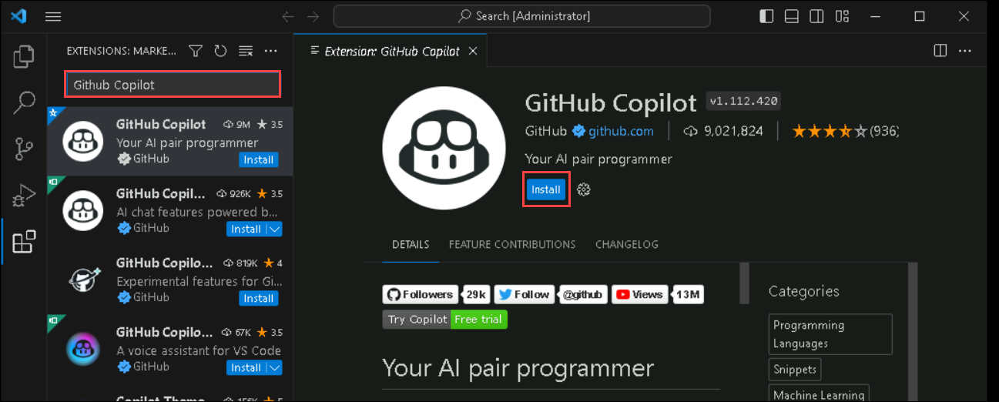
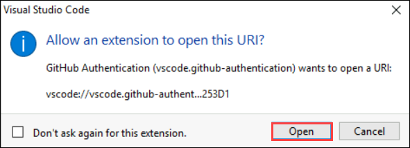
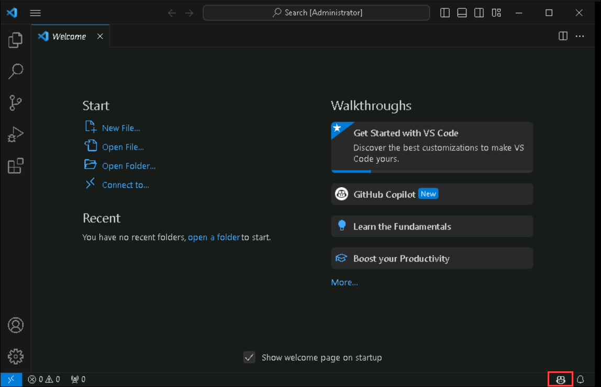
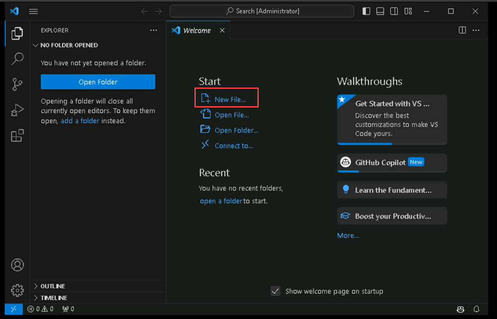
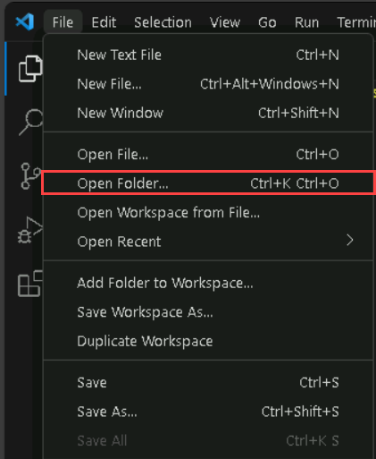
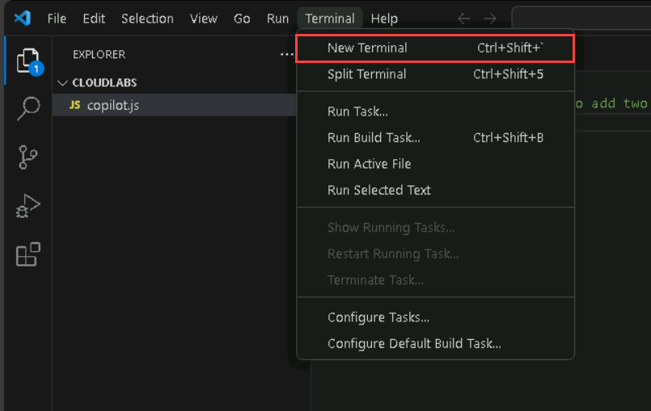
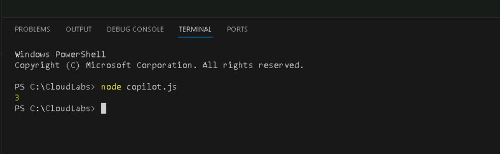

# Exercise 1: Introduction to GitHub Copilot

GitHub Copilot is an AI pair programmer that helps you write code faster and with less work. It draws context from comments and code to suggest individual lines and whole functions instantly. GitHub Copilot is powered by OpenAI Codex, a generative pretrained language model created by OpenAI.

**Copilot works with many code editors including VS Code, Visual Studio, JetBrains IDE, and Neovim.**

Additionally, GitHub Copilot is trained on all languages that appear in public repositories. For each language, the quality of suggestions you receive may depend on the volume and diversity of training data for that language.

Using Copilot inside a Codespace shows how easy it is to get up and running with GitHub's suite of [Collaborative Coding](https://github.com/features#features-collaboration) tools.

## Task 1: Install the GitHub Copilot extension in Visual Studio Code

1. Open Visual Studio Code from the desktop screen. 

   

3. In Visual Studio Code, open the Extensions view by clicking the Extensions icon in the activity bar on the left side of the Visual Studio Code window.

   

2. In the "Search Extensions in Marketplace" search box, search for the **GitHub Copilot** extension, then click Install.

   
  
3. Once the installation is complete, at the bottom right corner you will get a prompt to Sign in to GitHub.

   

4. Next, once you get the popup click on **Allow**

   

5. In the sign in to Github page enter the GitHub credentials from the environment details page and click on **Sign in**.

   

6. Next, to get the authentication code sign in to Outlook (https://outlook.office365.com/mail/) with the git credentials provided in the Environment details page and enter the verification code and click on **Verify**.

   

7. You will encounter a pop-up prompt. Click **Open** to proceed. Subsequently, another pop-up window will appear within Visual Studio Code (VS Code), where you should once again select **Open** to continue.

   

   

8. Restart the Visual Studio code and you will be able to see in the bottom right corner that Github Copilot has been activated.

   

## Task 2: Create a new file in Visual Studio Code

1. In the Visual Studio Code click on **New File** name the file as **copilot.js** and save it in the default CloudLabs folder.

    
  
2. Now, from the File menu click on **Open Folder** and click on CloudLabs and select the folder.

    

4. Now the newly created javascript file will come under the CloudLabs folder as shown below

   

## Task 3: GitHub Copilot Code Generation

1. Let's start with something simple. Let's create a function to add two numbers.

2. In the JavaScript file, simply write a comment like "Generate a function to add two numbers."

   ```
    //Generate a function to add two numbers
   ```
3. Then press enter. It will give you the suggestions.
   
   
   
5.  Now, you can accept the suggestion by pressing the **tab** button. Then press enter for the next line, and when the next line of code comes up, press **tab** again. The code will look as shown below.

    

6. Now let's call the function **add**. Below the function that is generated, type add and press **tab** key twice. It will autofill the values. 

7. Next, to print the output of the function, type **console** and press the **tab** key twice to accept the auto-filled code. The complete code will now look like as shown below.  
 
   

## Task 4: Review the generated code and understand how it works.

1. Now, from the upper navigation pane, click on **Terminal** and select **New Terminal**. A terminal window will appear at the bottom of the screen. 

   
 
2. Now in the terminal window, make sure the directory path is in the CloudLabs folder. Copy the below code to obtain an output for the function that we generated. 
   ```
    node copilot.js
   ```
3. The output will be generated as shown in the figure below.

   

## Task 5: Copilot code generation for different scenarios

1. Now in the Visula Studio window, in the left navigation pane, under CloudLabs folder, click on **New file** and create a file named **rainbow.js**.

   
   
3. In the code window of the new file that you just created, paste the following comment and press enter and it will give you the suggestion.To accept the suggestion press the **Tab** key.
    ```
    //Generate an array of all the colors from the rainbow
   ```
4. The code will look like as shown below.

   

## Task 6: Write a function and use GitHub Copilot to suggest code

1. In Visual Studio Code, create a new JavaScript  file under the CloudLabs folder named **function.js**.

2. In the JavaScript file, type the following function header.

    ```
      function calculateDaysBetweenDates(begin, end) {
    ```
3. GitHub Copilot will automatically suggest an entire function body in gray text. Press the **Tab** key to accept the suggestion. The code will look like as shown below.

   

 ## Task 7:Explain code with Copilot  
