# Exercise 1: Leverage Codespaces with VS Code for Copilot

### Estimated Duration: 15 minutes

GitHub Copilot is an AI pair programmer designed to make writing code easier and faster. It draws context from comments and code to suggest individual lines and whole functions instantly. GitHub Copilot is powered by OpenAI Codex, a generative pre-trained language model created by OpenAI.

**Copilot is compatible with a wide range of code editors, such as Neovim, JetBrains IDE, Visual Studio, and VS Code.**

Additionally, GitHub Copilot is trained in every language that can be found in public repositories. The amount and variety of training data for each language may have an impact on the quality of recommendations you obtain.

**GitHub Codespace** is a development environment that's hosted in the cloud. You can customize your project for GitHub Codespaces by committing configuration files to your repository (often known as Configuration-as-Code), which creates a repeatable codespace configuration for all users of your project.

Utilizing Copilot within a Codespace effortlessly demonstrates the simplicity of starting with GitHub’s comprehensive [Collaborative Coding](https://github.com/features#features-collaboration) tools.

In this exercise, you are tasked with creating a development container. You will specify certain extensions or configurations to be utilized or installed in your Codespace. As part of this process, ensure to include Copilot in your list of extensions.

## Lab objectives

You will be able to complete the following tasks:

- Task 1: Enable Copilot inside a Codespace

## Task 1: Enable Copilot inside a Codespace

1. To navigate back to the home page of your repository from the Organization settings, click **Repositories** from the left panel and select the private repository **skills-copilot-codespaces-vscode-<inject key="Deployment-id" enableCopy="false"/>**.

   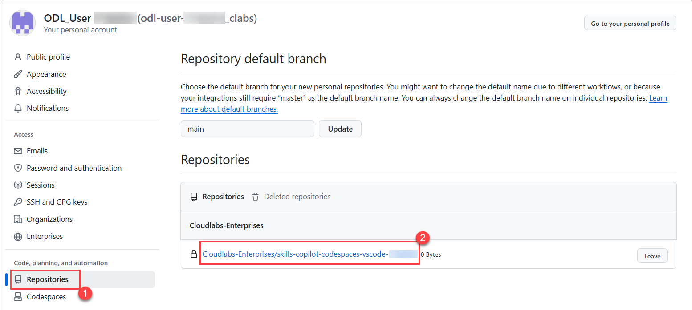

1. On the home page of your repository, click **creating a new file** under **Quick setup**.

    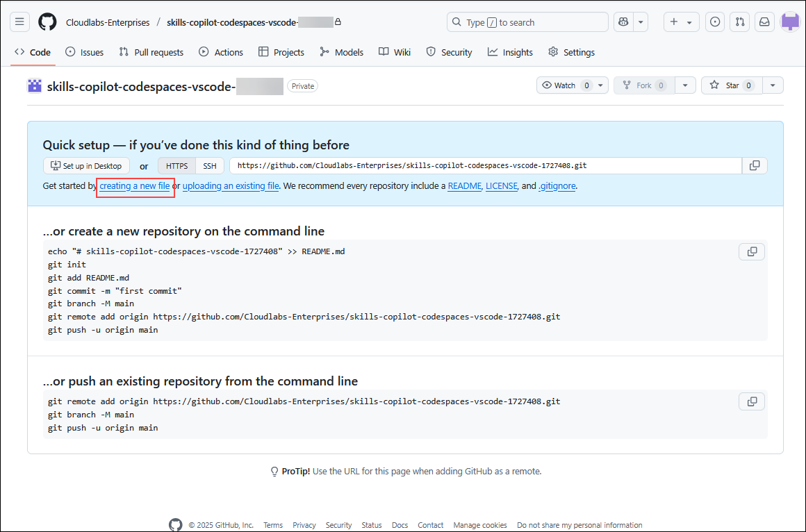

1. Type or paste the following in the empty text field prompt to name your file **(1)**.

   ```
   .devcontainer/devcontainer.json
   ```

1. In the body of the new **.devcontainer/devcontainer.json** file, add the following content **(2)** and click on **Commit changes** **(3)**:

   ```
   {
       // Name this configuration
       "name": "Codespace for Skills!",
       "customizations": {
           "vscode": {
               "extensions": [
                   "GitHub.copilot",
                   "hashicorp.terraform"
               ]
           }
       },
      "features": {
          "ghcr.io/devcontainers/features/terraform:1": {},
          "ghcr.io/devcontainers/features/azure-cli:1": {}
      }
   }
   ```

   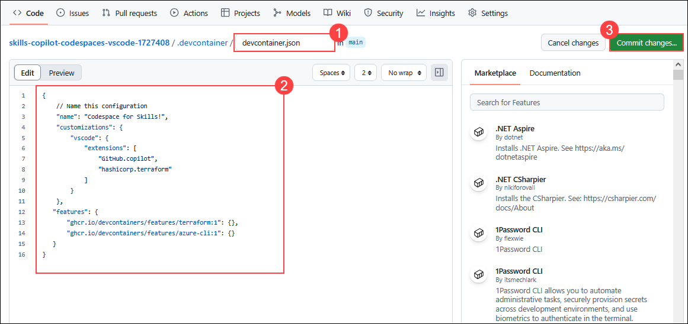
   
1. Click the **Commit changes** button.

   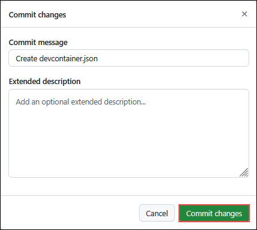

1. Navigate back to the home page of your repository by clicking the **Code** **(1)** tab located at the top left of the screen. Click the **Code** **(2)** button located in the middle of the page.

   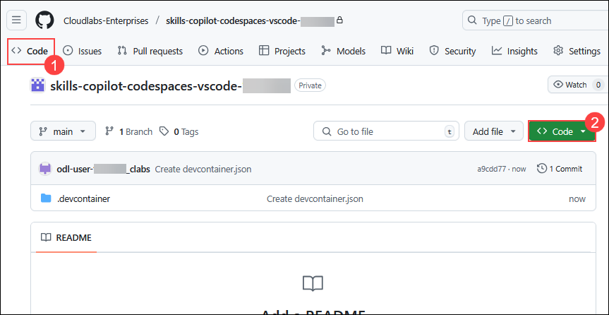

1. Click the **Codespaces (1)** tab on the box that pops up and then click the **Create codespace on main (2)** button.  If you don't see the "Create Codespace" button, it likely means your repository wasn't created under the **Cloudlabs-enterprises** organization. To fix this, either delete your current repository and recreate it under the specified organization, or fork the existing repository into **Cloudlabs-enterprises** Org.

   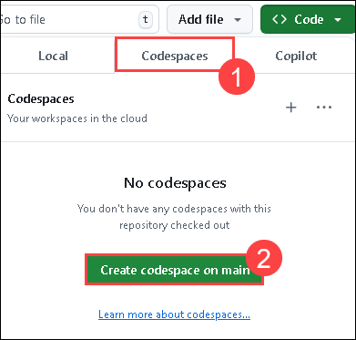

   >**Note**: If in case pop-up prompt doesn't appear in the browser to open Visual Studio code, manually launch Visual Studio code from the desktop and close it. Next, return to the browser, refresh the page and launch the codespace that was previously created.

1. You will encounter a pop-up prompt, Click **Open** to proceed. Subsequently, another pop-up window will appear within Visual Studio Code (VS Code), where you should select **Install Extension and Open URI** to continue.

   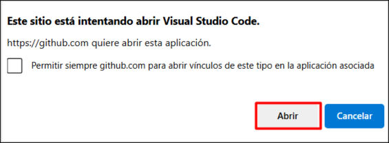

   

    >**Note**: Click on **Allow** if the extension **Github Codepsaces** wants to sign in using Github.

   

1. Click on **Continue** on **Select user to authorize Visual Studio Code**.

    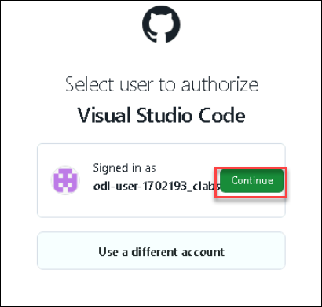

1. Click on **Authorize Visual-Studio-Code**.

    

1. Click on **Open** to open the Visual Studio Code.

    

1. Verify your codespace is running. Make sure the VS code looks as shown below:

    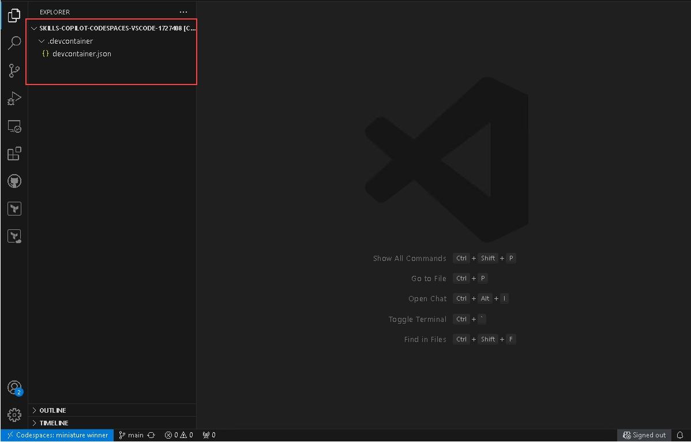   

1. Click on **Extensions** **(1)** from the left menu, search for **GitHub Copilot** **(2)** extension and select in the VS Code extension list. Check the **Github Copilot** **(3)** extension and verify its installation as shown below:

    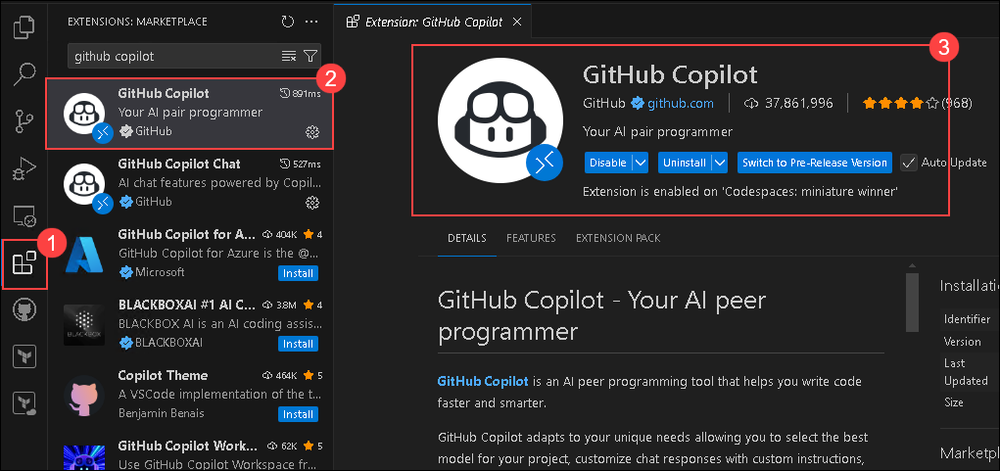

    >**Note**: If the GitHub Copilot extension is not installed, click on Install.

1. At the top next to the search bar, click on the showed icon, to sign in to GitHub.

   

1. On the pop-up window that appears, click on **Sign in**.

   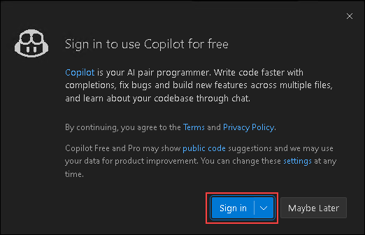

   > **Note**: If you encounter with error **No access to GitHub Copilot found**, please reach out to `cloudlabs-support@spektrasystems.com` for further assistance.

      

1. Next, once you get the popup, click on **Allow**

     

     >**Note**: Wait about 2 minutes for the codespace to spin itself up.

1. Click **Continue**, once the  **Select user to authorize Visual Studio Code** tab appears in the browser.

    

1. Click on **Authorize Visual-Studio-Code**.

    

1. Next, once you get the popup, click on **Open**.

    

    >**Note**: Click on **Allow** if the extension **Github Copilot Chat** wants to sign in using Github.

    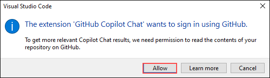


   > **Congratulations** on completing the task! Now, it's time to validate it. Here are the steps:
   > - Hit the Validate button for the corresponding task. If you receive a success message, you can proceed to the next task.
   > - If not, carefully read the error message and retry the step, following the instructions in the lab guide. 
   > - If you need any assistance, please contact us at cloudlabs-support@spektrasystems.com. We are available 24/7 to help you out.

<validation step="2c3e393f-eade-43e1-a96a-f8ea659b3047" />

### Summary

In this exercise, you have created a development container and added Copilot to the list of extensions.

### You have successfully completed the lab. Click on **Next >>** to procced with next exercise.
