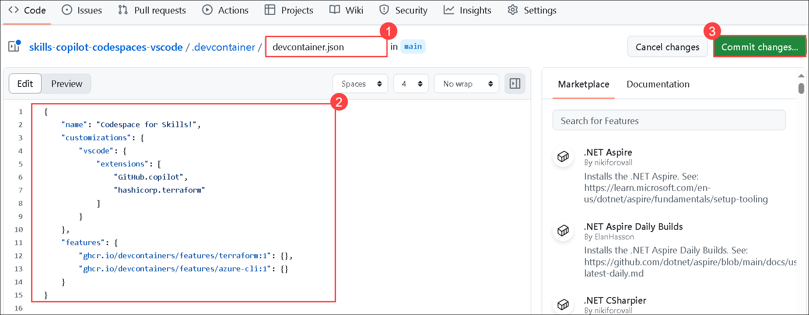
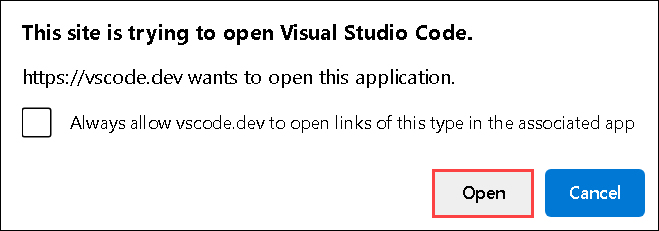

# Ejercicio 1: Aprovechar Codespaces con VS Code para Copilot

### Duración Estimada: 15 minutos

GitHub Copilot es un programador de pares de IA diseñado para que escribir código sea más fácil y rápido. Extrae el contexto de los comentarios y el código para sugerir líneas individuales y funciones completas al instante. GitHub Copilot está impulsado por OpenAI Codex, un modelo de lenguaje generativo preentrenado creado por OpenAI.

**GitHub Copilot es compatible con una amplia gama de editores de código, como Neovim, JetBrains IDE, Visual Studio y VS Code.**

Además, GitHub Copilot está entrenado en todos los lenguajes que se pueden encontrar en repositorios públicos. La cantidad y variedad de datos de entrenamiento para cada lenguaje puede tener un impacto en la calidad de las recomendaciones que obtenga.

**GitHub Codespace** es un entorno de desarrollo alojado en la nube. Puede personalizar su proyecto para GitHub Codespaces enviando archivos de configuración a su repositorio (a menudo conocido como Configuración-como-Código), lo que crea una configuración de codespace repetible para todos los usuarios de su proyecto.

El uso de Copilot dentro de un Codespace demuestra sin esfuerzo la simplicidad de comenzar con las herramientas integrales de [Programación Colaborativa](https://github.com/features#features-collaboration) de GitHub.

En este ejercicio, se le asigna la tarea de crear un contenedor de desarrollo. Deberá especificar ciertas extensiones o configuraciones a utilizar o instalar en su Codespace. Como parte de este proceso, asegúrese de incluir Copilot en su lista de extensiones.

## Objetivos del laboratorio

Será capaz de completar las siguientes tareas:

- Tarea 1: Habilitar Copilot dentro de un Codespace

## Tarea 1: Habilitar Copilot dentro de un Codespace

1. Navegue de regreso a la página de inicio de su repositorio, haga clic en la pestaña **Code** **(1)** de su repositorio, haga clic en el botón desplegable **Add file** **(2)** y luego seleccione `+ Create new file` **(3)**.

    

2. Escriba o pegue lo siguiente en el campo de texto vacío para nombrar su archivo **(1)**.

   ```
   .devcontainer/devcontainer.json
   ```

3. En el cuerpo del nuevo archivo **.devcontainer/devcontainer.json**, agregue el siguiente contenido **(2)** y haga clic en **Commit changes** **(3)**:

   ```
   {
       // Name this configuration
       "name": "Codespace for Skills!",
       "customizations": {
           "vscode": {
               "extensions": [
                   "GitHub.copilot",
                   "hashicorp.terraform"
               ]
           }
       },
      "features": {
          "ghcr.io/devcontainers/features/terraform:1": {},
          "ghcr.io/devcontainers/features/azure-cli:1": {}
      }
   }
   ```

   
   
4. Seleccione la opción **Commit directly to the `main` branch** y luego haga clic en el botón **Commit changes**.

   

5. Vuelva a la página de inicio de su repositorio haciendo clic en la pestaña **Code** **(1)** ubicada en la parte superior izquierda de la pantalla. Haga clic en el botón **Code** **(2)** ubicado al centro de la página.

   

6. Haga clic en la pestaña **Codespaces (1)** en el cuadro emergente y luego haga clic en el botón **Create codespace on main (2)**.

   

   >**Nota**: Si no aparece el mensaje emergente en el navegador para abrir Visual Studio Code, inicie Visual Studio Code manualmente desde el escritorio y ciérrelo. A continuación, vuelva al navegador, actualice la página e inicie el codespace que se creó anteriormente.

7. Aparecerá un mensaje emergente. Haga clic en **Abrir** para continuar. Posteriormente, aparecerá otra ventana emergente dentro de Visual Studio Code (VS Code), donde debe seleccionar **Instalar Extensión y Abrir URI** para continuar.

   

   

    >**Nota**: Haga clic en **Permitir** si la extensión **Github Codespaces** desea iniciar sesión con Github.

   

1. Haga clic en **Continue** en **Select user to authorize Visual Studio Code**.

    

1. Haga clic en **Open** para abrir Visual Studio Code.

    

1. Verifique que su codespace esté ejecutándose. Asegúrese de que VS Code se vea como se muestra a continuación:

       

1. Haga clic en **Extensiones** **(1)** en el menú de la izquierda y la extensión **GitHub Copilot** **(2)** debería aparecer en la lista de extensiones de VS Code. Haga clic en la extensión Copilot y verifique su instalación como se muestra a continuación:

    

    >**Nota**: Si la extensión GitHub Copilot no está instalada, haga clic en Instalar. 

1. En la parte superior junto a la barra de búsqueda, haga clic en el icono que se muestra para iniciar sesión en GitHub.

   

1. En la ventana emergente que aparece, en la página **Iniciar sesión para usar Copilot gratis**, haga clic en **Iniciar sesión**

   

   > **Nota**: Si aparece el error **No access to GitHub Copilot found**, comuníquese con `cloudlabs-support@spektrasystems.com` para obtener más ayuda.

      

9. A continuación, cuando aparezca la ventana emergente, haga clic en **Permitir**

   

   >**Nota**: espere alrededor de 2 minutos para que el codespace se active por sí solo.

10. Haga clic en **Continue** una vez que aparezca la pestaña **Select user to authorize Visual Studio Code** en el navegador.

    

11. A continuación, cuando aparezca la ventana emergente, haga clic en **Open**

    

   > **Felicitaciones** por completar la tarea. Ahora, es momento de validarla. Estos son los pasos:
   > - Presione el botón Validar para la tarea correspondiente. Si recibe un mensaje de éxito, puede continuar con la siguiente tarea.
   > - De lo contrario, lea atentamente el mensaje de error y vuelva a intentar el paso, siguiendo las instrucciones de la guía del laboratorio.
   > - Si necesita ayuda, comuníquese con nosotros a cloudlabs-support@spektrasystems.com. Estamos disponibles las 24 horas, los 7 días de la semana para ayudarlo.

   <validation step="2c3e393f-eade-43e1-a96a-f8ea659b3047" />

### Resumen

En este ejercicio, ha creado un contenedor de desarrollo y ha agregado Copilot a la lista de extensiones.

### Ha completado el laboratorio con éxito
