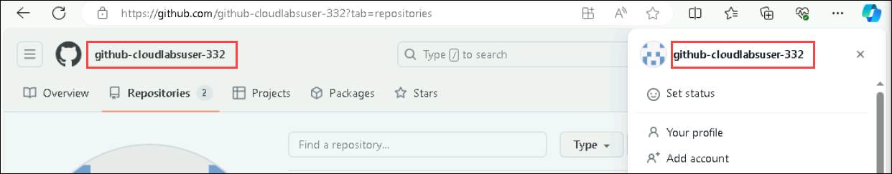
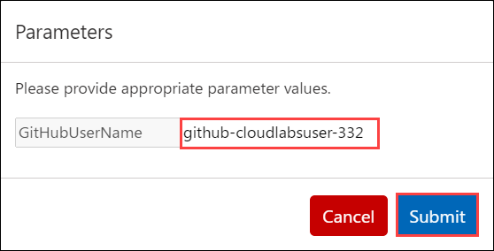

# Exercise 10: Creating a Mini Game with GitHub Copilot

Duration : 30 minutes

In this exercise, you will utilize the capabilities of GitHub Copilot to construct a classic rock, paper, scissors minigame. Through this practical engagement, you'll not only refine your programming expertise but also bolster your proficiency in crafting console applications using Python.

### Task 1: Setting up your environment

1. Navigate to [Mini-game-with-copilot](https://github.com/MicrosoftDocs/mslearn-challenge-project-create-mini-game-with-copilot) and click on **Fork**.

   

1. Click on **Create Fork**.

   

1. Once the repository is forked, select the **Code (1)** button and, in the **Codespaces** tab, select **Create codespace on main (2)**.

   

      >**Note**: In case you encounter a pop-up prompt. Click **Open** to proceed.

      

1. Click on **Open** when prompted to allow Github Codespaces Extension.

   
   
1. View the repository.

   

> **Congratulations** on completing the task! Now, it's time to validate it. Here are the steps:
 
- Navigate to the Lab Validation Page, from the upper right corner in the lab guide section.
- Hit the Validate button for the corresponding task. If you receive a success message, you can proceed to the next task.

   >**Note**: Upon clicking the validate button for this exercise, you'll receive a prompt to input your GitHub username. To find your GitHub username, simply click on your profile image within your GitHub account. After entering your username, proceed by selecting **Submit**.

   

   

- If not, carefully read the error message and retry the step, following the instructions in the lab guide.
- If you need any assistance, please contact us at labs-support@spektrasystems.com. We are available 24/7 to help you out.

### Task 2: Testing your GitHub Codespace

1. Open the **app.py** file.

   

1. Paste the following comment and click on **Enter** and verify the next comment is generated by **Github Copilot**.

   ```
   # write 'hello world' to the console
   ```

   
   
      >**Note:** In cases where the code isn't generated by **Github Copilot**, click on **Extensions**, search for Github Copilot, select it and click on **Install in Codespaces: opulent space eureka**.

      

1. Click on **Save**.
   
1. Click on **Terminal (1)** and select **New Terminal (2)**.

   

1. Run the application with the **python app.py** command in the terminal and check if the result is similar to the following console message:

   


### Task 3: Creating the game logic

1. Paste the following **comment (1)** to fetch the code and click on Make request **(Enter) (2)** button and click on **Accept (3)** to use the code. If you want to regenerate the code, click on **Regenerate (4)** option.

   ```
    The player can choose rock, paper, or scissors, and invalid inputs are handled gracefully. After each round, display whether the player won, lost, or tied. Allow the player to play again after each round and display their score at the end of the game. Inputs are converted to lowercase for consistency.
   ```

   

      >**Note:** However, it is to be noted that the suggestions provided by GitHub Copilot may vary and at times may be irrelevant and require a clear understanding of the python code and its usage.

1. Click on **Save**.

1. Run the application with the **python app.py** command in the terminal.

   

### Summary

In this exercise, you have successfully created a minigame using Python and Github Copilot.
