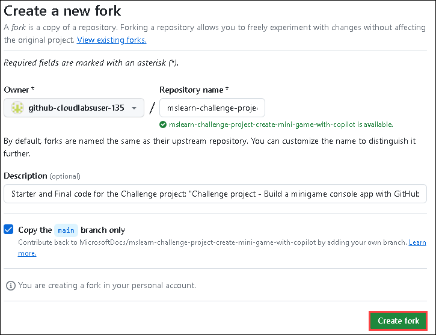
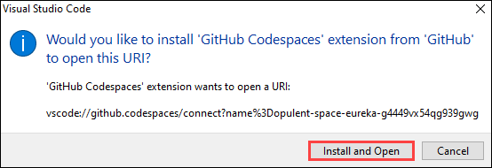
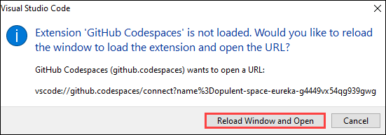
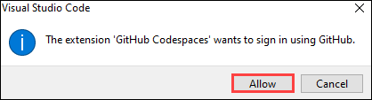
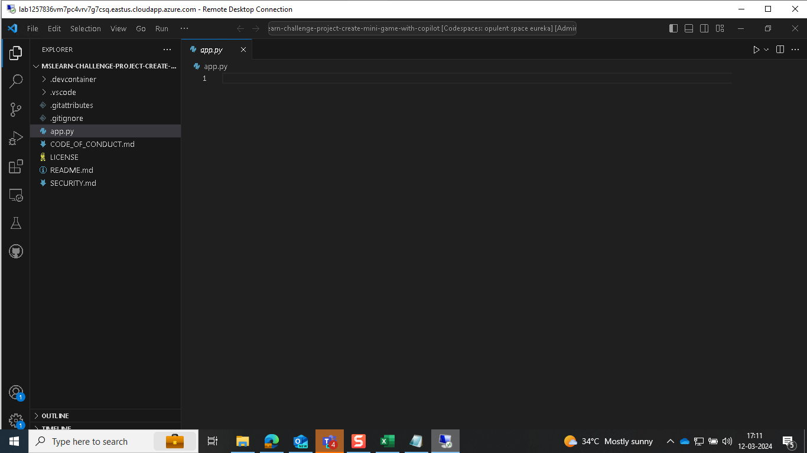
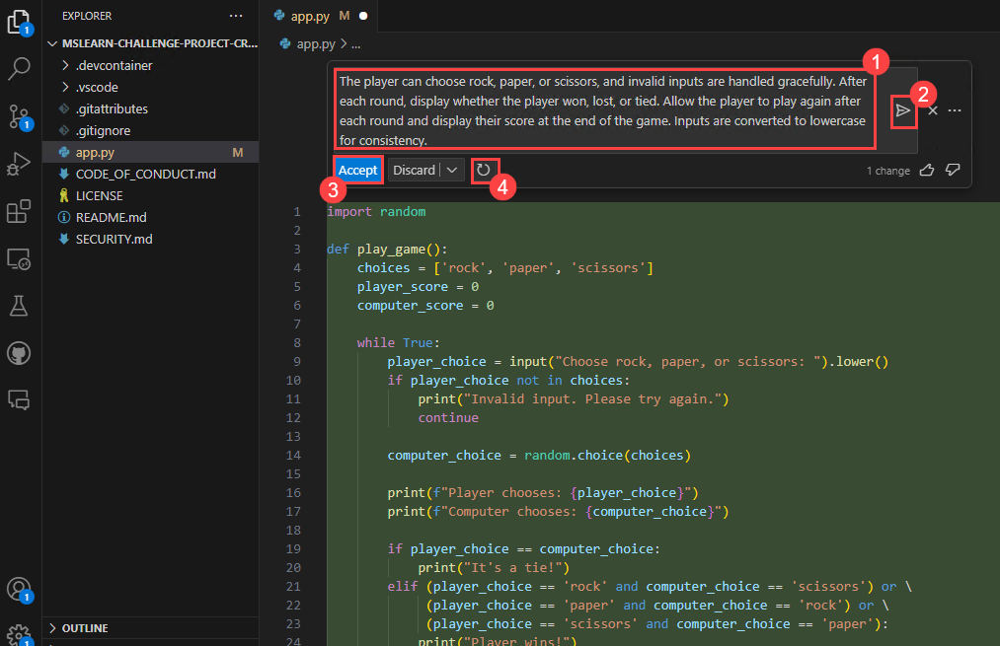

# Exercise 10: Creating a Mini Game with GitHub Copilot

Duration : 30 minutes

In this exercise, you will utilize the capabilities of GitHub Copilot to construct a classic rock, paper, scissors minigame. Through this practical engagement, you'll not only refine your programming expertise but also bolster your proficiency in crafting console applications using Python.

### Task 1: Setting up your environment

1. Navigate to [Mini-game-with-copilot](https://github.com/MicrosoftDocs/mslearn-challenge-project-create-mini-game-with-copilot) and click on **Fork**.

   

1. Click on **Create Fork**.

   

1. Once the repository is forked, select the **Code (1)** button and, in the **Codespaces** tab, select **Create codespace on main (2)**.

   

1. You will encounter a pop-up prompt. Click **Open** to proceed.

   

1. Click on **Install and Open**.

   

      >**Note:** In cases where **Github Codespaces** has not loaded, please click on **Reload Window and Open**.

   

1. Click on Allow when **Github Codespaces** wants to sign in using Github.

   

1. View the repository.

   

### Task 2: Testing your GitHub Codespace

1. Open the file named **app.py**.

   

1. Paste the following comment and click on **Enter** and verify the next comment is generated by **Github Copilot**.

   ```
   # write 'hello world' to the console
   ```

   
   
      **Note:** In cases where the code isn't generated by **Github Copilot**, click on **Extensions**, search for Github Copilot and select it and click on **Install in Codespaces: opulent space**.

   

1. Click on **Save**.
   
1. Click on **Terminal** and select **New Terminal**.

   

1. Run the application with the **python app.py** command in the terminal and check if the result is similar to the following console message:

   


### Task 3: Creating the game logic

1. Paste the following **comment (1)** to fetch the code and click on Make request **(Enter) (2)** button and click on **Accept (3)** to use the code. If you want to regenerate the code, click on **Regenerate (4)** option.

   

   **Note:** However, it is to be noted that the suggestions provided by GitHub Copilot may vary and at times may be irrelevant and require a clear understanding of the python code and its usage.

1. Click on **Save**.

1. Run the application with the **python app.py** command in the terminal.

   

1. 
