# Exercise 10: Working with the Copilot for Machine Learning [Optional]

### Estimated Duration: 30 minutes

Working with Copilot for machine learning involves leveraging GitHub Copilot, an AI-powered code completion tool developed by GitHub in collaboration with OpenAI. Here's a quick summary of the key steps and considerations:

Installation: Ensure you have GitHub Copilot installed as an extension in your integrated development environment (IDE), such as Visual Studio Code.

GitHub Integration: Link your IDE to your GitHub account to enable seamless integration. This allows Copilot to access your code repositories and provide context-aware suggestions.

Machine Learning Frameworks: Copilot supports various Machine Learning libraries and frameworks like TensorFlow, PyTorch, scikit-learn, and more. It can assist with code generation for tasks like data preprocessing, model building, and evaluation.

In this exercise, you will be cloning the Git repository with the required dataset into your environment. Here, you will be working with Copilot for Machine Learning, which involves leveraging GitHub Copilot.

>**Disclaimer**: GitHub Copilot will automatically suggest an entire function body or code in grayed text. Examples of what you'll most likely see in this exercise, but the exact suggestion may vary.

>**Note**: Before proceeding with the exercise, make sure you have installed Python and pip packages.

>**Note**: If you are unable to see any suggestions by GitHub Copilot in VS Code, please restart the VS Code once and try again. 

## Lab objectives

You will be able to complete the following tasks:

- Task 1: Prerequisites and Injecting the Required Dataset into Your Environment
- Task 2: Auto_Completion of Code with Different Experiments
- Task 3: Mathematical and Machine Learning with Different Examples
- Task 4: Data Visualization and Data Transformation
- Task 5: Training the sample model

### Task 1: Prerequisites and Injecting the Required Dataset into Your Environment

1. Open VS Code Terminal by clicking on **Ellipsis (...)** **(1)**, selecting **Terminal** **(2)**, and clicking on **New Terminal** **(3)**.

   

1. Clone the below git repository in your environment.

   ```
   git clone https://github.com/CloudLabsAI-Azure/ml-copilot-workshop.git
   ```

1. Change the directory in the terminal by running the below command:

   ```
   cd ml-copilot-workshop
   ```

1. To install all the required Python dependencies in your environment before working with Copilot run the below command in your terminal:

   ```
   pip install -r requirements.txt
   ```

### Task 2: Auto_Completion of Code with Different Experiments

   >**Note**: If the suggestion doesn't appear or if the output isn't generated as expected, press **Ctrl+I**. Paste the comments, review the suggestions, and then accept them. 

1. To install the **Jupyter**, the following steps are to be performed within Visual Studio Code:
    - Click on the **Extensions (1)** icon in the activity bar present on the left side of the Visual Studio Code Window.
    - In the **"Search Extensions in Marketplace"** search box, type and search for the **Jupyter (2)** extension.
    - Select **Jupyter (3)** from the list of results that show up, and verify that **Jupyter** has been installed.
    - If not, click on the **Install in Codespaces: ubiquitous space doodle(4)** button.

   

1. From the VS Code explorer window, right-click on the folder named **ml-copilot-workshop** **(1)** and click on **New File**. Name the file `Experiments.ipynb` **(2)** and verify that your new file looks as shown below:

   

1. Click on the file, select **+ Code**.

   

1. Click on **Select Kernel** from the top right, select the **Python Environment** and then choose Python **3.12**.   

1. Press **`CTRL + I`** to provide statemets to Github Copilot.

   ```
   # Import libraries with respect to loading data and creating a random forest model
   ```

1. Copilot will give a response, and you can review it , click **Accept** to accept the response.

   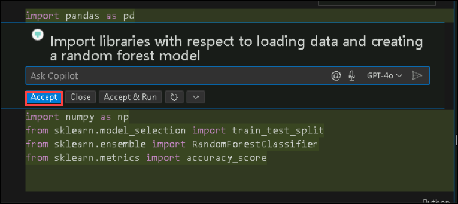

1. Accept all the suggestions for importing libraries as shown in the below screenshot **(1)** and click the **Run** **(2)** button to execute the cell. Click on `+Code` **(3)** to add the new cell.

   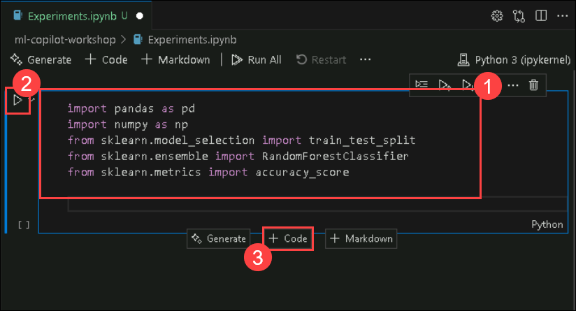

   >**Note**: While running the cell, you may need to install the required packages and select the kernel.

1. Press **`CTRL + I`** to provide statemets to Github Copilot.

   ```
   # Load the data from a csv file, and the name of the file is diabetes.csv
   ```

   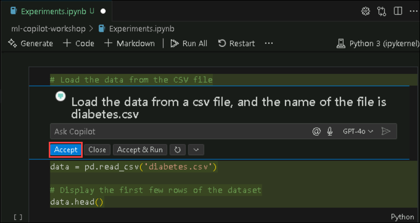

   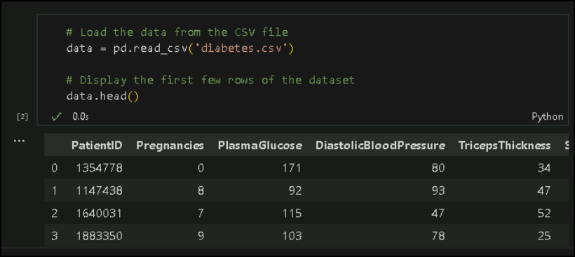    

1. Now click on **+Code** and move on to the next task.
  
### Task 3: Mathematical and Machine Learning with Different Examples

### Task 3.1: Mathematical Operations

   >**Note**: If the suggestion doesn't appear or if the output isn't generated as expected, press **Ctrl+I**. Paste the comments, review the suggestions, and then accept them. 

1. Press **`CTRL + I`** to provide statemets to Github Copilot.

   ```
   # Mathematical operations on the dataset, like generating the birth year from age
   ```

   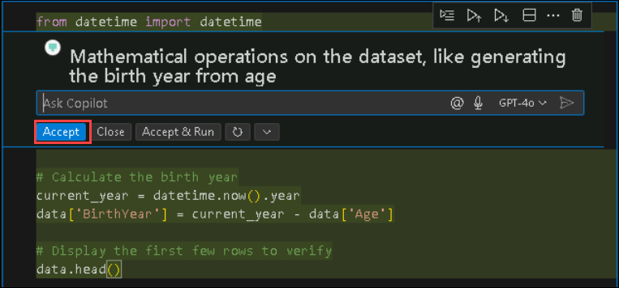

   >**Note**: Continue clicking on **+Code** after each comment till the last task of this exercise.

1. Press **`CTRL + I`** to provide statemets to Github Copilot.

   ```
   # Show the new column
   ```

   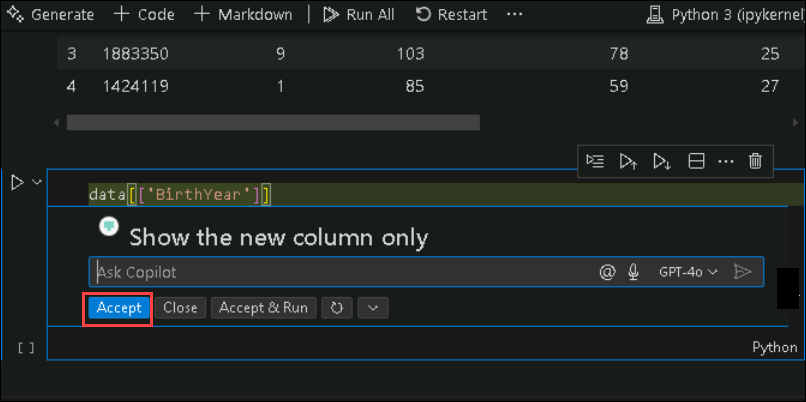
   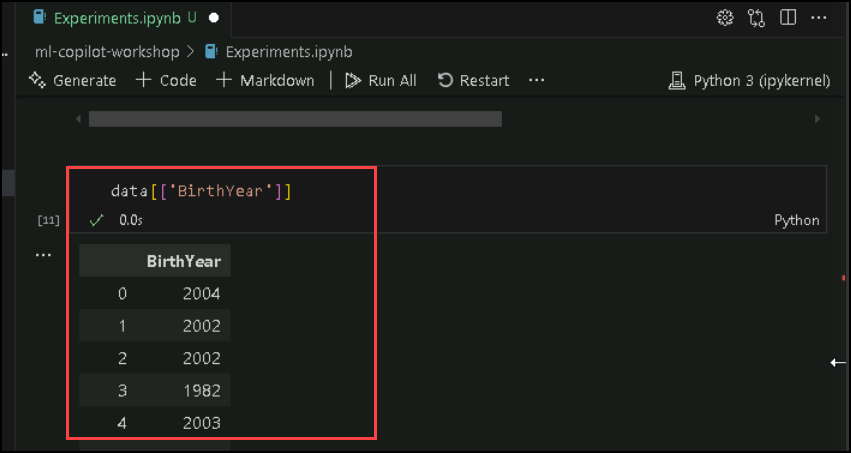

1. Press **`CTRL + I`** to provide statemets to Github Copilot.

   ```
   # Convert the BMI column to two decimal values
   ```

   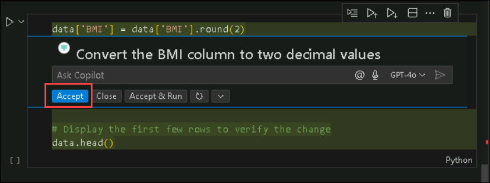

   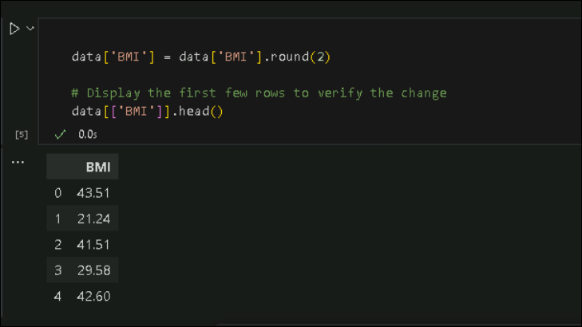

### Task 3.2: Machine Learning

   >**Note**: If the suggestion doesn't appear or if the output isn't generated as expected, press **Ctrl+I**. Paste the comments, review the suggestions, and then accept them. 

1. Press **`CTRL + I`** to provide statemets to Github Copilot. It will give a response, and you can review it , click **Accept** to accept the response.

   ```
   # Perform count, min, max, std, mean, 25%, 50%, and 75% on the dataset
   ```

   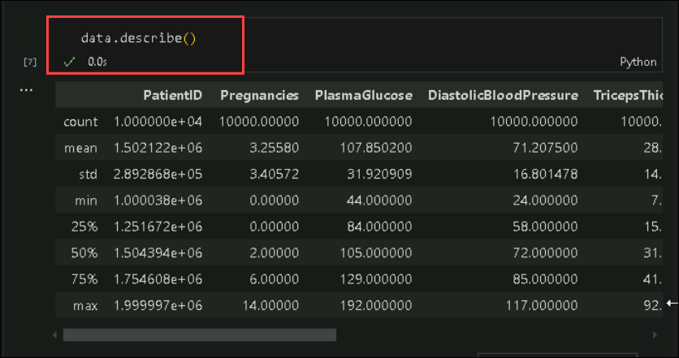

1. Before building the model, the main frame is to split the data into train tests and splits and this would be done by Copilot itself. Press **`CTRL + I`** to provide statemets to Github Copilot. It will give a response, and you can review it , click **Accept** to accept the response.

   ```
   # Split the data into training and testing data and the column name Diabetic is the target column
   ```

   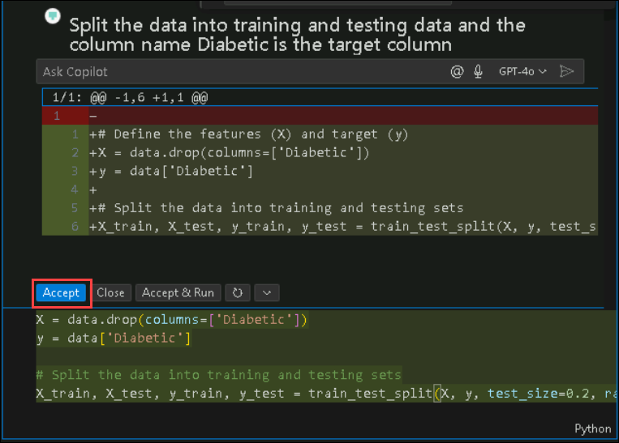

   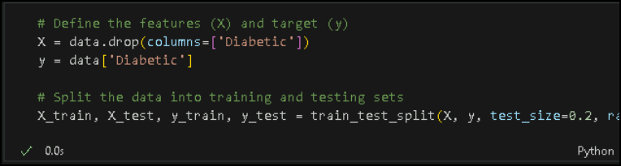


### Task 4: Data Visualization and Data Transformation

### Task 4.1: Data Visualization

   >**Note**: If the suggestion doesn't appear or if the output isn't generated as expected, press **Ctrl+I**. Paste the comments, review the suggestions, and then accept them. 

1. Press **`CTRL + I`** to provide statemets to Github Copilot. It will give a response, and you can review it , click **Accept** to accept the response.

   ```
   # Perform univariate analysis on the dataset and plot the graphs.hist
   ```

   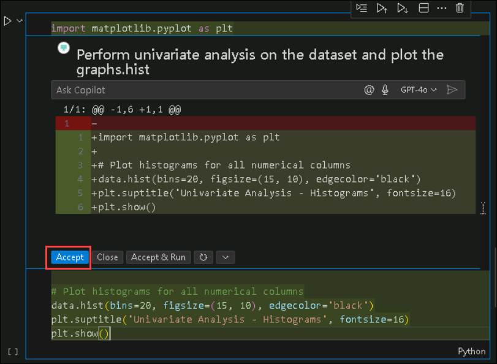

1. Once the cell run is completed, you will be getting a graphical representation output similar to the below image.

   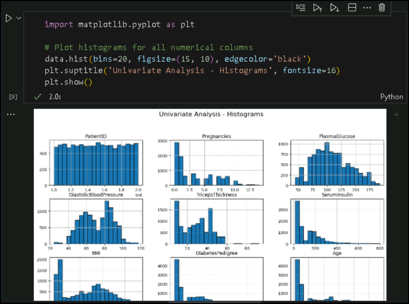

1. Now, type the below comments for specifying certain commonly used plots for visualization. Press **`CTRL + I`** to provide statemets to Github Copilot. It will give a response, and you can review it , click **Accept** to accept the response.
   ```
   # Perform scatter plot on the dataset and plot the graphs
   ```

   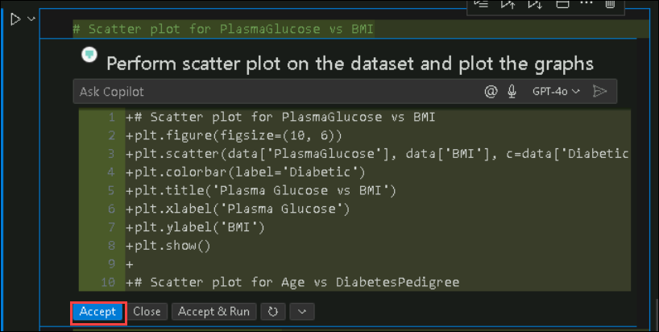

   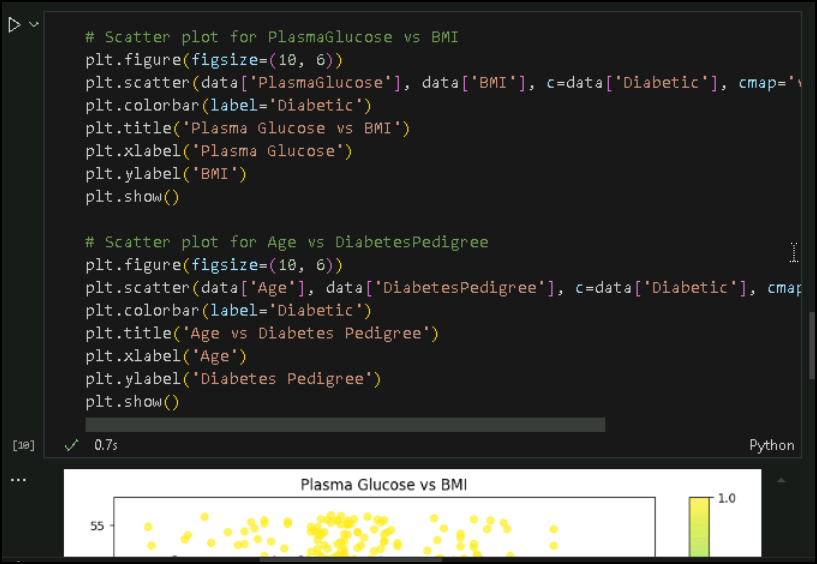

1. Press **`CTRL + I`** to provide statemets to Github Copilot. It will give a response, and you can review it , click **Accept** to accept the response.

   ```
   # Perform Joint Grid plot on the dataset and plot the graphs
   ```

   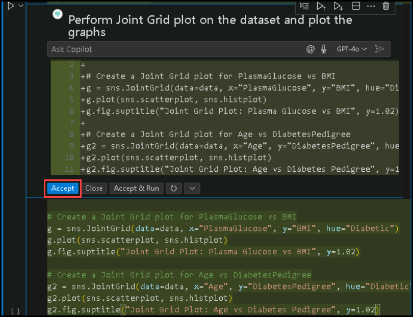

   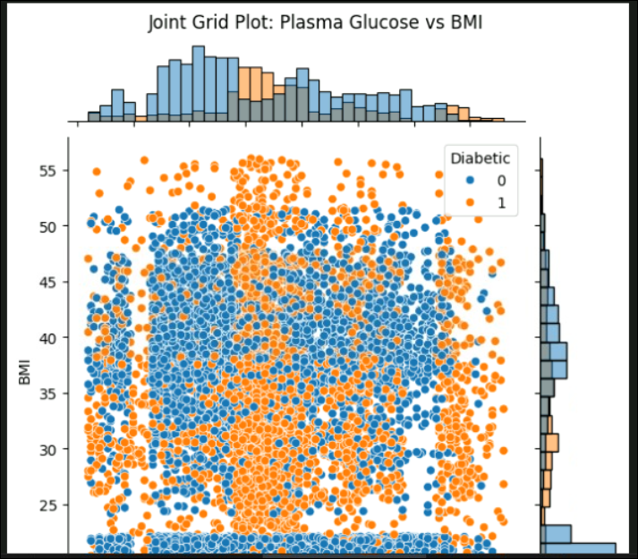

1. Press **`CTRL + I`** to provide statemets to Github Copilot. It will give a response, and you can review it , click **Accept** to accept the response.

   ```
   # Perform comparison on all features of the dataset and plot the graphs in a single plot using heatmap
   ```

   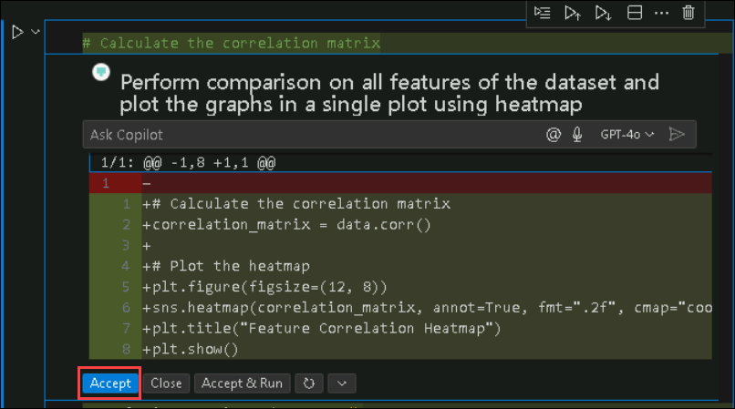

   

   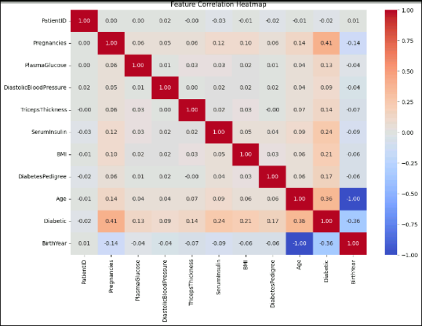


### Task 4.2: Data Transformations

   >**Note**: If the suggestion doesn't appear or if the output isn't generated as expected, press **Ctrl+I**. Paste the comments, review the suggestions, and then accept them. 

1. Press **`CTRL + I`** to provide statemets to Github Copilot. It will give a response, and you can review it , click **Accept** to accept the response.

   ```
   # Perform standardization on the data
   ```

   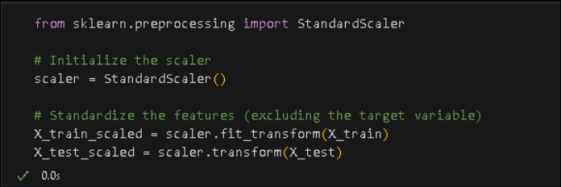


### Task 5: Training the sample model

Training a sample model using Random Forest.

   >**Note**: If the suggestion doesn't appear or if the output isn't generated as expected, press **Ctrl+I**. Paste the comments, review the suggestions, and then accept them. 

>**Note**: The model training is a continuation of the train test split step to train the model; run the train test split step first and then continue with the model building.

1. Click **+ Code** to add a new cell for creating the random forest model. Press **`CTRL + I`** to provide statemets to Github Copilot. It will give a response, and you can review it , click **Accept** to accept the response.

   ```
   # Create a random forest model with 100 trees, and the criterion is entropy
   ```

   

   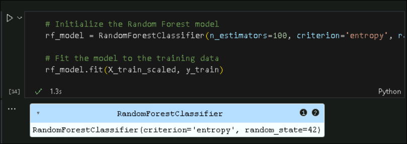

1. Click **+ Code** to add a new cell for calculating the accuracy of the model. Press **`CTRL + I`** to provide statemets to Github Copilot. It will give a response, and you can review it , click **Accept** to accept the response.

   ```
   # Calculate the accuracy of the model
   ```
   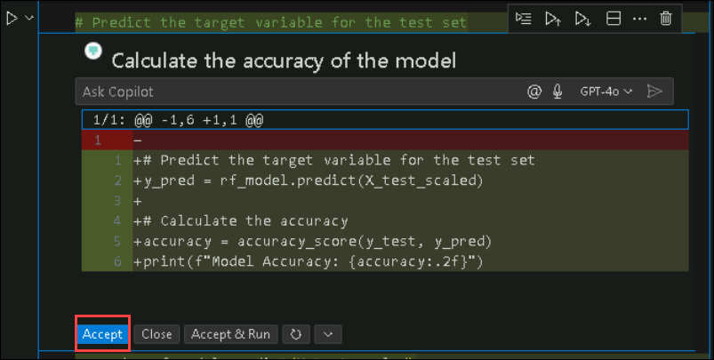

   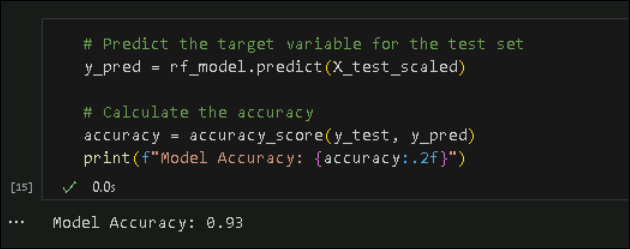


### Summary

In this exercise, you have successfully leveraged the GitHub Copilot for Machine Learning.

## You have successfully completed the lab. Click on **Next >>** to procced with next exercise.
