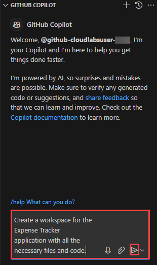
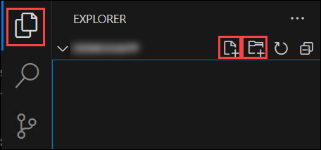
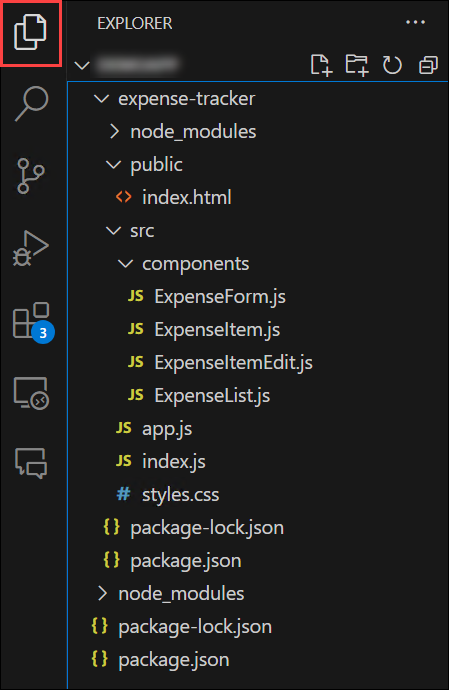
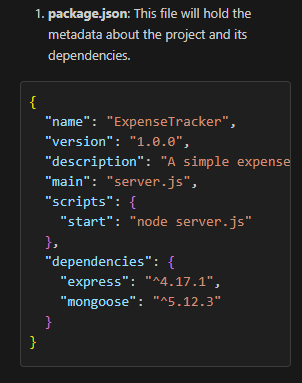
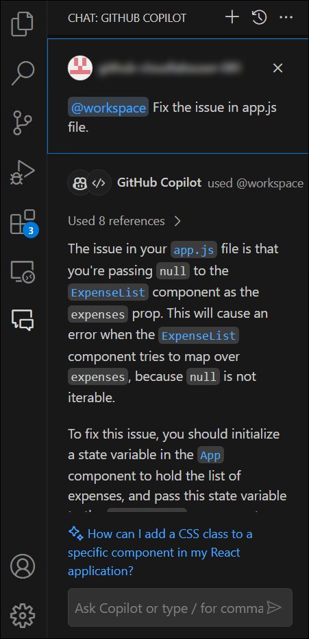
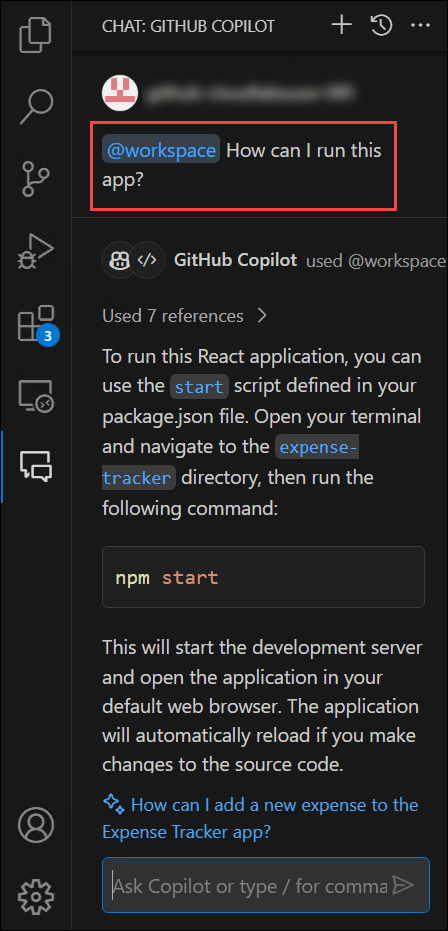
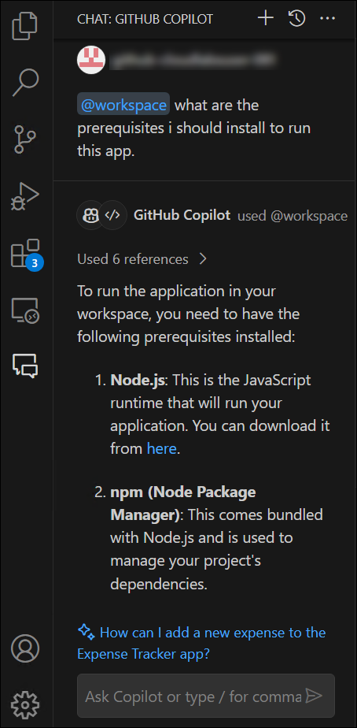
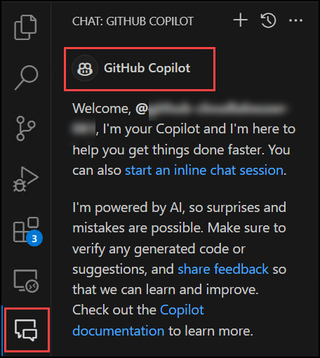
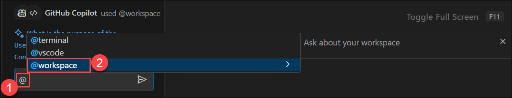
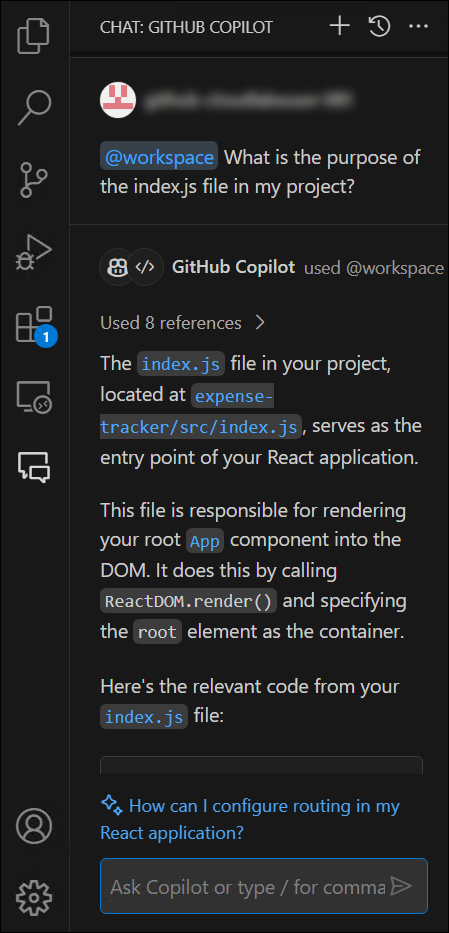

# Exercise 10: Using GitHub Copilot Workspace and File Reference [Optional]

### Estimated Duration: 30 minutes

As a software developer at **Contoso Ltd.**, a leading software development company, you are always looking for ways to enhance your coding efficiency and the overall quality of your code. After successfully exploring the basic features of **GitHub Copilot** and using it to develop and deploy an application to Azure, you now turn your focus to some of the advanced features of this AI-powered coding assistant.

In this challenge, you are specifically tasked with exploring and utilizing the three key features of the **GitHub Copilot**: the **workspace** and the **file reference**. Understanding and utilizing these features can significantly boost your productivity and efficiency in coding by providing more accurate, context-aware code suggestions.

- **GitHub Copilot Workspace:** **GitHub Copilot Workspace** is an advanced feature of **GitHub Copilot**, an AI-powered code completion tool. The workspace in GitHub Copilot refers to the current working directory where your code files reside.

   When you're coding, **GitHub Copilot** utilizes the information in your workspace to generate contextually relevant code suggestions. This means that it takes into account the specifics of your current project, such as the code files, libraries, and dependencies that are present in your workspace, to provide you with the most suitable code completions. This feature makes **GitHub Copilot** an intelligent coding assistant that not only understands the syntax and language semantics but also the context of your project, which results in more accurate and helpful code suggestions.
   By effectively using the **Workspace** feature, developers can improve their coding efficiency, reduce errors, and create higher-quality code.

- **File referencing in GitHub Copilot:** **File referencing in GitHub Copilot** refers to the AI's ability to understand and interpret the context of your project by considering the information in other files within your workspace.

   When you're working on a specific file in your codebase, **GitHub Copilot** can take into account the information, functions, classes, or variables defined in other files of your project. This means it doesn't just provide suggestions based on the current file you're working on; it can also reference other files to give you more accurate and relevant code completions. This feature is particularly useful when you're working on large projects where code is spread across multiple files. GitHub Copilot's ability to reference other files allows it to better understand the bigger picture of your project, resulting in more context-aware suggestions. This can significantly improve your coding efficiency and the overall quality of your code.

Whether you are a seasoned developer looking to enhance your coding efficiency or a beginner seeking to improve your coding skills, this lab will provide valuable insights into how **GitHub Copilot** can be a powerful tool in your coding journey. By the end of this challenge, you aim to demonstrate to **Contoso Ltd.** how these advanced features of **GitHub Copilot** can significantly enhance coding efficiency and the overall quality of code, further reinforcing the benefits of integrating AI into the development workflow. Let's get started!

>**Note:** The results produced by **GitHub Copilot** for this particular task may not precisely align with your outcomes. This discrepancy occurs because **Github Copilot** is an AI-driven tool that can yield variable outputs from time to time.


## Lab objectives

In this lab, you will complete the following tasks:

* Task 1: Utilizing the GitHub Copilot Workspace to Create a New Application Workspace
* Task 2: Utilize the Capabilities of File Referencing
  
## Task 1: Utilizing the GitHub Copilot Workspace to Create a New Application Workspace

The Github Copilot Workspace can not only provide the instructions, answers, or detailed code snippets regarding the queries you submit to it, but it can also create the complete workspace of an application from scratch. Here, you will be creating a new simple React app named **Expense Tracker** to track the expenses of the users and also modify (edit) or delete them, all with the help of the **GitHub Copilot Workspace**. You will be debugging the app using this feature itself and verifying that the app runs successfully in your local environment. To create the `Expense Tracker` app using the **GitHub Copilot workspace**, follow the below steps:

1. In the LABVM desktop, select Visual Studio Code.
   
1. Navigate back to VS Code, click on **File (1)** and click on **Open Folder (2)**.

   
   
1. Navigate to `C:\LabFiles` and select the **DemoApp** folder.

      

1. Click on **Yes, i trust the authors** when the following pop-up comes.

      
   
1. From the left pane, select the **Chat** icon. You will be provided with the **Github Copilot** welcome chat window.

    

1. Provide the prompt, `Create a workspace for the Expense Tracker application with all the necessary files and code.` and hit **Send**. 

      

      

1. Now, create the workspace for your **Expense Tracker** application by creating the required files and folders. To do so, select **Explorer** from the left pane, and choose the appropriate file or folder icons to create a new file or folder as per the workspace structure of your application.

    

1. The workspace structure for your **Expense Tracker** application would look similar to this, as per the output generated by the **GitHub Copilot Workspace**:

    

1. Scroll down in the chat to find the content that has to be pasted for the respective files.
   
    

    >**Note:** Read the output generated by the **Copilot** properly and make sure you install all the required packages if asked by the Copilot, before running your application.

1. Do the same for all the required components of your applications suggested by the **GitHub Copilot Workspace** in the **GitHub Copilot Chat**, and complete all the components.

1. Make sure to utilize the **GitHub Copilot Workspace** in case of any errors in any of the components of your application. Let's say an issue appears in the **app.js** file of your application. Then you can provide a similar prompt as given to know the reason behind the error and use the advanced capabilities of the **GitHub Copilot Workspace** to rectify the error: `@workspace. Fix the issue in the app.js file.`

    >**Note:** Make sure you use the **@workspace** command in the chatbox to utilize the workspace feature so that it can analyze the whole workspace files and directories of your application and provide you with the best resolution for the error that doesn't conflict with any other component.

1. You will get an output similar to this:

    

    Go through the response and resolve the errors using the steps provided in it.

1. Now, when all the errors have been fixed, you can ask Copilot how to run your application by prompting `@workspace. How can I run this app?` and submitting it.

    Follow the steps provided by it and run your application.

    

1. You can also check if all the pre-requisites required to run your **Expense Tracker** app are already in place by providing the Copilot with the prompt `@workspace. What are the prerequisites I should install to run this app?`

    

    Closely review the response generated by the **GitHub Copilot** using its workspace feature and make sure that all these prerequisites are installed. If not, install them using the steps mentioned in your answer.

1. Run the application, and it will open in your **Edge** browser as below:

    

## Task 2: Utilize the Capabilities of File Referencing

**File Referencing in GitHub Copilot** refers to the AI's ability to understand and interpret the context of your project by considering the information in other files within your workspace.

When you're working on a specific file in your codebase, **GitHub Copilot** can take into account the information, functions, classes, or variables defined in other files of your project. This means it doesn't just provide suggestions based on the current file you're working on; it can also reference other files to give you more accurate and relevant code completions. This feature is particularly useful when you're working on large projects where code is spread across multiple files. **GitHub Copilot's** ability to reference other files allows it to better understand the bigger picture of your project, resulting in more context-aware suggestions. This can significantly improve your coding efficiency and the overall quality of your code.

In this task, you will be utilizing the **GitHub Copilot File Referencing** capability to enhance coding efficiency by providing contextually relevant code suggestions. To use the File Referencing feature, follow the below steps:

1. From the left pane, select the **Chat** icon. You will be provided with the **GitHub Copilot** welcome chat window.

    

1. In the textbox, enter **@** **(1)** and select **Workspace** **(2)** to activate the **GitHub Copilot Workspace** agent. You need this agent to analyze your whole workspace so that it can provide accurate answers and the related code blocks by referencing the correct files.

    

1. Now, you can use the following prompt to understand how the file referencing feature works in **GitHub Copilot**. It can accurately provide the answer for the file to which you refer: `What is the purpose of the index.js file in my project?`

    The **GitHub Copilot** will make reference to the information, functions, classes, or variables defined in the file you asked the question about and will provide you with a detailed explanation of what is in the **index.js**. Not just the explanation; it will also provide you with the related code accompanied by the answer, referenced in the provided file.

    The **GitHub Copilot** also automatically references the additional files in your project that may be required to provide you with the best answer. To get information about those files, select **Used n references** (where **n** is the total number of files referenced from your current project) present at the start of the answer and see all the files that **GitHub Copilot** referenced to provide you with the answer.

    

    Some more prompts that you can provide to understand the feature of file referencing are:

    ```
    @workspace What does the ExpenseList.js file do in my application?
    ```
    ```
    @workspace What is the purpose of the app.js file in my project?
    ```
    ```
    @workspace How can I change the CSS for my application?
    ```

## Review

In this lab, you have used GitHub Copilot to create an application workspace with file referencing.

## You have successfully completed the lab
