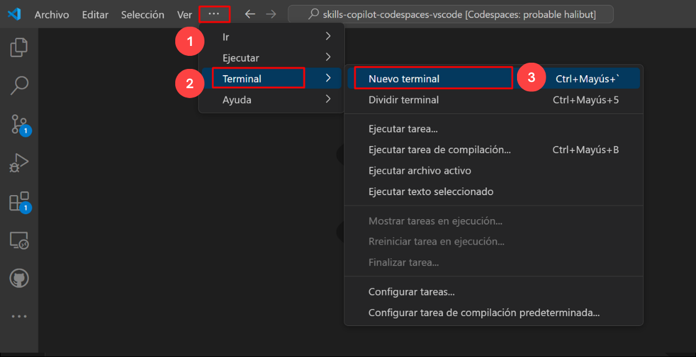

# Exercise 10: Trabajar con Copilot para Machine Learning [Opcional]

### Duración Estimada: 30 minutos

Trabajar con Copilot para machine learning implica aprovechar GitHub Copilot, una herramienta de completado de código impulsada por IA desarrollada por GitHub en colaboración con OpenAI. A continuación, se incluye un breve resumen de los pasos y consideraciones clave:

Instalación: Asegúrese de tener GitHub Copilot instalado como una extensión en su entorno de desarrollo integrado (IDE), como Visual Studio Code.

Integración con GitHub: Vincule su IDE a su cuenta de GitHub para permitir una integración perfecta. Esto permite que Copilot acceda a sus repositorios de código y proporcione sugerencias en función del contexto.

Frameworks de Machine Learning: Copilot es compatible con varias bibliotecas y frameworks de machine learning como TensorFlow, PyTorch, scikit-learn y más. Puede ayudar con la generación de código para tareas como el preprocesamiento de datos, la creación de modelos y la evaluación.

En este ejercicio, clonará el repositorio de Git con el dataset requerido en su entorno. Aquí, trabajará con Copilot para Machine Learning, que implica aprovechar GitHub Copilot.

>**Descargo de responsabilidad**: GitHub Copilot sugerirá automáticamente todo el cuerpo de una función o código en texto gris. A continuación, se muestran ejemplos de lo que probablemente verá en este ejercicio, pero la sugerencia exacta puede variar.

>**Nota**: Antes de continuar con el ejercicio, asegúrese de haber instalado los paquetes Python y pip.

>**Nota**: Si no puede ver ninguna sugerencia de GitHub Copilot en VS Code, reinicie VS Code una vez e intente nuevamente.

## Objetivos del laboratorio

Será capaz de completar las siguientes tareas:

- Tarea 1: Requisitos previos e Inyección del Dataset Requerido en su Entorno
- Tarea 2: Autocompletado de Código con Diferentes Experimentos
- Tarea 3: Machine Learning y Aprendizaje Matemático con Diferentes Ejemplos
- Tarea 4: Visualización y Transformación de Datos
- Tarea 5: Entrenamiento del modelo de ejemplo

### Tarea 1: Requisitos previos e Inyección del Dataset Requerido en su Entorno

1. Abra la Terminal de VS Code haciendo clic en los **Puntos suspensivos (...)** **(1)**, seleccionando **Terminal** **(2)** y haciendo clic en **Nuevo terminal** **(3)**.

   

1. Clone el siguiente repositorio git en su entorno.

   ```
   git clone https://github.com/CloudLabsAI-Azure/ml-copilot-workshop.git
   ```

1. Cambie el directorio en la terminal ejecutando el siguiente comando:

   ```
   cd ml-copilot-workshop
   ```

1. Para instalar todas las dependencias de Python requeridas en su entorno antes de trabajar con Copilot, ejecute el siguiente comando en su terminal:

   ```
   pip install -r requirements.txt
   ```

### Tarea 2: Autocompletado de Código con Diferentes Experimentos

1. Desde la ventana Explorador de VS Code, haga clic derecho en la carpeta llamada **ml-copilot-workshop** **(1)** y haga clic en **Nuevo archivo**. Nombre el archivo `Experiments.ipynb` **(2)** y verifique que su nuevo archivo se vea como se muestra a continuación:

   

1. Escriba los comentarios mostrados a continuación para importar todas las bibliotecas donde Copilot solicita automáticamente todas las librerías; presione "Enter" para pasar a la siguiente línea y revisar la sugerencia, presione "Tab" y haga clic en el botón **Ejecutar (Run)** para ejecutar la celda.

   ```
   # Import libraries with respect to loading data and creating a random forest model
   import pandas as pd
   ```

   

1. Acepte todas las sugerencias para importar las bibliotecas como se muestra en la siguiente captura de pantalla **(1)** y haga clic en el botón **Ejecutar** **(2)** para ejecutar la celda. Haga clic en `+ Código` **(3)** para agregar la nueva celda.

   

   >**Nota**: Mientras ejecuta la celda, es posible que deba instalar los paquetes necesarios y seleccionar el kernel.

1. Escriba los comentarios mostrados a continuación para cargar los datos utilizando el prompt de Copilot. Presione "Enter" para pasar a la siguiente línea y revisar la sugerencia, y presione "Tab" para aceptar la sugerencia y haga clic en el botón **Ejecutar** para ejecutar la celda.

   ```
   # Load the data from a csv file, and the name of the file is diabetes.csv
   ```

    

1. Ahora haga clic en **+ Código** y pase a la siguiente tarea.

   
### Tarea 3: Machine Learning y Aprendizaje Matemático con Diferentes Ejemplos

### Tarea 3.1: Operaciones matemáticas

1. Escriba los comentarios mostrados a continuación para realizar el primer experimento matemático que sería generar el año de nacimiento a partir de la columna de edad presente en el conjunto de datos. Presione "Enter" para pasar a la siguiente línea y revisar la sugerencia, y presione "Tab" para aceptar la sugerencia y haga clic en el botón **Ejecutar** para ejecutar la celda.

   ```
   # Mathematical operations on the dataset, like generating the birth year from age
   ```

   

   >**Nota**: Continúe haciendo clic en **+Código** después de cada comentario hasta la última tarea de este ejercicio.

1. Escriba el siguiente comentario. Presione "Enter" para pasar a la siguiente línea y revisar la sugerencia, y presione "Tab" para aceptar la sugerencia y haga clic en el botón **Ejecutar** para ejecutar la celda.

   ```
   # Show the new column
   ```

   

1. Escriba los comentarios mostrados a continuación para convertir la columna de BMI a dos valores decimales, presione "Tab". Presione "Enter" para pasar a la siguiente línea y revisar la sugerencia, y presione "Tab" para aceptar la sugerencia, haga clic en el botón **Ejecutar** para ejecutar la celda.

   ```
   # Convert the BMI column to two decimal values
   ```

   

1. En la misma celda de código, escriba el comentario mostrado a continuación. Presione "Enter" para pasar a la siguiente línea y revisar la sugerencia, y presione "Tab" para aceptar la sugerencia y haga clic en el botón **Ejecutar** para ejecutar la celda.

   ```
   # Show the new column only
   ```

   


### Tarea 3.2: Machine Learning

1. Escriba los siguientes comentarios para realizar el análisis de datos y el resumen estadístico del conjunto de datos. Presione "Enter" para pasar a la siguiente línea y revisar la sugerencia, y presione "Tab" para aceptar la sugerencia y haga clic en el botón **Ejecutar** para ejecutar la celda.

   ```
   # Perform count, min, max, std, mean, 25%, 50%, and 75% on the dataset
   ```

   

1. Una vez que se complete la ejecución de la celda, obtendrá un resultado similar al de la siguiente imagen.

   

1. Antes de construir el modelo, el marco principal es dividir los datos en pruebas de entrenamiento y validación, y esto lo haría el propio Copilot. Escriba los siguientes comentarios. Presione "Enter" para pasar a la siguiente línea y revisar la sugerencia, y presione "Tab" para aceptar la sugerencia y haga clic en el botón **Ejecutar** para ejecutar la celda.

   ```
   # Split the data into training and testing data and the column name Diabetic is the target column
   ```

   

   


### Tarea 4: Visualización y Transformación de Datos

### Tarea 4.1: Visualización de Datos

1. Haga clic en **+ Código** para abrir la nueva celda y escriba los siguientes comentarios para realizar las operaciones básicas en el conjunto de datos. Presione "Enter" para pasar a la siguiente línea y revisar la sugerencia, y presione "Tab" para aceptar la sugerencia y haga clic en el botón **Ejecutar** para ejecutar la celda.

   ```
   # Perform univariate analysis on the dataset and plot the graphs
   ```

   

1. Una vez finalizada la ejecución de la celda, obtendrá una representación gráfica de salida similar a la siguiente imagen.

   

1. Ahora, escriba los siguientes comentarios para especificar ciertos gráficos de uso común para la visualización. Presione "Enter" para ir a la siguiente línea y revise la sugerencia, y presione "Tab" para aceptar la sugerencia y haga click en el botón **Ejecutar** para obtener la salida como se muestra en la siguiente imagen.

   ```
   # Perform scatter plot on the dataset and plot the graphs
   ```

   

1. Escriba los siguientes comentarios para realizar un gráfico conjunto (Joint) o cuadrícula (Grid) (gráficos poco utilizados) para la visualización. Presione "Enter" para pasar a la siguiente línea y revisar la sugerencia, y presione "Tab" para aceptar la sugerencia y haga clic en el botón **Ejecutar** para obtener el resultado como se muestra en la siguiente imagen.

   ```
   # Perform Joint Grid plot on the dataset and plot the graphs
   ```

   

   

1. Escriba los siguientes comentarios para realizar la visualización de todas las características del conjunto de datos. Presione "Enter" para pasar a la siguiente línea y revisar la sugerencia, y presione "Tab" para aceptar la sugerencia y haga clic en el botón **Ejecutar** para obtener el resultado como se muestra en la siguiente imagen.

   ```
   # Perform comparison on all features of the dataset and plot the graphs in a single plot using heatmap
   ```

   

   


### Tarea 4.2: Transformaciones de Datos


1. Haga clic en **+ Código** para agregar una nueva celda y escriba los comentarios siguientes para la Estandarización, que es el proceso de escalar y centrar las características numéricas para que tengan una media de 0 y una desviación estándar de 1, haciéndolas comparables y adecuadas para ciertos algoritmos. Presione "Enter" para pasar a la siguiente línea y revisar la sugerencia, y presione "Tab" para aceptar la sugerencia y haga clic en el botón **Ejecutar**

   ```
   # Perform standardization on the data
   ```

   

   

1. Obtendrá el resultado que se muestra en la siguiente imagen una vez que la celda de código termine de ejecutarse.

   


### Tarea 5: Entrenamiento del modelo de ejemplo

Entrenamiento de un modelo de ejemplo utilizando Random Forest.

>**Nota**: El entrenamiento del modelo es una continuación del paso de división en entrenamiento y validación para entrenar el modelo; ejecute primero el paso de división en entrenamiento y validación y luego continúe con la construcción del modelo.

1. Haga clic en **+ Código** para agregar una nueva celda y escriba los siguientes comentarios para crear el modelo de bosque aleatorio (random forest). Presione "Enter" para pasar a la siguiente línea y revisar la sugerencia, y presione "Tab" para aceptar la sugerencia y haga clic en el botón **Ejecutar**.

   ```
   # Create a random forest model with 100 trees, and the criterion is entropy
   ```

   

   

   

1. En una nueva celda, escriba los siguientes comentarios a continuación para calcular la precisión del modelo. Presione "Enter" para pasar a la siguiente línea y revisar la sugerencia, y presione "Tab" para aceptar la sugerencia y haga clic en el botón **Ejecutar**

   ```
   # Calculate the accuracy of the model
   ```

   

### Resumen

En este ejercicio, ha aprovechado con éxito GitHub Copilot para Machine Learning.

### Ha completado el laboratorio con éxito
