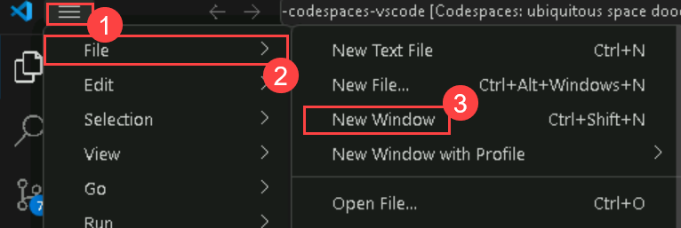

# Exercise 11: Creating a Mini Game with GitHub Copilot [Optional]

### Estimated Duration : 20 minutes

In this exercise, you will utilize the capabilities of GitHub Copilot to construct a classic rock, paper, scissors minigame. Through this practical engagement, you'll not only refine your programming expertise but also bolster your proficiency in crafting console applications using Python.

## Lab objectives

You will be able to complete the following tasks:

- Task 1: Testing your GitHub Codespace
- Task 2: Creating the game logic

### Task 1: Testing your GitHub Codespace

1. Click on the Three horizontal line in the top left corner **(1)**, click **File (2)** and then click on **New Window (3)**.

   

1. Click on the **ellipsis (1)** on the top, click on **Terminal (2)** and select **New Terminal (3)**.

     

1. Run the following command to clone the **Mii-game-with-copilot** repository.

   ```
   git clone https://github.com/MicrosoftDocs/mslearn-challenge-project-create-mini-game-with-copilot.git
   ```


1. Open the **app.py** file.

   

1. Paste the following comment and click on **Enter** and verify the next comment is generated by **Github Copilot**.

   ```
   # write 'hello world' to the console
   ```

   
   
      >**Note:** In cases where the code isn't generated by **Github Copilot**, click on **Extensions**, search for Github Copilot, select it and click on **Install in Codespaces: opulent space eureka**.

      

1. Click on **Save**.
   
1. Click on **Terminal (1)** and select **New Terminal (2)**.

   

1. Run the application with the **python app.py** command in the terminal and check if the result is similar to the following console message:

   


### Task 3: Creating the game logic

1. Delete the code generated in the previous step and then use the shortcut CTRL + I to prompt GitHub Copilot to perform an action. Paste the following **comment (1)** to fetch the code and click on Make request **(Enter) (2)** button and click on **Accept (3)** to use the code.
   
   ```
    The player can choose rock, paper, or scissors, and invalid inputs are handled gracefully. After each round, display whether the player won, lost, or tied. Allow the player to play again after each round and display their score at the end of the game. Inputs are converted to lowercase for consistency.
   ```

   

      >**Note:** However, it is to be noted that the suggestions provided by GitHub Copilot may vary and at times may be irrelevant and require a clear understanding of the python code and its usage.

1. Click on **Save**.

1. Run the application with the **python app.py** command in the terminal.

   

### Summary

In this exercise, you have successfully created a minigame using Python and Github Copilot.

### You have successfully completed the lab.