# Exercise 11: Creating a Mini Game with GitHub Copilot [Optional]

### Estimated Duration : 20 minutes

In this exercise, you will utilize the capabilities of GitHub Copilot to construct a classic rock, paper, scissors minigame. Through this practical engagement, you'll not only refine your programming expertise but also bolster your proficiency in crafting console applications using Python.

## Lab objectives

You will be able to complete the following tasks:

- Task 1: Setting up your environment
- Task 2: Testing your GitHub Codespace
- Task 3: Creating the game logic

### Task 1: Setting up your environment

1. Navigate to [Mini-game-with-copilot](https://github.com/MicrosoftDocs/mslearn-challenge-project-create-mini-game-with-copilot) and click on **Fork**.

   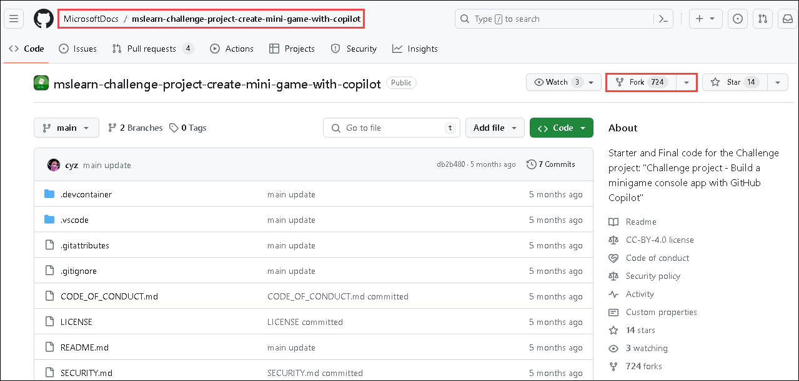

1. Click on **Create Fork**.

   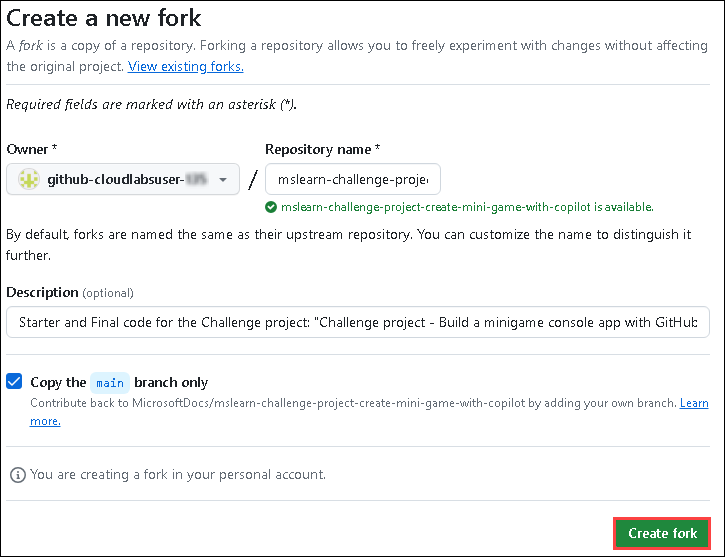

      >**Note:**  In the absence of an existing repository, skip to the next step.

      >**Note:** If you receive the pop-up **The Repository already exists**, please delete the existing one and perform the above step again. To delete the existing repository, follow the below steps:

      >- Navigate to the existing repository that must be deleted:

      
   
      
      
      >- Click on **Settings**.

     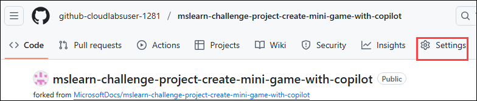

      >- Scroll down to the **Danger Zone** pane and click on **Delete this repository**.

      

      >- Click on **I want to delete this repository**. 

      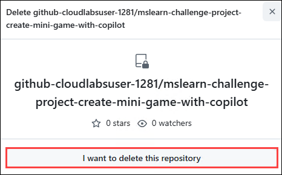

      >- Cick on **I have read and understand these effects** to accept that you have read and understood the effects.  

      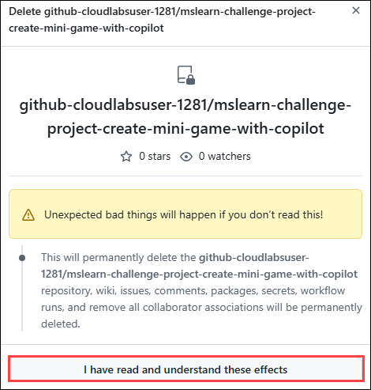

      >- Give the name of the repository and click on **Delete this repository**.

     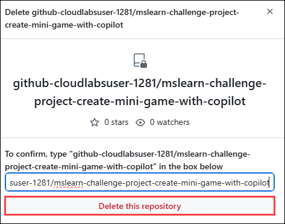

      > **Note:** Once the existing repository has been deleted, please repeat the step-02.
      
1. Once the repository is forked, select the **Code (1)** button and, in the **Codespaces** tab, select **Create codespace on main (2)**.

   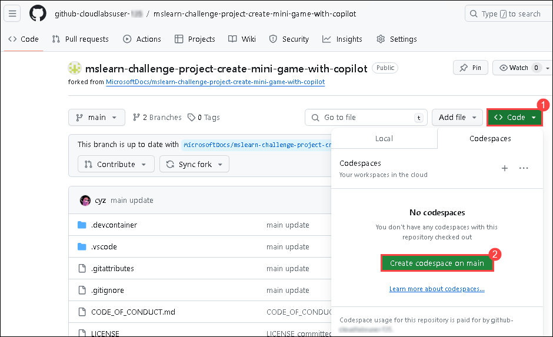

      >**Note**: In case you encounter a pop-up prompt. Click **Open** to proceed.

      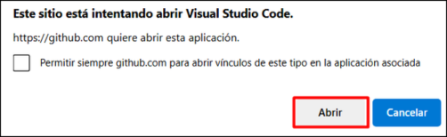

1. Click on **Open** when prompted to allow Github Codespaces Extension.

   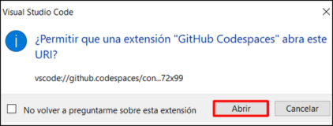
   
1. View the repository.

   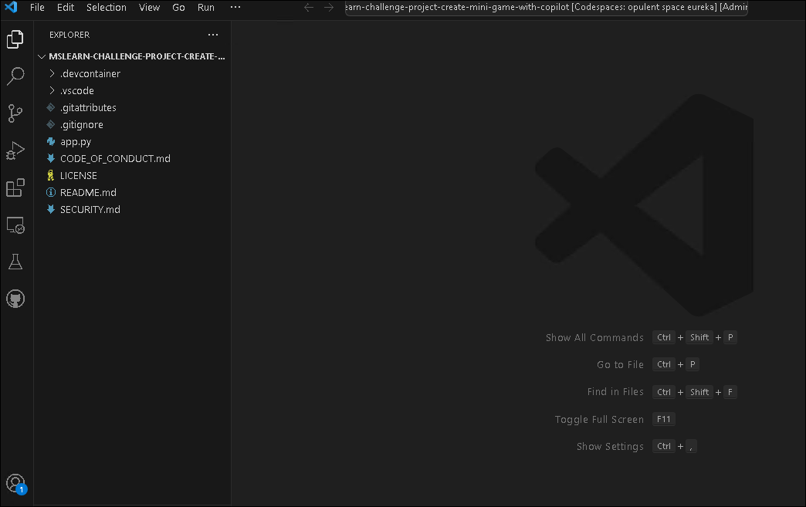

### Task 2: Testing your GitHub Codespace

1. Open the **app.py** file.

   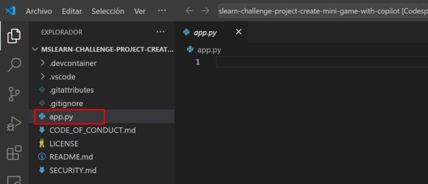

1. Paste the following comment and click on **Enter** and verify the next comment is generated by **Github Copilot**.

   ```
   # write 'hello world' to the console
   ```

   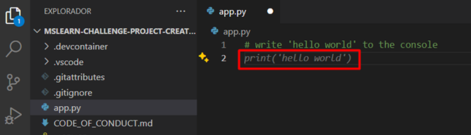
   
      >**Note:** In cases where the code isn't generated by **Github Copilot**, click on **Extensions**, search for Github Copilot, select it and click on **Install in Codespaces: opulent space eureka**.

      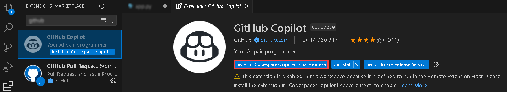

1. Click on **Save**.
   
1. Click on **Terminal (1)** and select **New Terminal (2)**.

   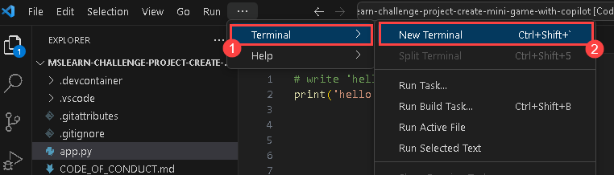

1. Run the application with the **python app.py** command in the terminal and check if the result is similar to the following console message:

   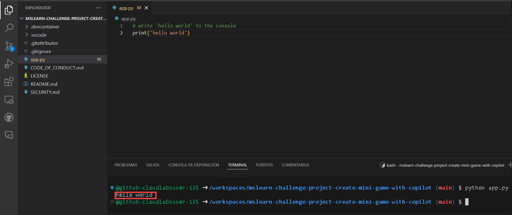


### Task 3: Creating the game logic

1. Delete the code generated in the previous step and then use the shortcut CTRL + I to prompt GitHub Copilot to perform an action. Paste the following **comment (1)** to fetch the code and click on Make request **(Enter) (2)** button and click on **Accept (3)** to use the code.
   
   ```
    The player can choose rock, paper, or scissors, and invalid inputs are handled gracefully. After each round, display whether the player won, lost, or tied. Allow the player to play again after each round and display their score at the end of the game. Inputs are converted to lowercase for consistency.
   ```

   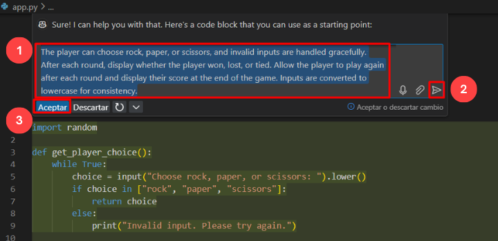

      >**Note:** However, it is to be noted that the suggestions provided by GitHub Copilot may vary and at times may be irrelevant and require a clear understanding of the python code and its usage.

1. Click on **Save**.

1. Run the application with the **python app.py** command in the terminal.

   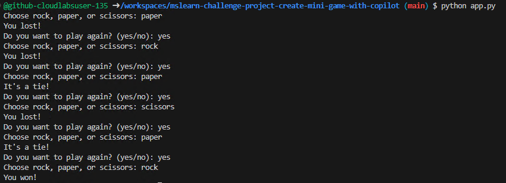

### Summary

In this exercise, you have successfully created a minigame using Python and Github Copilot.

### You have successfully completed the lab.
