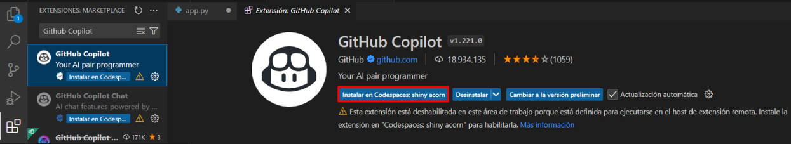
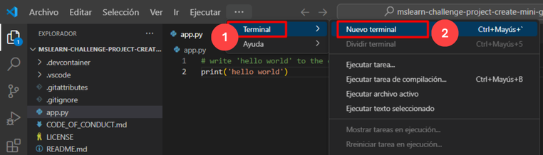

# Ejercicio 11: Crear un Minijuego con GitHub Copilot [Opcional]

### Duración Estimada: 20 minutos

En este ejercicio, utilizará las capacidades de GitHub Copilot para construir un clásico minijuego de piedra, papel o tijera. A través de este ejercicio práctico, no solo perfeccionará sus conocimientos de programación, sino que también reforzará su destreza en la creación de aplicaciones de consola con Python.

## Objetivos del laboratorio

Será capaz de completar las siguientes tareas:

- Tarea 1: Configurar su entorno
- Tarea 2: Probar su GitHub Codespace
- Tarea 3: Crear la lógica del juego

### Tarea 1: Configurar su entorno

1. Navegue hasta [Mini-game-with-copilot](https://github.com/MicrosoftDocs/mslearn-challenge-project-create-mini-game-with-copilot) y haga clic en **Fork**.

   

1. Haga clic en **Create fork**.

   

1. Una vez bifurcado el repositorio, seleccione el botón **Code (1)** y, en la pestaña **Codespaces**, seleccione **Create codespace on main (2)**.

   

      >**Nota**: En caso de que aparezca un mensaje emergente. Haga clic en **Abrir** para continuar.

      

1. Haga clic en **Abrir** cuando se le solicite que permita la extensión Github Codespaces.

   
   
1. Observe el repositorio.

   

### Tarea 2: Probar su GitHub Codespace

1. Abra el archivo **app.py**.

   

1. Pegue el siguiente comentario y haga clic en **Enter** y verifique que el próximo comentario sea generado por **GitHub Copilot**.

   ```
   # write 'hello world' to the console
   ```

   
   
      >**Nota:** En los casos en que el código no sea generado por **GitHub Copilot**, haga clic en **Extensiones**, busque GitHub Copilot, selecciónelo y haga clic en **Instalar en Codespaces:**.

      

1. Haga clic en **Guardar**.
   
1. Haga clic en **Terminal (1)** y seleccione **Nuevo Terminal (2)**.

   

1. Ejecute la aplicación con el comando **python app.py** en la terminal y compruebe si el resultado es similar al siguiente mensaje de consola:

   


### Tarea 3: Crear la lógica del juego

1. Elimine el código generado en el paso anterior y luego use el atajo CTRL + I para solicitar a GitHub Copilot que realice una acción. Pegue el siguiente **comentario (1)** para obtener el código y haga clic en el botón Realizar solicitud **(Enter) (2)** y haga clic en **Aceptar (3)** para utilizar el código.
   
   ```
    The player can choose rock, paper, or scissors, and invalid inputs are handled gracefully. After each round, display whether the player won, lost, or tied. Allow the player to play again after each round and display their score at the end of the game. Inputs are converted to lowercase for consistency.
   ```

   

      >**Nota:** Sin embargo, es importante tener en cuenta que las sugerencias proporcionadas por GitHub Copilot pueden variar y, en ocasiones, pueden ser irrelevantes y requerir una comprensión clara del código de Python y su uso.

1. Haga clic en **Guardar**.

1. Ejecute la aplicación con el comando **python app.py** en la terminal.

   

### Resumen

En este ejercicio, ha creado con éxito un minijuego usando Python y GitHub Copilot.

### Ha completado el laboratorio con éxito
