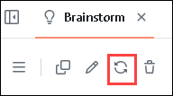

# Exercise-12: Prepare a Weather WebApp using GitHub Copilot Workspace

## Overview
This lab explores GitHub Copilot Workspace, a cutting-edge, AI-enhanced development environment integrated with GitHub Copilot, designed to boost productivity for teams. You will experience how the workspace combines AI-assisted code suggestions with advanced tools for context sharing, debugging, and seamless collaboration within software projects. By leveraging agentic AI, one of the most exciting advancements in generative AI, the workspace transforms everyday development tasks into more efficient and intelligent workflows. The lab will demonstrate how this dynamic environment redefines team-based software development, aligning with the latest innovations in the GenAI space.

## Lab Objectives

- Task 1: Brainstorm and generate a plan using Copilot Workspace
- Task 2: Run the Application

### Task 1: Brainstorm and generate a plan using Copilot Workspace

1. Navigate to [Copilot Workspace](https://copilot-workspace.githubnext.com/).

1. Click on **Sign in with GitHub**.

      

1. Provide the GitHub credentials from the **Licenses** tab under the **Environment** pane.

1. Click on **Authorize**.

1. Click on **Create new repository** under **Start New Session**.

      

1. Provide the below **prompt (1)** in the Write section and click on **Brainstorm (2)**

   ```
   Create a file that represents Weather App displaying current weather conditions, forecasts and alerts for a specified location using a weather API
   ```

      

1. Review the brainstormed ideas.

      

      > **Note**: You can click on **Regenerate** to modify the response.

      

1. Click on **Add task** which you feel is the most suitable for you. You can observe how the task is added.

      

      

1. Scroll down to discover additional suggested questions to enhance your understanding of the solution.

      

1. Click on the **Generate plan (1)** dropdown and select **Generate code (2)** to generate a detailed plan along with the associated commands to be used.

      

      > **Note**: Alternatively, you can click on Generate plan and click on **Implement selected files (1)** to generate the code based on the plan. **View (2)** the files.

      

1. Review the code.

      

1. Click on **Create repository** from the top right.

      

1. Provide the name of the repository as **weather-app (1)** and click on **Create repository (2)**.

      

### Task 2: Run the Application

1. Click on the **Weather App** from the top left. It will load the repository and the files that were created.

      

1. Click on **Code (1)** and select **+ Codespace (2)**.

      

1. You will encounter a pop-up prompt. Click **Open** to proceed. Subsequently, another pop-up window will appear within Visual Studio Code (VS Code), where you should select **Install Extension and Open URI** to continue.

   

   

    >**Note**: Click on **Allow** if the extension **Github Codepsaces** wants to sign in using Github.

     

1. 
