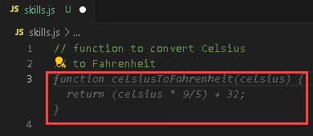
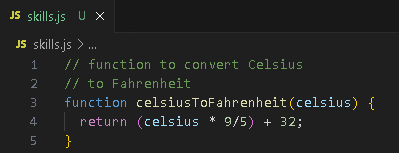
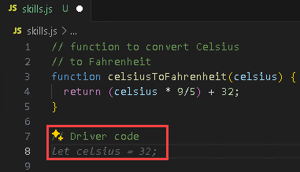
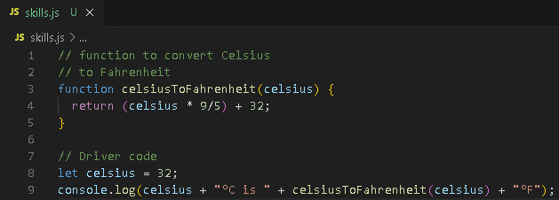
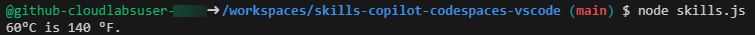
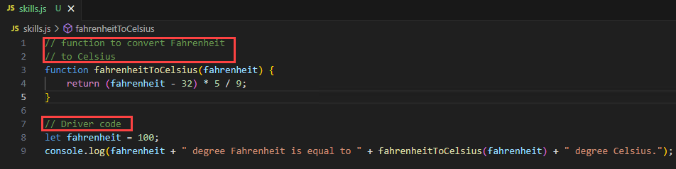
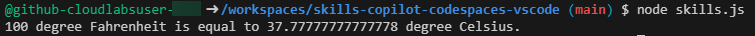

# Exercise 2: Exploring AI-Driven Code Suggestions in JavaScript

### Estimated Duration: 20 minutes

While GitHub Copilot offers recommendations for many languages and frameworks, it excels in particular when it comes to Python, JavaScript, TypeScript, Ruby, Go, C#, and C++. The samples below are in JavaScript, but they should also work in other languages.

In this lab, you will have the opportunity to experiment with and apply JavaScript with the assistance of GitHub Copilot and GitHub Copilot Chat.

>**Disclaimer**: A whole function body will be automatically suggested by GitHub Copilot in gray text. Here's an example of what you are likely to see; however, the precise recommendation could vary.

## Lab objectives

In this lab, you will complete the following tasks:

- Task 1: Add a JavaScript file and start writing code

## Task 1: Add a JavaScript file and start writing code

1. In the LABVM desktop, select Visual Studio Code.
 
1. From the VS Code Explorer window, create a New File.

   

1. Name the file `skills.js` and verify your new file looks as shown below:

   

1. In the `skills.js` file, type the following function header:

   ```
   // function to covert Celsius
   // to Fahrenheit
   ```
   
   > **Note**: A whole function body will be automatically suggested by GitHub Copilot in gray text. Here's an example of what you are likely to see; however, the precise recommendation could vary.

   

1. Press `Tab` to accept the suggestion.

   

1. In the next line, type the following:

   ```
   // Driver code
   ```
   

1. Press `Tab` to accept the suggestion  and then press `Ctrl + S` to save the file.

      

     > **Note**: However, it should be noted that the suggestions from GitHub Copilot may vary, necessitating a clear understanding of the Javascript code and its usage.

1. Click on the **ellipsis (1)** on the top, click on **Terminal (2)** and select **New Terminal (3)**.

        
   
1. Run the application with the `node skills.js` command in the terminal and verify the output has been generated.

   

    >**Note**: You can also try the same commands to convert from Fahrenheit to Celsius as shown below:

     

     

   >**Note**: Wait about 60 seconds, then refresh your GitHub repository landing page for the next step.

   > **Congratulations** on completing the task! Now, it's time to validate it. Here are the steps:
   > - Hit the Validate button for the corresponding task. If you receive a success message, you can proceed to the next task.
   > - If not, carefully read the error message and retry the step, following the instructions in the lab guide. 
   > - If you need any assistance, please contact us at cloudlabs-support@spektrasystems.com. We are available 24/7 to help you out.

   <validation step="1a33c3e3-22e0-493a-a18e-ad9b1ec77e00" />

## Review
In this lab, you have effectively created JavaScript code and pushed it from the production branch to the main branch.

## You have successfully completed the lab
