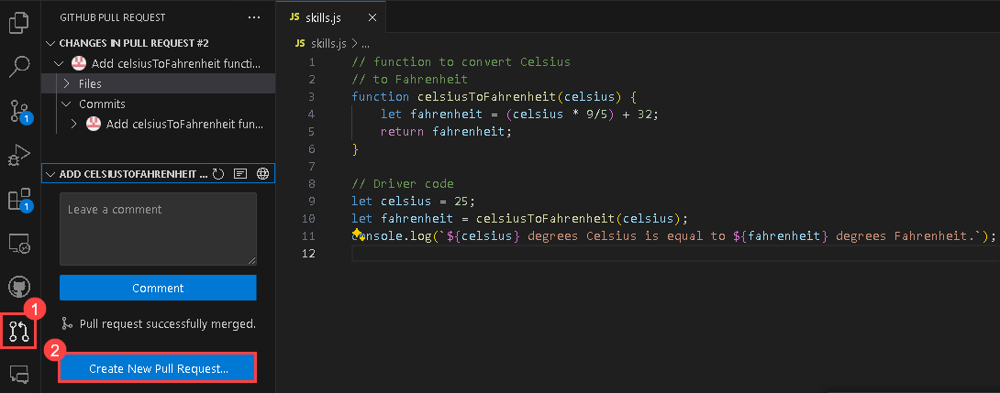
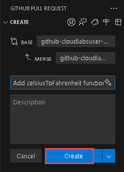
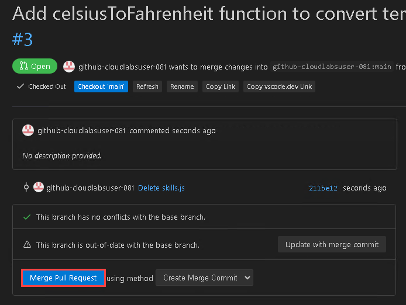
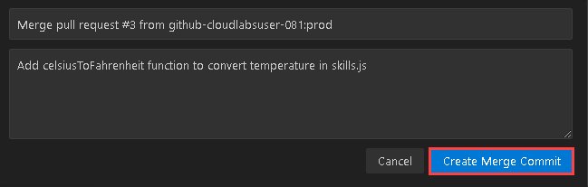

# Exercise 2: Exploring AI-Driven Code Suggestions in JavaScript

### Estimated Duration: 30 minutes

While GitHub Copilot offers recommendations for many languages and frameworks, it excels in particular when it comes to Python, JavaScript, TypeScript, Ruby, Go, C#, and C++. The samples below are in JavaScript, but they should also work in other languages.

In this lab, you will have the opportunity to experiment with and apply JavaScript with the assistance of GitHub Copilot and GitHub Copilot Chat.

>**Disclaimer**: A whole function body will be automatically suggested by GitHub Copilot in gray text. Here's an example of what you are likely to see; however, the precise recommendation could vary.

## Lab objectives

In this lab, you will complete the following tasks:

- Task 1: Add a JavaScript file and start writing code
- Task 2: Create a Pull Request

## Task 1: Add a JavaScript file and start writing code

1. In the LABVM desktop, select Visual Studio Code.
 
1. From the VS Code Explorer window, create a New File.

   

1. Name the file `skills.js` and verify your new file looks as shown below:

   

1. In the `skills.js` file, type the following function header:

   ```
   // function to covert Celsius
   // to Fahrenheit
   ```
   
   > **Note**: A whole function body will be automatically suggested by GitHub Copilot in gray text. Here's an example of what you are likely to see; however, the precise recommendation could vary.

   

1. Press `Tab` to accept the suggestion.

   

1. In the next line, type the following:

   ```
   // Driver code
   ```
   

1. Press `Tab` to accept the suggestion  and then press `Ctrl + S` to save the file.

      

     > **Note**: However, it should be noted that the suggestions from GitHub Copilot may vary, necessitating a clear understanding of the Javascript code and its usage.
   
1. Run the application with the **node skills.js** command in the terminal and verify the output has been generated.

   

  > **Note**: You can also try the same commands to convert from Fahrenheit to Celsius as shown below:

   

   

## Task 2: Create a Pull Request

In this task, you will use the VS Code terminal to add the `skills.js` file to the GitHub repository from `prod` to `main`.

1. Click on the **Pull Request (1)** symbol as shown below and click on **Create New Pull Request (2)**.

    

1. Click on New Pull Request.

1. Click on **Create**.

   

1. Click on **Merge Pull Request** and select **Create Merge Commit**.

    

    

## Review
In this lab, you have effectively created JavaScript code and pushed it from the production branch to the main branch.

## You have successfully completed the lab
