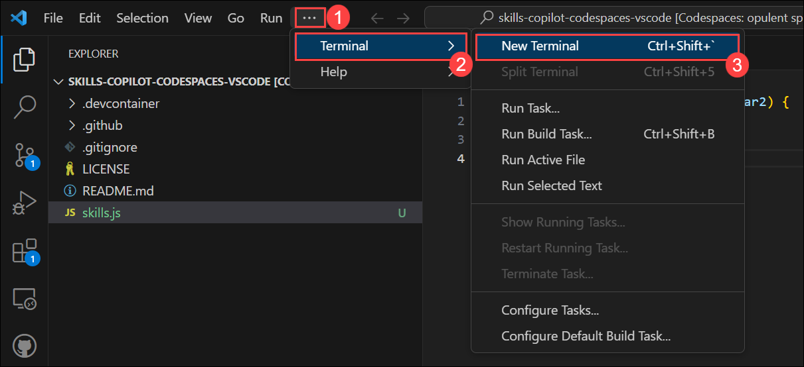

# Exercise 2: Seeing AI code suggestions in a JavaScript file

GitHub Copilot provides suggestions for numerous languages and a wide variety of frameworks, but works especially well for Python, JavaScript, TypeScript, Ruby, Go, C# and C++. The following samples are in JavaScript, but other languages will work similarly.

In this exercise, you will have the opportunity to experiment with and apply JavaScript with the assistance of Copilot.

>**Disclaimer**: GitHub Copilot will automatically suggest an entire function body or code in grayed text. Examples of what you'll most likely see in this exercise, but the exact suggestion may vary.

## Task 1: Add a JavaScript file and start writing code

1. From the VS Code explorer window, create a new file.

   

1. Name the file `skills.js` and verify your new file looks as shown below:

   

1. In the `skills.js` file, type the following function header.

   ```
   function calculateNumbers(var1, var2)
   ```

   GitHub Copilot will automatically suggest an entire function body in grayed text. Below is an example of what you'll most likely see, but the exact suggestion may vary.

   

1. Press `Tab` to accept the suggestion and then save the file.

   

## Task 2: Push code to your repository from the codespace

In this task, you will use the VS Code terminal to add the `skills.js` file to the GitHub repository.

1. Open VS Code Terminal by clicking on **Ellipsis (...)** **(1)**, select **Terminal** **(2)** and click on **New Terminal** **(3)**.

   

1. Run the below command to add the `skills.js` file to the GitHub repository.

   ```
   git add skills.js
   ```

1. Next from the VS Code terminal stage and commit the changes to the repository:

   ```
   git commit -m "Copilot first commit"
   ```

1. Finally from the VS Code terminal push the code to the repository:

   ```
   git push
   ```

   

   >**Note**: Wait about 60 seconds then refresh your GitHub repository landing page for the next step.


## Task 3: Best Practices to use GitHub Copilot

## Task 3.1- Example: Set the stage with a high-level goal

This is most helpful if you have a blank file or empty codebase. In other words, if GitHub Copilot has zero context of what you want to build or accomplish, setting the stage for the AI 
pair programmer can be really useful. It helps to prime GitHub Copilot with a big picture description of what you want it to generate—before you jump in with the details.

When prompting GitHub Copilot, think of the process as having a conversation with someone: How should I break down the problem so we can solve it together? How would I approach pair 
programming with this person?

1. From the VS Code explorer window, create a new file.

   

1. Name the file `index.js` and verify your new file looks as shown below:

   

1. Now press **Ctrl+I** to open the GitHub Copilot Chat and paste the following **comments (1)** to create a basic markdown editor and click on **Make request(Enter) (2)** button.

   ```
   /*
   Create a basic markdown editor in Next.js with the following features:
   - Use react hooks
   - Create state for markdown with default text "type markdown here"
   - A text area where users can write markdown 
   - Show a live preview of the markdown text as I type
   - Support for basic markdown syntax like headers, bold, italics 
   - Use React markdown npm package 
   - The markdown text and resulting HTML should be saved in the component's state and updated in real time 
   */
   ```

   

1. This will prompt GitHub Copilot to generate the following code in the image and produce a very simple, unstyled but functional markdown editor.

   


## Task 3.2- Example: Make your ask simple and specific. Aim to receive a short output from GitHub Copilot

Once you communicate your main goal to the AI pair programmer, articulate the logic and steps it needs to follow for achieving that goal. GitHub Copilot better understands your goal 
when you break things down. (Imagine you’re writing a recipe. You’d break the cooking process down into discrete steps–not write a paragraph describing the dish you want to make.)
Let GitHub Copilot generate the code after each step, rather than asking it to generate a bunch of code all at once.

1. In the same index.js file enter the below step-by-step instructions for reversing a sentence.

    ```
    // reverse a sentence
    // the start of the new sentence must be capital
    ```

1. The generated outcome whould look similar to belwo image.

   


## Task 3.3- Example: Give GitHub Copilot an example or two

Learning from examples is not only useful for humans, but also for your AI pair programmer. For instance, we wanted to extract the names from the array of data below and store it in a 
new array:

 ```
       const data = [
     [
       { name: 'John', age: 25 },
       { name: 'Jane', age: 30 }
     ],
     [
       { name: 'Bob', age: 40 }
     ]
   ];
    
 ```

1. Type the below comment in the chat to generate the output without showing example to GitHub Copilot.

   ```
    // Map through an array of arrays of objects to transform data
    
   ```

1. It generated an incorrect usage of map.

   

1. By contrast, type the below comments to provide the example to generate the desired output.

    ```
      // Map through an array of arrays of objects
      // Example: Extract names from the data array
      // Desired outcome: ['John', 'Jane', 'Bob']
    
    ```

1. Now, We received our desired outcome.

   

1. Open the **New Terminal** **(3)** to push the code.

1. Run the below command to add the `index.js` file to the GitHub repository.

   ```
   git add index.js
   ```

1. Next from the VS Code terminal stage and commit the changes to the repository:

   ```
   git commit -m "Copilot first commit"
   ```

1. Finally from the VS Code terminal push the code to the repository:

   ```
   git push
   ```

   >**Note**: Wait about 60 seconds then refresh your GitHub repository landing page for the next step.


1. Click on **Next** from the bottom right to continue with the next exercies.

### Summary

In this exercise, you have successfully generated JavaScript code with the help of Copilot.
