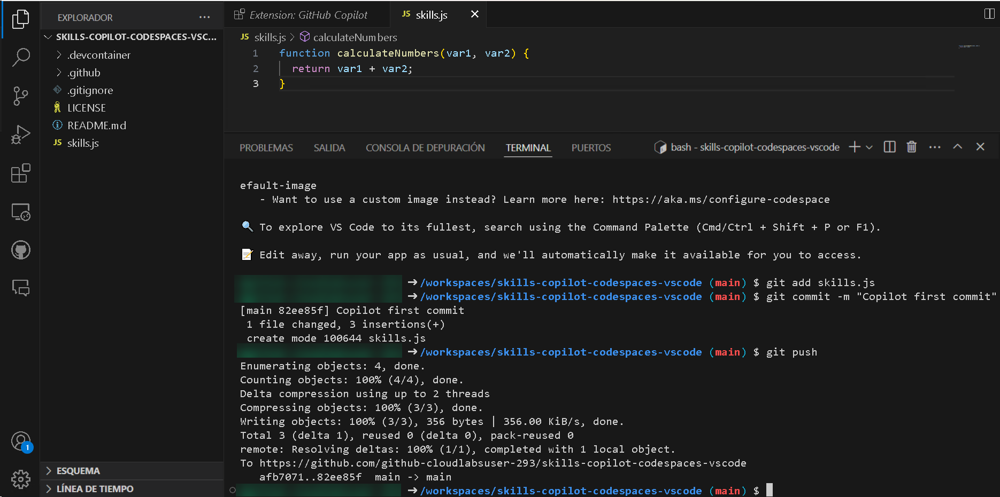

# Exercise 2: Exploring AI-Driven Code Suggestions in JavaScript

### Estimated Duration: 20 minutes

While GitHub Copilot offers recommendations for many languages and frameworks, it excels in particular when it comes to Python, JavaScript, TypeScript, Ruby, Go, C#, and C++. The samples below are in JavaScript, but they should also work in other languages.

In this lab, you will have the opportunity to experiment with and apply JavaScript with the assistance of GitHub Copilot and GitHub Copilot Chat.

>**Disclaimer**: A whole function body will be automatically suggested by GitHub Copilot in gray text. Here's an example of what you are likely to see; however, the precise recommendation could vary.

## Lab objectives

In this lab, you will complete the following tasks:

- Task 1: Add a JavaScript file and start writing code

## Task 1: Add a JavaScript file and start writing code

1. In the LABVM desktop, select Visual Studio Code.
 
1. From the VS Code Explorer window, create a New File.

   

1. Name the file `skills.js` and verify your new file looks as shown below:

   

1. In the `skills.js` file, type the following function header:

   ```
   // function to covert Celsius
   // to Fahrenheit
   ```
   
   > **Note**: A whole function body will be automatically suggested by GitHub Copilot in gray text. Here's an example of what you are likely to see; however, the precise recommendation could vary.

   
   
   .png)

4. Press `Tab` to accept the suggestion and then press `Ctrl + S` to save the file.

   .png)

## Task 2: Push code to your repository from the codespace

In this task, you will use the VS Code terminal to add the `skills.js` file to the GitHub repository.

1. Open VS Code Terminal by clicking on **Ellipsis (...)** **(1)**, select **Terminal** **(2)** and click on **New Terminal** **(3)**.

   

2. Run the below command to add the `skills.js` file to the GitHub repository.

   ```
   git add skills.js
   ```

3. Next, from the VS Code terminal stage, commit the changes to the repository:

   ```
   git commit -m "Copilot first commit"
   ```

4. Finally, from the VS Code terminal, push the code to the repository:

   ```
   git push
   ```

   

   >**Note**: If you are facing any error which says `Rejected`, then run the below given command and re-run `git push` command again. This will fetch changes in remote branch and merge them into current branch without rebasing.
   
      ```
      git pull --no-rebase
      ```
   >**Note**: A message appears in the terminal stating that you need to close the newly opened file, in addition to the two files that are already open. Please close the newly opened file.
## Task 3: Best practices to use GitHub Copilot

### Verify GitHub Copilot Chat extension in VS Code

1. To Verify the GitHub Copilot Chat extension, the following steps are to be performed within Visual Studio Code:
    - Click on the **Extensions (1)** icon in the activity bar present on the left side of the Visual Studio Code Window.
    - In the "Search Extensions in Marketplace" search box, type and search for the **GitHub Copilot Chat (2)** extension.
    - Select **GitHub Copilot Chat (3)** from the list of results that show up, and verify that **GitHub Copilot Chat** has been installed.
    - If not, click on the **Install (4)** button.

   

1. Once the installation is complete, GitHub Copilot Chat icon will appear on the top right next to the search bar as shown below.

   

## Task 3.1- Example: Set the stage with a high-level goal

This is most helpful if you have a blank file or an empty codebase. In other words, it can be quite helpful to set the stage for the AI pair programmer if GitHub Copilot has no idea what you want to build or achieve. It helps to prime GitHub Copilot with a big-picture description of what you want it to generate—before you jump in with the details.

When prompting GitHub Copilot, think of the process as having a conversation with someone: How should I break down the problem so we can solve it together? How would I approach pair programming with this person?

1. From the VS Code Explorer window, create a New File.

   

2. Name the file `index.js` and verify your new file looks as shown below:

   

3. Now press Ctrl + I to open the GitHub Copilot Chat and paste the following **comment (1)** to fetch the code and click on Make request **(Enter) (2)** button and click on **Accept (3)** to use the code. 

1. Press `Tab` to accept the suggestion.

   

1. In the next line, type the following:

   ```
   // Driver code
   ```
   

1. Press `Tab` to accept the suggestion  and then press `Ctrl + S` to save the file.

      

     > **Note**: However, it should be noted that the suggestions from GitHub Copilot may vary, necessitating a clear understanding of the Javascript code and its usage.

1. Click on the **ellipsis (1)** on the top, click on **Terminal (2)** and select **New Terminal (3)**.

        
   
1. Run the application with the `node skills.js` command in the terminal and verify the output has been generated.

   

    >**Note**: You can also try the same commands to convert from Fahrenheit to Celsius as shown below:

     

     

   >**Note**: Wait about 60 seconds, then refresh your GitHub repository landing page for the next step.


   > **Congratulations** on completing the task! Now, it's time to validate it. Here are the steps:
   > - Hit the Validate button for the corresponding task. If you receive a success message, you can proceed to the next task.
   > - If not, carefully read the error message and retry the step, following the instructions in the lab guide. 
   > - If you need any assistance, please contact us at cloudlabs-support@spektrasystems.com. We are available 24/7 to help you out.


   <validation step="6792c557-2d4b-43ce-a904-427d7a72f16d" />

## Review
In this lab, you have effectively created JavaScript code and pushed it from the production branch to the main branch.

## You have successfully completed the lab
