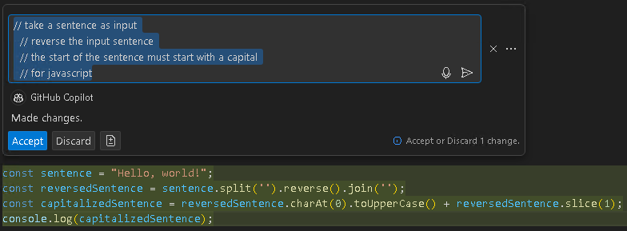
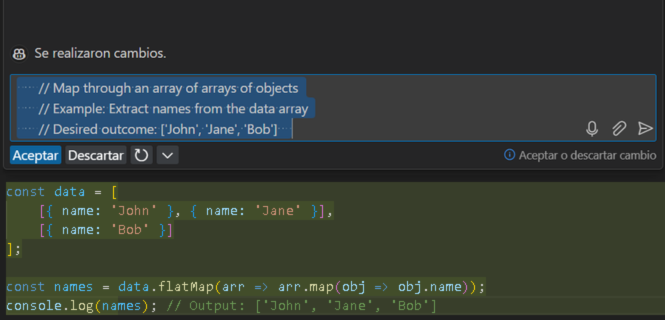

# Exercise 2: Exploring AI-Driven Code Suggestions in JavaScript

### Duration: 30 minutes

While GitHub Copilot provides recommendations across various languages and frameworks, it particularly excels with Python, JavaScript, TypeScript, Ruby, Go, C#, and C++. Although the following samples are in JavaScript, they should be compatible with other languages as well.

In this exercise, you will get the chance to explore and utilize JavaScript, guided by the support of GitHub Copilot and GitHub Copilot Chat.

>**Disclaimer**: A whole function body will be automatically suggested by GitHub Copilot in gray text. However, the precise recommendation could vary.

>**Note**: If you are unable to see any suggestions by GitHub Copilot in VS Code, please restart the VS Code once and try again. 

## Lab objectives

You will be able to complete the following exercises:

- Add a JavaScript file and start writing code
- Push code to your repository from the codespace
- Best practices to use GitHub Copilot

## Task 1: Add a JavaScript file and start writing code

1. From the VS Code Explorer window, create a New File.

   

2. Name the file `skills.js` and verify your new file looks as shown below:

   

3. In the `skills.js` file, type the following function header and press enter:

   ```
   function calculateNumbers(var1, var2)
   ```
   
   > **Note**: A whole function body will be automatically suggested by GitHub Copilot in gray text. Here's an example of what you are likely to see; however, the precise recommendation could vary.

   .png)

4. Press `Tab` to accept the suggestion and then press `Ctrl + S` to save the file.

   .png)

## Task 2: Push code to your repository from the codespace

In this task, you will use the VS Code terminal to add the `skills.js` file to the GitHub repository.

1. Open VS Code Terminal by clicking on **Ellipsis (...)** **(1)**, select **Terminal** **(2)** and click on **New Terminal** **(3)**.

   

2. Run the below command to add the `skills.js` file to the GitHub repository.

   ```
   git add skills.js
   ```

3. Next, from the VS Code terminal stage, commit the changes to the repository:

   ```
   git commit -m "Copilot first commit"
   ```

4. Finally, from the VS Code terminal, push the code to the repository:

   ```
   git push
   ```

   

   >**Note**: Wait about 60 seconds, then refresh your GitHub repository landing page for the next step.


## Task 3: Best practices to use GitHub Copilot

### Verify GitHub Copilot Chat extension in VS Code

1. To Verify the GitHub Copilot Chat extension, the following steps are to be performed within Visual Studio Code:
    - Click on the **Extensions (1)** icon in the activity bar present on the left side of the Visual Studio Code Window.
    - In the "Search Extensions in Marketplace" search box, type and search for the **GitHub Copilot Chat (2)** extension.
    - Select **GitHub Copilot Chat (3)** from the list of results that show up, and verify that **GitHub Copilot Chat** has been installed.
    - If not, click on the **Install (4)** button.

   

1. Once the installation is complete, in the left navigation pane you will able to see the icon for GitHub Copilot Chat as shown below.

   

## Task 3.1- Example: Set the stage with a high-level goal

This is most helpful if you have a blank file or an empty codebase. In other words, it can be quite helpful to set the stage for the AI pair programmer if GitHub Copilot has no idea what you want to build or achieve. It helps to prime GitHub Copilot with a big-picture description of what you want it to generate—before you jump in with the details.

When prompting GitHub Copilot, think of the process as having a conversation with someone: How should I break down the problem so we can solve it together? How would I approach pair programming with this person?

1. From the VS Code Explorer window, create a New File.

   

2. Name the file `index.js` and verify your new file looks as shown below:

   

3. Now press Ctrl + I to open the GitHub Copilot Chat and paste the following **comment (1)** to fetch the code and click on Make request **(Enter) (2)** button and click on **Accept (3)** to use the code. 

   ```
   /*
   Create a basic markdown editor in Next.js with the following features:
   - Use react hooks
   - Create a state for markdown with the default text "type markdown here"
   - A text area where users can write markdown 
   - Show a live preview of the markdown text as I type
   - Support for basic markdown syntax like headers, bold, and italics 
   - Use React markdown npm package 
   - The markdown text and resulting HTML should be saved in the component's state and updated in real-time 
   */
   ```

   

## Task 3.2- Example: Aim to receive a short output from GitHub Copilot for a simple and specific ask

After you've explained your primary objective to the AI pair programmer, explain the reasoning and procedures it must take to reach that objective. This will help GitHub Copilot gain a clearer understanding of your intended outcome when you break things down. For example, imagine you’re writing a recipe. Rather than writing a paragraph outlining the food you intend to make, you would break down the cooking procedure into distinct parts.
So, instead of asking GitHub Copilot to generate a large amount of code at once, let it generate the code after each step.

1. In the same index.js file, enter the below step-by-step instructions for reversing a sentence.

    ```
      // take a sentence as input
      // reverse the input sentence
      // the start of the sentence must start with a capital
      // for javascript
    ```

2. The generated outcome would look similar to the below image.

   


## Task 3.3- Example: Give GitHub Copilot an example or two

Not only can people benefit from learning from examples, but so can your AI pair programmer. For example, in order to take the names out of the data array below and put them in a
new array:

   ```
          const data = [
        [
          { name: 'John', age: 25 },
          { name: 'Jane', age: 30 }
        ],
        [
          { name: 'Bob', age: 40 }
        ]
      ];    
   ```

1. Type the below comment in the chat to generate the output without showing an example to GitHub Copilot.

   ```
    // As an illustration, pull names out of the data array  
   ```

2. It generated an incorrect usage of the map.

   

3. By contrast, type the below comments to provide an example of how to generate the desired output.

    ```
      // Map through an array of arrays of objects
      // Example: Extract names from the data array
      // Desired outcome: ['John', 'Jane', 'Bob']    
    ```

4. Now, we have received our desired outcome. Save the newly created `index.js` file by using the `CTRL + S` shortcut keys.

   

5. Open the **New Terminal** to push the code.

6. Run the below command to pull the latest changes.

   ```
   git pull
   ```

1. Run the below command to add the `index.js` file to the GitHub repository.
   
   ```
   git add index.js
   ```

8. Next from the VS Code terminal, commit the changes to the repository:

   ```
   git commit -m "Copilot commit"
   ```

9. Finally, from the VS Code terminal, push the code to the repository:

   ```
   git push
   ```

   >**Note**: Wait about 60 seconds, then refresh your GitHub repository landing page for the next step.

   <validation step="73a63481-3140-4473-9b94-36d265cdc8cb" />

10. Click on **Next** below to move on to the next page.

      > **Congratulations** on completing the task! Now, it's time to validate it. Here are the steps:
       
      - Go to the **Lab Validation** tab.
      - Click on the **Validate** button under the **Actions** section for *Exercise 2: Seeing AI code suggestions in a JavaScript file!*
      - A success message indicates you’re ready for the next task. Proceed accordingly.
      - If not, review the message, revisit the lab guide, and attempt the step again.
      - If you need any assistance, please contact us at labs-support@spektrasystems.com. We are available 24/7 to help you out.

### Summary

In this exercise, you have successfully generated JavaScript code and other best practices using GitHub Copilot and GitHub Copilot Chat.

### You have successfully completed the lab
