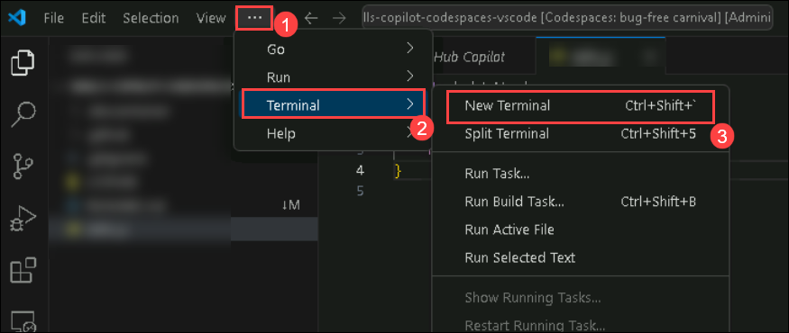

# Ejercicio 2: Explorar Sugerencias de Código Impulsadas por IA en JavaScript

### Duración Estimada: 20 minutos

Si bien GitHub Copilot ofrece recomendaciones en varios lenguajes y frameworks, destaca particularmente con Python, JavaScript, TypeScript, Ruby, Go, C# y C++. Aunque los siguientes ejemplos están en JavaScript, también deberían ser compatibles con otros lenguajes.

En este ejercicio, tendrá la oportunidad de explorar y utilizar JavaScript, guiado por el apoyo de GitHub Copilot y GitHub Copilot Chat.

>**Descargo de responsabilidad**: GitHub Copilot sugerirá automáticamente todo el cuerpo de una función en texto gris. Sin embargo, la recomendación precisa podría variar.

>**Nota**: Si no puede ver ninguna sugerencia de GitHub Copilot en VS Code, reinicie VS Code una vez e intente nuevamente.

## Objetivos del laboratorio

Será capaz de completar las siguientes tareas:

- Tarea 1: Agregar un archivo JavaScript y comenzar a escribir código

## Tarea 1: Agregar un archivo JavaScript y comenzar a escribir código

1. En el escritorio de LABVM, seleccione Visual Studio Code.

1. Desde la ventana Explorador de VS Code, cree un Nuevo Archivo.

   

2. Nombre el archivo como `skills.js` y compruebe que su nuevo archivo se vea como se muestra a continuación:
    > **Nota:** Crea el archivo `skill.js` fuera de la carpeta `.devcontainer`.


   

3. En el archivo skills.js, escriba el siguiente encabezado de función y pulse `Enter` para ver las sugerencias de código.

   ```
   // function to covert Celsius
   // to Fahrenheit
   ```
   
   > **Nota**: GitHub Copilot sugerirá automáticamente un cuerpo de función completo en texto gris. Este es un ejemplo de lo que probablemente verá; sin embargo, la recomendación precisa podría variar.

   

4. Presione `Tab` para aceptar la sugerencia.

   

     > **Nota**: Es posible que tenga que volver a pulsar la tecla Tab para ver las sugerencias y aceptarlas.

1. En la siguiente línea, escriba lo siguiente:

   ```
   // Driver code
   ```
   

1. Presione `Enter` y `Tab` para aceptar la sugerencia y luego presione `Ctrl + S` para guardar el archivo.

      

     > **Nota**: Sin embargo, debe tenerse en cuenta que las sugerencias de GitHub Copilot pueden variar, por lo que es necesario comprender claramente el código de Javascript y su uso.

1. Haga clic en los **puntos suspensivos (1)** en la parte superior, haga clic en **Terminal (2)** y seleccione **Nuevo Terminal (3)**.

        
   
1. Ejecute la aplicación con el comando `node skills.js` en la terminal y verifique que se haya generado la salida.

   

    >**Nota**: También puede probar los mismos comandos para convertir de Fahrenheit a Celsius, tal como se muestra a continuación:

     

     

   >**Nota**: Espere unos 60 segundos y luego actualice la página de inicio de su repositorio de GitHub para el siguiente paso.

   > **Felicitaciones** por completar la tarea. Ahora, es momento de validarla. Estos son los pasos:
   > - Presione el botón Validar para la tarea correspondiente. Si recibe un mensaje de éxito, puede continuar con la siguiente tarea.
   > - Si no es así, lea atentamente el mensaje de error y vuelva a intentar el paso siguiendo las instrucciones de la guía de laboratorio.
   > - Si necesita ayuda, comuníquese con nosotros a cloudlabs-support@spektrasystems.com. Estamos disponibles las 24 horas, los 7 días de la semana para ayudarlo.

   <validation step="6792c557-2d4b-43ce-a904-427d7a72f16d" />
    
## Revisión

En este laboratorio, ha creado código JavaScript de manera eficaz y lo ha enviado desde la rama de producción a la rama principal.

## Ha completado el laboratorio con éxito
