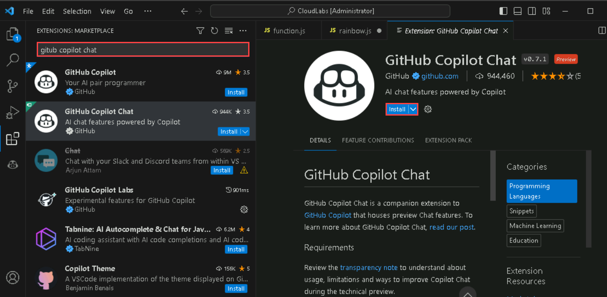
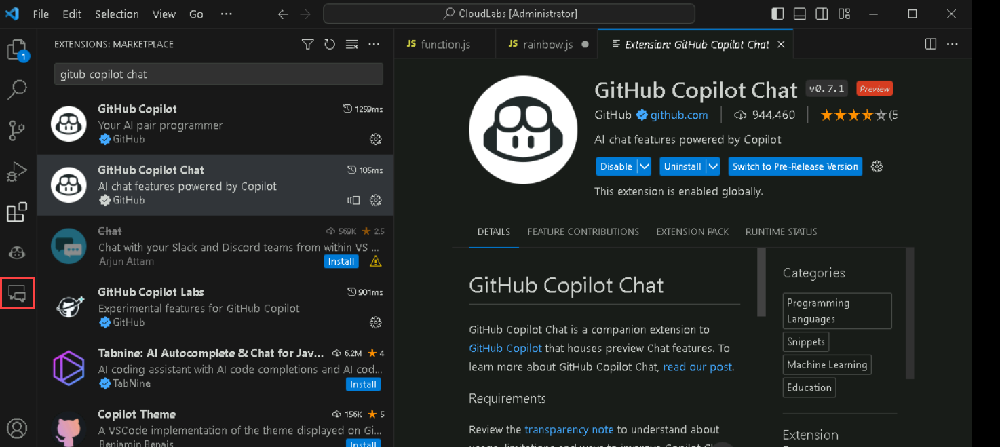
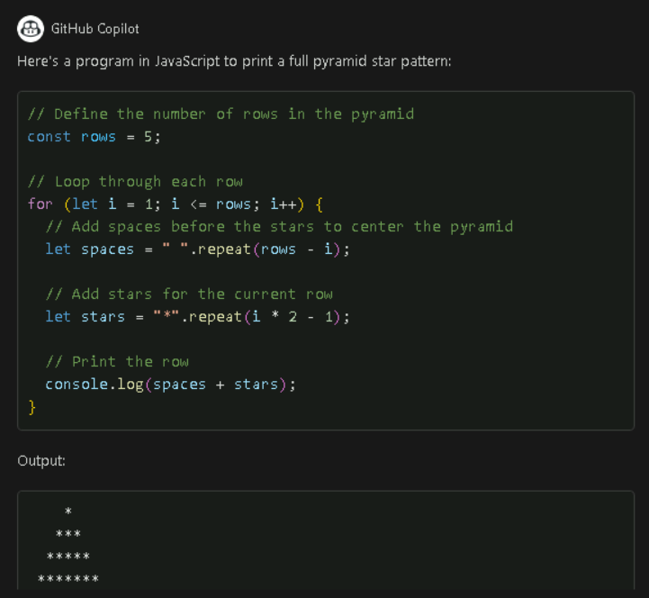
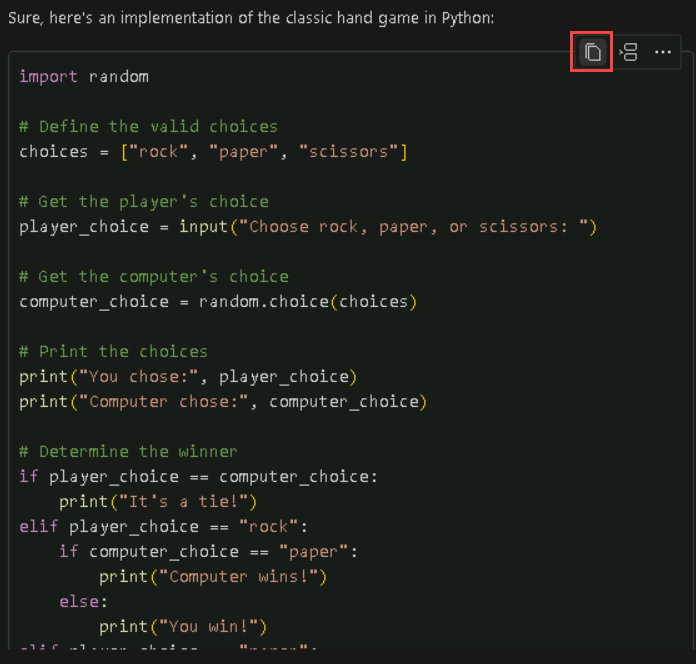
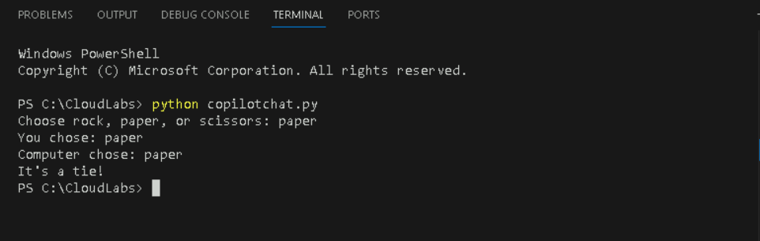
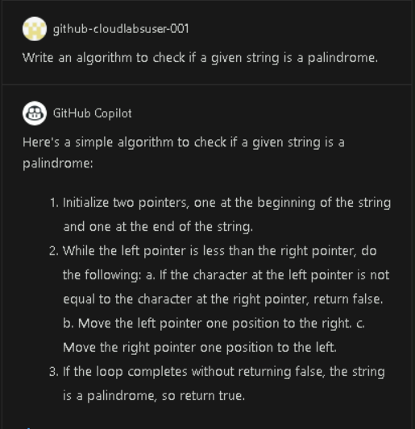
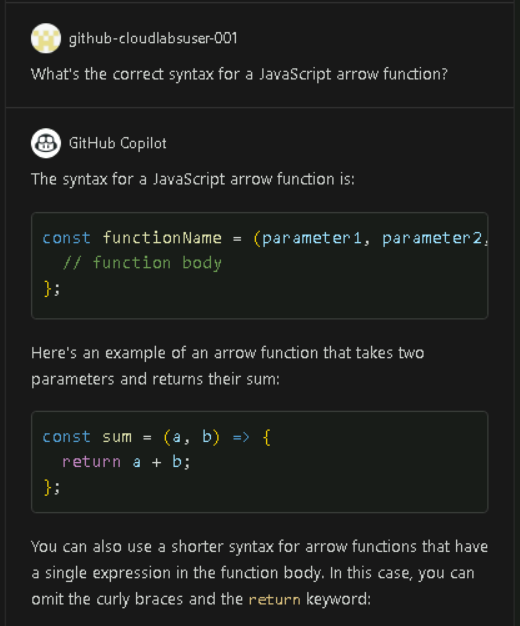

# Exercise 3: Github Copilot Chat

GitHub Copilot Chat is a chat interface that lets you interact with GitHub Copilot, to ask and receive answers to coding-related questions from directly within a supported IDE. The chat interface provides access to coding information and support without requiring you to navigate documentation or search online forums

### Task 1: Install Github Copilot Chat Extension

1. In Visual Studio Code, open the Extensions view by clicking the Extensions icon in the activity bar on the left side of the Visual Studio Code window.

   

2. In the "Search Extensions in Marketplace" search box, search for the **GitHub Copilot Chat** extension, then click Install.

   
  
3. Once the installation is complete, in the left navigation pane you will able to see the icon for Github Copilot Chat as shown in the figure below.

   

### Task 2: Generate Code by Chat

1. In the Visual Studio Code activity bar, click the GitHub Copilot Chat icon to open the GitHub Copilot Chat chat window.

2. At the bottom of the GitHub Copilot Chat window, in the **Ask Copilot a question or type / for topics** text box, type a coding-related question, then press Enter. For example, type "Write a Program to print the Full Pyramid Star Pattern."

    

3. GitHub Copilot Chat will process your question and provide an answer, with code suggestions when appropriate, in the chat window. 

    

    >**Note**: Optionally, if GitHub Copilot Chat suggests a follow-up question above the **Ask Copilot a question or type / for topics** text box, click the follow-up question to ask it.

    >**Note**:  If your question is outside the scope of GitHub Copilot Chat, it will tell you and may suggest an alternative question to ask.

### Task 3: Interact with GitHub Copilot Chat and create a new project structure

1. In the Visual Studio Code window, in the left navigation pane, under the CloudLabs folder, click on **New file** and create a file named **copilotchat.py**

    

2. Now, click on the GitHub Copilot Chat icon and create a simple project. For example, let's give a prompt to generate a code for playing the rock, paper, or scissors game with the computer. 

3. Copy the given prompt and paste it into the GitHub Copilot Chat chat window.**Implement the classic hand game where the player chooses rock, paper, or scissors, and the computer also makes a choice. Determine the winner based on the rules of the game. In Python outside the browser environment with a print statement**

4. It will generate a code, now to show the options for a code suggestion, hover over the suggestion. To copy the code suggestion to your clipboard, click the Copy icon.

   

5. Paste the code in the file named **copilotchat.py** file that you just created.

6. Now, from the upper navigation pane, click on **Terminal** and select **New Terminal** option and copy the following command to run the code in the terminal.

    ```
    python copilotchat.py
    ```
  
 7. Type either rock, paper or scissors to get an output like as shown in the figure below.
    
    

### Task 4: Use GitHub Copilot Chat to generate code for different scenarios

1. You can use Github Copilot Chat for various other scenarios like for example if you want to create an algorithm to check if a given  word is palindromic or not. Copy the following prompt in the GitHub Copilot Chat chat window.

   ```
   Write an algorithm to check if a given string is a palindrome
   ```
2. You will get the algorithm as per the prompt as shown in the figure given below.

   

3.  You can also use the Github Copilot Chat feature if you're unsure about the correct syntax for a particular task or feature in your code, you can ask Copilot for clarification. For example, you can comment, **What's the correct syntax for a JavaScript arrow function?**

4. It will provide the output as shown below.

   
    
