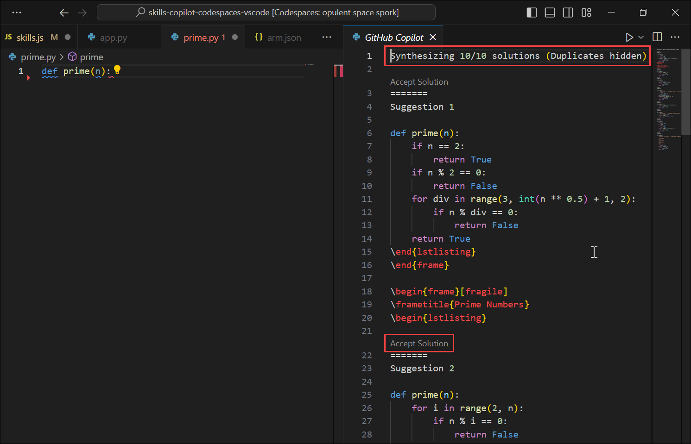

# Exercise 3: View the GitHub Copilot tab with multiple suggestions

While GitHub Copilot offers suggestions for numerous languages and a variety of frameworks, it excels when it comes to Python, JavaScript, TypeScript, Ruby, Go, C#, and C++. The Copilot can also assist in query generation for databases.

In this exercise, you will have the opportunity to explore and apply the use of Python in conjunction with Copilot, and you will do so with the benefit of receiving multiple suggestions.

>**Disclaimer**: GitHub Copilot will automatically suggest an entire function body or code in gray text. Following are the examples of what you'll most likely see in this exercise, but the exact suggestion may vary.

## Task 1: Pull the latest code to the Codespace repo.

   >**Note**: The "Pull" must be done prior to the next task.

1. Navigate to VS Code, using the VS Code terminal to pull the latest code:

   ```
   git pull
   ```

   

## Task 2: Add Python method code

1. From inside the codespace in the VS Code Explorer window, create a new file.

   

1. Name the file `app.py` **(1)** and you will see a recommendation to install the `Python` extension. Click on **Install** **(2)**.

   

1. Once the Python extension is installed. Open the newly created `app.py` file, and type the following code:

   ```
   def hello():
   ```

1. GitHub Copilot will automatically suggest an entire code in gray text. Press the Tab to accept the suggestion, and then save the file.

   

### Task 3: View the GitHub Copilot tab with multiple suggestions

In this task, you will continue to use Copilot and may need some of the suggestions that GitHub Copilot offers. GitHub Copilot will synthesize around 10 different code suggestions in a new tab.

1. From the codespace in the VS Code Explorer window, create a new file named `prime.py` **(1)** and type the following code **(2)**.

   ```
   def prime(n):
   ```

   

1. To open a new tab with multiple synthesized solutions, press `Ctrl + Enter`. GitHub Copilot will synthesize around 10 different code suggestions in a new tab. You can view the solutions, and to accept a suggestion, you need to click on **Accept Solution** above the suggestion and then save the file.

   

### Task 4: Push code to your repository from the VS code codespace

1. Navigate back to the VS Code terminal and add files to the repository.

1. Run the below command to add the `app.py` and `prime.py` files to the repository:

   ```
   git add app.py prime.py
   ```

1. Next, from the VS Code terminal stage, commit the changes to the repository:

   ```
   git commit -m "Copilot second commit"
   ```

1. Finally, from the VS Code terminal, push to code to the repository:

   ```
   git push
   ```

   

   >**Note**: Wait about 60 seconds, then refresh your repository landing page for the next step.

1. You can verify the `app.py` and `prime.py` files available in your GitHub repository.

   

1. Click on Next from the bottom right to continue with the next exercise.

### Summary

In this exercise, you have successfully finished the task of using Python in conjunction with Copilot, and you have done so with the benefit of receiving multiple suggestions.
