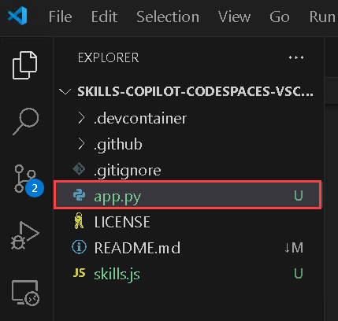
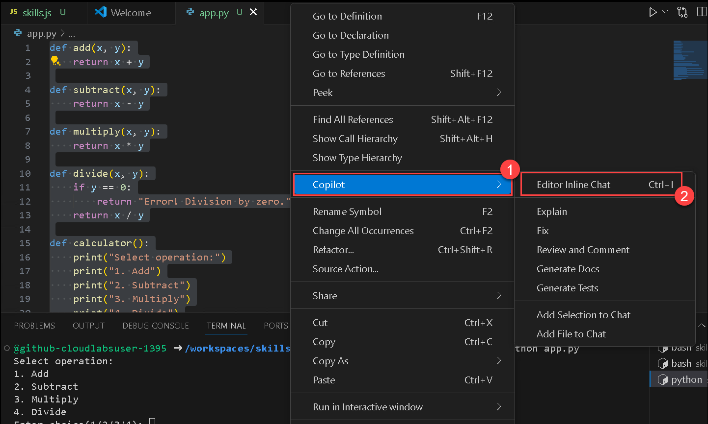

# Ejercicio 3: Explorar Python con GitHub Copilot: Sugerencias de Código Inteligentes

### Duración Estimada: 30 minutos

GitHub Copilot acelera la creación de scripts de lenguaje de programación a través de la generación de código basada en IA y herramientas inteligentes. Al analizar el contexto y los comentarios, Copilot genera rápidamente código básico y ofrece sugerencias dinámicas para mejoras y optimizaciones. Además de la generación de código, Copilot ofrece funciones avanzadas como autocompletado, expansión de código y sugerencias para mejorar el código existente o introducir nuevas funcionalidades.

> **Descargo de responsabilidad:** GitHub Copilot sugerirá automáticamente todo el cuerpo de una función en texto gris. Sin embargo, la recomendación precisa podría variar.

> **Nota:** Si no puede ver ninguna sugerencia de GitHub Copilot en VS Code, reinicie VS Code una vez e intente nuevamente.

## Objetivos del laboratorio

Será capaz de completar las siguientes tareas:

- Tarea 1: Desarrollar un Script de Python para Implementar una Calculadora
- Tarea 2: Explorar las Herramientas de GitHub Copilot

## Tarea 1: Desarrollar un Script de Python para Implementar una Calculadora

1. Desde la ventana del Explorador de VS Code, cree un Nuevo Archivo.

   

2. Nombre el archivo `app.py` y verifique que su nuevo archivo se vea como se muestra a continuación:
   > **Nota:** Crea el archivo `app.py` fuera de la carpeta `.devcontainer`.

   

3. Ahora, presione `Ctrl + I` para abrir GitHub Copilot Chat y pegue los siguientes **comentarios (1)** y haga clic en > o presione **Enter (2)**. Copilot le dará una respuesta, y usted puede revisarla y hacer clic en **Aceptar (3)**. Además, usted puede **Descartar** la sugerencia como se muestra en la imagen a continuación.
   
   ```
   Create a simple calculator that can add, subtract, multiply or divide depending upon the input from the user.
   ```

   

4. Presione `CTRL + S` para guardar el archivo.

5. Haga clic en los **puntos suspensivos (1)** en la parte superior, haga clic en la **Terminal (2)** y seleccione **Nuevo Terminal (3)**.

   .png)

6. Ejecute la aplicación con el comando **python app.py** en la terminal y verifique que se haya generado la salida.

      

      > **Felicitaciones** por completar la tarea. Ahora es momento de validarla. Estos son los pasos:
      > - Presione el botón Validar para la tarea correspondiente. Si recibe un mensaje de éxito, puede continuar con la siguiente tarea.
      > - De lo contrario, lea atentamente el mensaje de error y vuelva a intentar el paso, siguiendo las instrucciones de la guía de laboratorio.
      > - Si necesita ayuda, comuníquese con nosotros a cloudlabs-support@spektrasystems.com. Estamos disponibles las 24 horas, los 7 días de la semana para ayudarlo.

      <validation step="37a79ae8-73af-4ce6-a2f0-c3895b352cd3" />

## Tarea 2: Explorar las Herramientas de GitHub Copilot

Al aprovechar el código generado anteriormente, explorará herramientas específicas proporcionadas por Copilot que simplifican las tareas principales.

1. Presione `CTRL + A` para seleccionar todo el código.

2. Haga clic derecho en el código seleccionado, elija **Copilot (1)** y seleccione **Editor Inline Chat (2)**.

      

3. La siguiente ventana le solicita que sugiera cualquier mejora o ampliación que desee realizar al código. Pegue los siguientes **comentarios (1)** y haga clic en > o presione **Enter (2)**. Copilot le dará una respuesta y podrá revisarla y hacer clic en **Aceptar (3)**. También puede **Descartar** la sugerencia como se muestra en la imagen a continuación.

   ```
   Include calculation of percentages
   ```
   
   

4. Presione `CTRL + S` para guardar el archivo.

5. Haga clic en los **puntos suspensivos (1)** en la parte superior, haga clic en la **Terminal (2)** y seleccione **Nuevo Terminal (3)**.

      .png)
   
6. Ejecute la aplicación con el comando **python app.py** en la terminal y verifique que se haya generado la salida.

      

7. Seleccione el código nuevamente y haga clic derecho en el código seleccionado, elija **Copilot (1)** y seleccione **Explain (2)**.

   

8. Se abre GitHub Copilot Chat a la derecha, el cual ofrece una explicación completa del código como se muestra a continuación.

      

9. Seleccione el código nuevamente y haga clic derecho en el código seleccionado, elija **Copilot (1)** y seleccione **Fix (2)**.

   

10. GitHub Copilot utilizará automáticamente el comentario `/fix` para proponer posibles mejoras a partes específicas del código para su mejora. Haga clic en **Aceptar** para utilizar las correcciones en su código.

      

11. Seleccione el código nuevamente y haga clic derecho en el código seleccionado, elija **Copilot (1)** y seleccione **Generate documentacion (2)**.

      

12. GitHub Copilot usará automáticamente el comentario `/doc` para proporcionar un desglose de una línea de código específica. Haga clic en Aceptar para comprender mejor el código mientras lo revisa.

      

13. Seleccione el código nuevamente y haga clic derecho en el código seleccionado, elija **Copilot (1)** y seleccione **Generate pruebas (2)**.

      

14. GitHub Copilot utilizará automáticamente el comentario `/tests `. Haga clic en **Aceptar**.


15. Haga clic en **Aceptar** de nuevo para aceptar la sugerencia. 

      
16. Presione `CTRL + S` para guardar el archivo.      

17. Se abrirá un nuevo archivo llamado **test_app.py**, que mostrará los casos de prueba.

      .png)

## Revisión
En este laboratorio, aprendió a crear un script de Python para una calculadora y exploró las herramientas de GitHub Copilot, las cuales agilizan las tareas de manera efectiva.
  
## Ha completado el laboratorio con éxito
