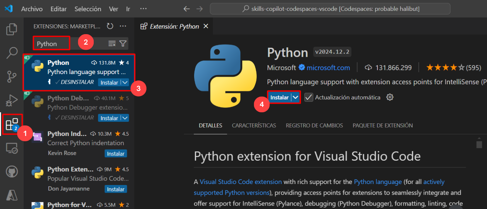

# Exercise 3: Exploring Python with GitHub Copilot: Intelligent Code Suggestions

### Estimated Duration: 20 minutes

GitHub Copilot provides suggestions for a multitude of languages and frameworks, excelling particularly with Python, JavaScript, TypeScript, Ruby, Go, C#, and C++. Moreover, Copilot offers valuable assistance in generating queries for databases.

In this exercise, you will have the chance to delve into Python and leverage Copilot’s capabilities, benefiting from a variety of suggestions.

>**Disclaimer**: GitHub Copilot will automatically suggest an entire function body or code in gray text. Following are the examples of what you'll most likely see in this exercise, but the exact suggestion may vary.

>**Note**: If you are unable to see any suggestions by GitHub Copilot in VS Code, please restart the VS Code once and try again. 

## Lab objectives

You will be able to complete the following exercises:

- Add Python method code
- View the GitHub Copilot tab with multiple suggestions
- Push code to your repository from the VS code codespace

## Task 1: Add Python method code

### Installing Python extension in VS Code

1. To install the Python extension, the following steps are to be performed within Visual Studio Code:
    - Click on the **Extensions** **(1)** icon in the activity bar present on the left side of the Visual Studio Code Window.
    - In the "Search Extensions in Marketplace" search box, type and search for the **Python** **(2)** extension.
    - Select **Python** **(3)** from the list of results that show up.
    - Click on the **Install** **(4)** button.

   

1. From inside the codespace in the VS Code Explorer window, create a New File.

   

1. Name the file `app.py`. Type the following code within this newly created file and then use the enter key to go to the next line.

   ```
   def hello():
   ```

1. GitHub Copilot will automatically suggest an entire code in gray text. Press the Tab to accept the suggestion, and then save the file.

   

   > **Note**: Here's an example of what you are likely to see; however, the precise recommendation could vary.

### Task 2: View the GitHub Copilot tab with multiple suggestions

In this task, you will continue to use Copilot and may need some of the suggestions that GitHub Copilot offers. GitHub Copilot will synthesize around 10 different code suggestions in a new tab.

1. From inside the codespace in the VS Code Explorer window, create a new file named `prime.py` **(1)** and type the following code **(2)**.

   ```
   def prime(n):
   ```

   

   > **Note**: Here's an example of what you are likely to see; however, the precise recommendation could vary.

1. To open a new tab with multiple synthesized solutions, press `Ctrl + Enter`. GitHub Copilot will synthesize around 10 different code suggestions in a new tab. You can view the solutions, and to accept a suggestion, you need to click on **Accept Suggestion** below the desired suggestion and then save the file.

   

    > **Note**: In cases where the Github Copilot suggestions doesn't come up, close and re-open the Visual Studio Code.

### Task 3: Push code to your repository from the VS code codespace

1. Navigate back to the VS Code terminal and add files to the repository.

2. Run the below command to add the `app.py` and `prime.py` files to the repository:

   ```
   git add app.py prime.py
   ```

3. Next, from the VS Code terminal stage and commit the changes to the repository:

   ```
   git commit -m "Copilot second commit"
   ```

4. Finally, from the VS Code terminal push to code to the repository:

   ```
   git push
   ```

   

   >**Note**: Wait about 60 seconds, then refresh your repository landing page for the next step.

5. You can verify the `app.py` and `prime.py` files available in your GitHub repository.

   

   <validation step="95754ad8-7b5c-486d-8e7c-d034df03ff1b" />

6. Click on **Next** below to move on to the next page.

      > **Congratulations** on completing the task! Now, it's time to validate it. Here are the steps:
       
      - Go to the **Lab Validation** tab.
      - Click on the **Validate** button under the **Actions** section for *Exercise 3: View the GitHub Copilot tab with multiple suggestions*
      - A success message indicates you’re ready for the next task. Proceed accordingly.
      - If not, review the message, revisit the lab guide, and attempt the step again.
      - If you need any assistance, please contact us at labs-support@spektrasystems.com. We are available 24/7 to help you out.

### Summary

In this exercise, you have successfully finished the task of using Python in conjunction with Copilot, and you have done so with the benefit of receiving multiple suggestions.

### You have successfully completed the lab
