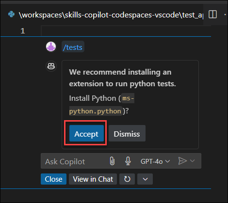

# Exercise 3: Exploring Python with GitHub Copilot: Intelligent Code Suggestions

### Estimated Duration: 30 minutes

GitHub Copilot accelerates the creation of programming language scripts through AI-driven code generation and intelligent tools. By analyzing context and comments, Copilot swiftly generates foundational code and offers dynamic suggestions for enhancements and optimizations.Beyond code generation, Copilot offers advanced features like autocompletion, code expansion, and suggestions for enhancing existing code or introducing new functionalities. 

> **Disclaimer**: GitHub Copilot will automatically suggest the entire body of a function in gray text. However, the precise recommendation may vary.

> **Note**: If you can't see any GitHub Copilot hints in VS Code, restart VS Code once and try again.

## Lab objectives

In this lab, you will complete the following tasks:

- Task 1:  Develop a Python Script for Implementing a Calculator
- Task 2: Explore GitHub Copilot Tools

## Task 1:  Develop a Python Script for Implementing a Calculator

1. From the VS Code Explorer window, create a **New File**.

   

1. Name the file `app.py` and verify your new file looks as shown below:
   > **Note:** Create the `app.py` file outside the `.devcontainer` folder.

   

1. Now press `Ctrl + I` to open the GitHub Copilot Chat and paste the following **comments (1)** and click > or press **Enter (2)**. Copilot will give a response, and you can review it and click **Accept (3)**. Also, you can **Discard** the suggestion as depicted in the image below.
   
   ```
   Create a simple calculator that can add, subtract, multiply or divide depending upon the input from the user.
   ```

   

1. Press `CTRL + S` to save the file.

1. Click on the **ellipsis (1)** on the top, click on **Terminal (2)** and select **New Terminal (3)**.

   

1. Run the application with the **python app.py** command in the terminal and verify the output has been generated.

      

      > **Congratulations** on completing the task! Now, it's time to validate it. Here are the steps:
      > - Hit the Validate button for the corresponding task. If you receive a success message, you can proceed to the next task.
      > - If not, carefully read the error message and retry the step, following the instructions in the lab guide. 
      > - If you need any assistance, please contact us at cloudlabs-support@spektrasystems.com. We are available 24/7 to help you out.

      <validation step="37a79ae8-73af-4ce6-a2f0-c3895b352cd3" />

## Task 2: Explore GitHub Copilot Tools

By leveraging the previously generated code, you will explore specific tools provided by Copilot that simplifies major tasks.

1. Press `Ctrl + A` to select the entire code from the `app.py` file.

1. Right click on the selected code, select **Copilot (1)** and select **Editor Inline Chat (2)**.

      

1. The following window prompts you to suggest any improvements or enhancements you would like to make to the code. Paste the following **comments (1)** and click > or press **Enter (2)**. Copilot will give a response, and you can review it and click **Accept (3)**. Also, you can **Discard** the suggestion as depicted in the image below.

   ```
   Include calculation of percentages
   ```
   
   

1. Press `CTRL + S` to save the file.

1. Click on the **ellipsis (1)** on the top, click on **Terminal (2)** and select **New Terminal (3)**.

      
   
1. Run the application with the **python app.py** command in the terminal and verify the output has been generated.

      

1. Select the code again and right click on the selected code, select **Copilot (1)** and select **Explain (2)**.

   

1. It opens the GitHub Copilot Chat on the right, offering a comprehensive explanation of the code as show below.

      

1. Select the code again and right click on the selected code, select **Copilot (1)** and select **Fix (2)**.

   

1. GitHub Copilot will automatically utilize the `/fix` comment to propose potential improvements to specific parts of code for enhancement. Click on **Accept** to utilize the fixes in your code.

      

1. Select the code again and right click on the selected code, select **Copilot (1)** and select **Generate Docs (2)**.

      

1. GitHub Copilot will automatically use the `/doc` comment to provide a breakdown of a specific line of code. Click on Accept to gain a deeper understanding while reviewing the code.

      

1. Select the code again and right click on the selected code, select **Copilot (1)** and select **Generate Tests(2)**.

      

1. GitHub Copilot will automatically use the `/tests` comment. Click on **Accept**.

      

1. Click on **Accept** again to accept the suggestion.

      

1. Press `CTRL + S` to save the file.       

1. It will open a new file named **test_app.py**, displaying the test cases.

      

## Review
In this lab, you learned to create a Python script for a calculator and explored GitHub Copilot tools, which streamline tasks effectively.
  
## You have successfully completed the lab. Click on **Next >>** to procced with next exercise.
