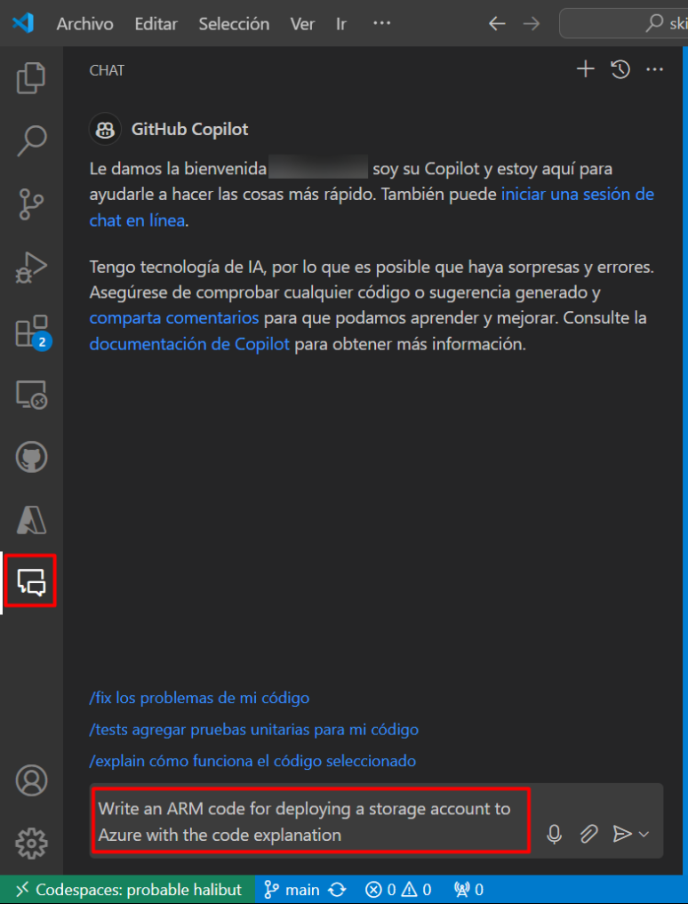
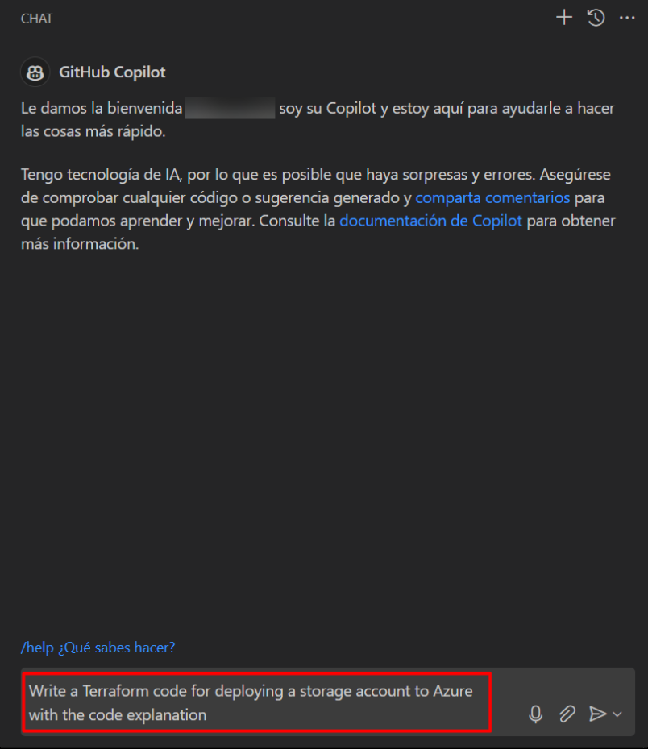
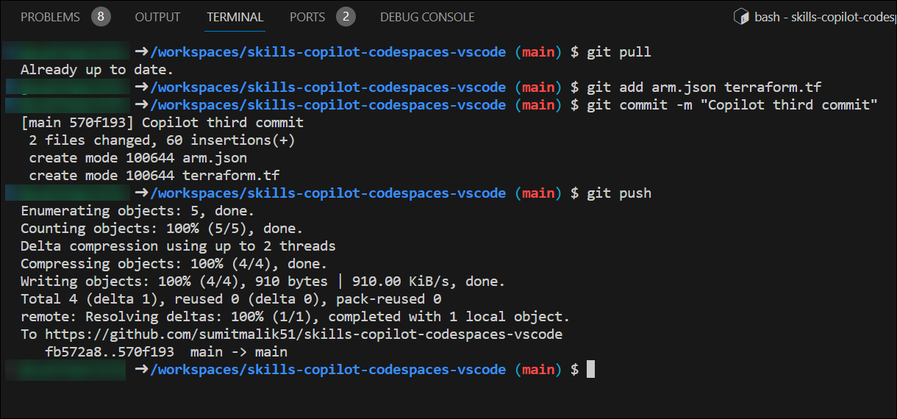

# Exercise 4: Using GitHub Copilot Chat to generate ARM and Terraform code with Copilot

### About GitHub Copilot Chat and Visual Studio Code

GitHub Copilot Chat is a chat interface that lets you ask and receive answers to coding-related questions directly within a supported IDE. Copilot Chat can help you with a variety of coding-related tasks, like offering you code suggestions, providing natural language descriptions of a piece of code's functionality and purpose, generating unit tests for your code, and proposing fixes for bugs in your code. For more information, see "[About GitHub Copilot Chat](https://docs.github.com/en/copilot/github-copilot-chat/about-github-copilot-chat)."

### Use cases for GitHub Copilot Chat

GitHub Copilot Chat can provide coding assistance in a variety of scenarios.

 - Generating unit test cases
 - Explaining code
 - Proposing code fixes
 - Answering coding questions

In this exercise, you will be installing GitHub Copilot Chat extension and you will be generating ARM and Terraform code with Copilot.

#### Task 1: Installing GitHub Copilot Chat extension in VS Code

1. To install the GitHub Copilot Chat extension, the following steps are to be performed within Visual Studio Code:
    - Click on the **Extensions (1)** icon in the activity bar present on the left side of the Visual Studio Code Window.
    - In the "Search Extensions in Marketplace" search box, type and search for the **GitHub Copilot Chat (2)** extension.
    - Select **GitHub Copilot Chat (3)** from the list of results that show up.
    - Click on the **Install (4)** button.

   

1. Once the installation is complete, in the left navigation pane you will able to see the icon for GitHub Copilot Chat as shown in the below.

   

### Task 2: Generate Code by Chat that uses ARM to deploy resources to Azure

1. In the Visual Studio Code activity bar, click the GitHub Copilot Chat icon to open the GitHub Copilot Chat chat window.

1. At the bottom of the GitHub Copilot Chat window, in the **Ask Copilot a question or type / for topics** text box, type a coding-related question, then press Enter. For example, type "Write a ARM code for deploying Storage Account to Azure."

    

1. GitHub Copilot Chat will process your question and provide an answer, with code suggestions when appropriate, in the chat window. 

    

    >**Note**: Optionally, if GitHub Copilot Chat suggests a follow-up question above the **Ask Copilot a question or type / for topics** text box, click the follow-up question to ask it.

    >**Note**:  If your question is outside the scope of GitHub Copilot Chat, it will tell you and may suggest an alternative question to ask.
   
1. You can view the response from GitHub Copilot in the Chat. To insert code into new file, click on **Ellipsis (...)** **(1)** and select **Insert Into New File** **(2)**.

   

1. Press `CTRL + S` to save the file. Name the file as `arm.json` and click on **OK**

   

### Task 3: Generate Code by Chat that uses Terraform to deploy resources to Azure

1. In the Visual Studio Code activity bar, click the GitHub Copilot Chat icon to open the GitHub Copilot Chat chat window.

1. At the bottom of the GitHub Copilot Chat window, in the **Ask Copilot a question or type / for topics** text box, type a coding-related question, then press Enter. For example, type "Write a Terraform code for deploying Storage Account to Azure."

   

1. GitHub Copilot Chat will process your question and provide an answer, with code suggestions when appropriate, in the chat window. 

    

    >**Note**: Optionally, if GitHub Copilot Chat suggests a follow-up question above the **Ask Copilot a question or type / for topics** text box, click the follow-up question to ask it.

    >**Note**:  If your question is outside the scope of GitHub Copilot Chat, it will tell you and may suggest an alternative question to ask.
   
1. You can view the response from GitHub Copilot in the Chat. To insert code into new file, click on **Ellipsis (...)** **(1)** and select **Insert Into New File** **(2)**.

   

1. Press `CTRL + S` to save the file. Name the file as `terraform.tf` and click on **OK**

   

### Task 4: Push code to your repository from the codespace

1. Use the VS Code terminal to add files to the repository. Open VS Code Terminal if it's not opened yet.

1. Run the below command to add the `app.py` and `prime.py` files to the repository:

   ```
   git add arm.json terraform.tf
   ```

1. Next from the VS Code terminal stage and commit the changes to the repository:

   ```
   git commit -m "Copilot third commit"
   ```

1. Finally from the VS Code terminal push to code to the repository:

   ```
   git push
   ```

   

   >**Note**: Wait about 60 seconds then refresh your repository landing page for the next step.

1. You can verify the `app.py` and `prime.py` files available in your GitHub repository.

   

1. Click on Next from the bottom right to continue with the next exercies.
