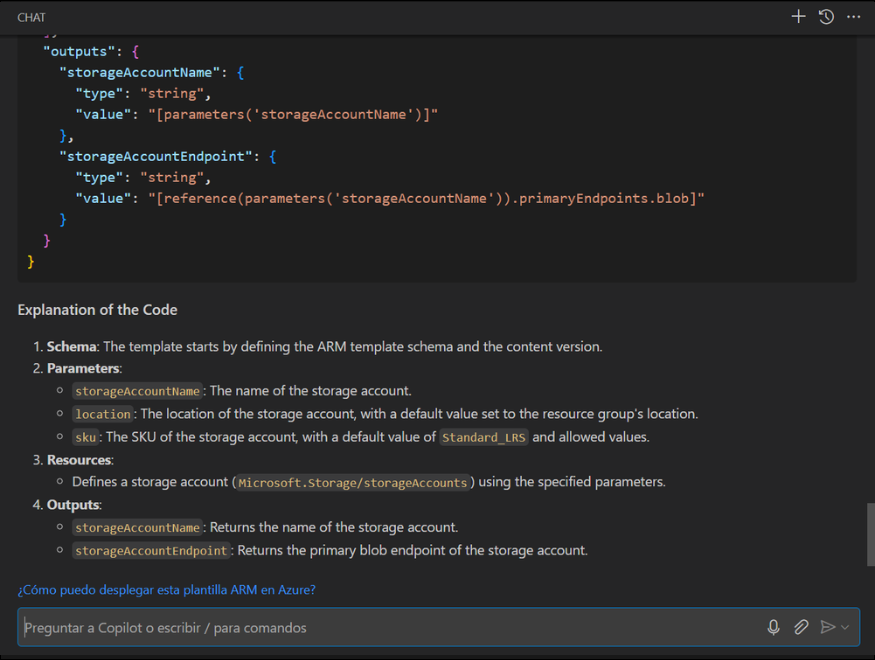
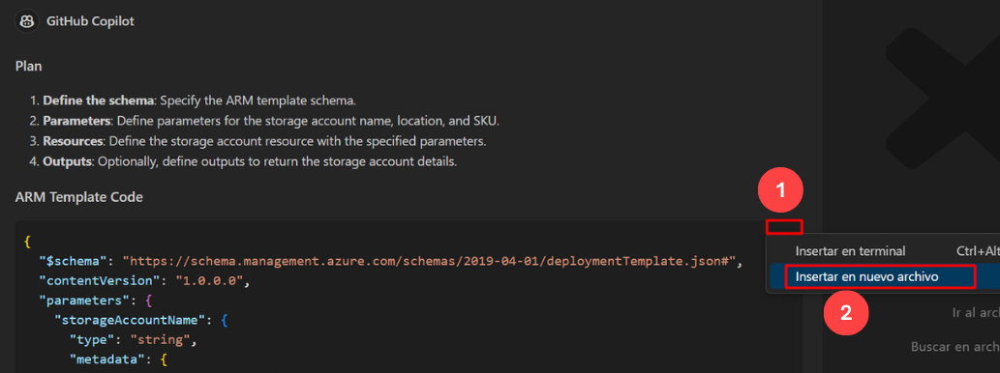

# Exercise 4: Using GitHub Copilot Chat to generate ARM and Terraform code with Copilot

### Estimated Duration: 40 minutes

## About GitHub Copilot Chat and Visual Studio Code

GitHub Copilot Chat allows you to ask coding questions and receive answers directly within the supported IDE. Copilot Chat can help you with a variety of coding-related tasks, like offering you code suggestions, providing natural language descriptions of a piece of code's functionality and purpose, generating unit tests for your code, and proposing fixes for bugs in your code. For more information, see "[About GitHub Copilot Chat](https://docs.github.com/en/copilot/github-copilot-chat/about-github-copilot-chat)."

## Use cases for GitHub Copilot Chat

There are several situations in which GitHub Copilot Chat can help with coding.

 - Generating unit test cases
 - Explaining code
 - Proposing code fixes
 - Answering coding questions

In this exercise, you will utilize Copilot to generate code in ARM, Terraform, and PowerShell.

> **Disclaimer**: GitHub Copilot will automatically suggest an entire function body or code in gray text. Examples of what you'll most likely see in this exercise, but the exact suggestion may vary.

>**Note**: If you are unable to see any suggestions by GitHub Copilot in VS Code, please restart the VS Code once and try again. 

## Lab objectives

You will be able to complete the following exercises:

- Generate code by chat that uses ARM to deploy resources to Azure
- Generate code by chat that uses Terraform to deploy resources to Azure
- Generate code by chat that uses PowerShell to deploy resources to Azure
- Push code to your repository from the codespace

### Task 1: Generate code by chat that uses ARM to deploy resources to Azure

1. In the Visual Studio Code activity bar, click the GitHub Copilot Chat icon to open the GitHub Copilot Chat window.

1. At the bottom of the GitHub Copilot Chat window, in the **Ask Copilot or type / for commands** text box, type a coding-related question, then press Enter. For example, type "Write an ARM code for deploying a storage account to Azure with the code explanation."

    

1. GitHub Copilot Chat will process your question and provide an answer, with code suggestions when appropriate, in the chat window. 

    

       

    > **Note:** Here's an example of what you are likely to see; however, the precise recommendation could vary.

    > **Note**: Optionally, if GitHub Copilot Chat suggests a follow-up question above the **Ask Copilot or type / for commands** text box, click the follow-up question to ask it.

    > **Note**:  If your question is outside the scope of GitHub Copilot Chat, it will tell you and may suggest an alternative question to ask.
   
1. You can view the response from GitHub Copilot in the chat. To insert code into a new file, click on **Ellipsis (...)** **(1)** and select **Insert Into New File** **(2)**.

   

1. Press `CTRL + S` to save the file. Name the file `arm.json` and click on **OK**

   

### Task 2: Generate code by chat that uses Terraform to deploy resources to Azure

1. In the Visual Studio Code activity bar, click the GitHub Copilot Chat icon to open the GitHub Copilot Chat window.

1. At the bottom of the GitHub Copilot Chat window, in the **Ask Copilot or type / for commands** text box, type a coding-related question, then press Enter. For instance, type "Write a Terraform code for deploying a storage account to Azure with the code explanation".

   

1. GitHub Copilot Chat will process your question and provide an answer, with code suggestions when appropriate, in the chat window.

    

    > **Note:** Here's an example of what you are likely to see; however, the precise recommendation could vary.
    
    > **Note**: Optionally, if GitHub Copilot Chat suggests a follow-up question above the **Ask Copilot a question or type / for topics** text box, click the follow-up question to ask it.

    > **Note**:  If your question is outside the scope of GitHub Copilot Chat, it will tell you and may suggest an alternative question to ask.
   
1. You can view the response from GitHub Copilot in the chat. To insert code into a new file, click on **Ellipsis (...)** **(1)** and select **Insert Into New File** **(2)**.

   

1. Press `CTRL + S` to save the file. Name the file `terraform.tf` and click on **OK**

   

### Task 3: Generate code by chat that uses PowerShell to deploy resources to Azure

1. In the Visual Studio Code activity bar, click the GitHub Copilot Chat icon to open the GitHub Copilot Chat window.

1. At the bottom of the GitHub Copilot Chat window, in the **Ask Copilot a question or type / for topics** text box, type a coding-related question, then press Enter. For example, type "Write a PowerShell script for deploying a storage account to Azure."

   

1. GitHub Copilot Chat will process your question and provide an answer, with code suggestions when appropriate, in the chat window. 

    

    > **Note:** Here's an example of what you are likely to see; however, the precise recommendation could vary.

    > **Note**: Optionally, if GitHub Copilot Chat suggests a follow-up question above the **Ask Copilot a question or type / for topics** text box, click the follow-up question to ask it.

    > **Note**:  If your question is outside the scope of GitHub Copilot Chat, it will tell you and may suggest an alternative question to ask.
   
1. You can view the response from GitHub Copilot in the chat. To insert code into a new file, click on **Ellipsis (...)** **(1)** and select **Insert Into New File** **(2)**.

   

1. Press `CTRL + S` to save the file, and you will see a recommendation to install the `PowerShell` extension. Click on Install. Name the file `powershell.ps1` and click on **OK**.

   

### Task 4: Push code to your repository from the codespace

1. Use the VS Code terminal to add files to the repository. Open VS Code Terminal if it's not opened yet.

1. Run the below command to add the `arm.json` , `terraform.tf` and `powershell.ps1` files to the repository:

   ```
   git add arm.json terraform.tf powershell.ps1
   ```

1. Next, from the VS Code terminal stage, commit the changes to the repository:

   ```
   git commit -m "Copilot third commit"
   ```

1. Finally, from the VS Code terminal, push to code to the repository:

   ```
   git push
   ```

   

   >**Note**: Wait about 60 seconds, then refresh your repository landing page for the next step.

1. You can verify the `arm.json`, `powershell.ps1`, and `terraform.tf` files available in your GitHub repository.

   

1. Click on **Next** below to move on to the next page.

### Summary

In this exercise, Copilot has been utilized to automatically generate code in ARM, Terraform, and PowerShell.

### You have successfully completed the lab
