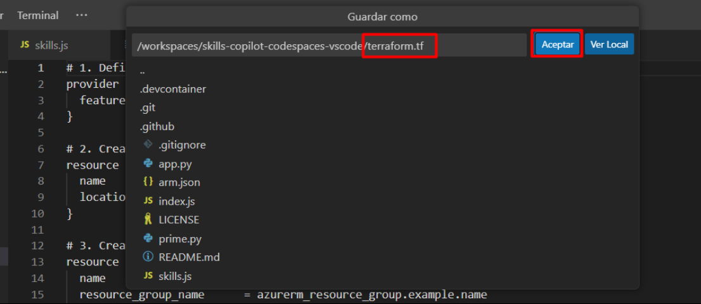

# Ejercicio 4: Usar GitHub Copilot Chat para generar código ARM y Terraform con Copilot

### Duración Estimada: 25 minutos

## Acerca de GitHub Copilot Chat y Visual Studio Code

GitHub Copilot Chat le permite hacer preguntas sobre codificación y recibir respuestas directamente en el IDE compatible. Copilot Chat puede ayudarle con una variedad de tareas relacionadas con la programación, como ofrecerle sugerencias de código, proporcionar descripciones en lenguaje natural de la funcionalidad y el propósito de un fragmento de código, generar pruebas unitarias para su código y proponer correcciones para errores en su código. Para obtener más información, consulte "[Acerca de GitHub Copilot Chat](https://docs.github.com/en/copilot/github-copilot-chat/about-github-copilot-chat)".

## Casos de uso de GitHub Copilot Chat

Hay varias situaciones en las que GitHub Copilot Chat puede ayudarle con la programación.

- Generar casos de pruebas unitarias
- Explicar el código
- Proponer correcciones de código
- Responder preguntas sobre codificación

En este ejercicio, utilizará Copilot para generar código en ARM, Terraform y PowerShell.

>**Descargo de responsabilidad**: GitHub Copilot sugerirá automáticamente todo el cuerpo de una función o código en texto gris. A continuación, se muestran ejemplos de lo que probablemente verá en este ejercicio, pero la sugerencia exacta puede variar.

>**Nota**: Si no puede ver ninguna sugerencia de GitHub Copilot en VS Code, reinicie VS Code una vez e intente nuevamente.

## Objetivos del laboratorio

Será capaz de completar las siguientes tareas:

- Tarea 1: Generar código mediante chat que use ARM para implementar recursos en Azure
- Tarea 2: Generar código mediante chat que use Terraform para implementar recursos en Azure
- Tarea 3: Generar código mediante chat que use PowerShell para implementar recursos en Azure
- Tarea 4: Enviar código a su repositorio desde el codespace

### Tarea 1: Generar código mediante chat que use ARM para implementar recursos en Azure

1. En la barra de actividades de Visual Studio Code, haga clic en el ícono de GitHub Copilot Chat para abrir la ventana de GitHub Copilot Chat.

1. En la parte inferior de la ventana de GitHub Copilot Chat, en el cuadro de texto **Preguntar a Copilot o escribir / para los comandos**, escriba una pregunta relacionada con la codificación y, luego, presione Entrar. Por ejemplo, escriba "Write an ARM code for deploying a storage account to Azure with the code explanation".

    

1. GitHub Copilot Chat procesará su pregunta y proporcionará una respuesta, con sugerencias de código cuando corresponda, en la ventana de chat.

    

       

    > **Nota:** Este es un ejemplo de lo que probablemente verá; sin embargo, la recomendación precisa podría variar.

    > **Nota**: Opcionalmente, si GitHub Copilot Chat sugiere una pregunta de seguimiento sobre el cuadro de texto **Preguntar a Copilot o escribir / para los comandos**, haga clic en la pregunta de seguimiento para hacerla.

    > **Nota**: Si su pregunta está fuera del alcance de GitHub Copilot Chat, se le indicará y es posible que le sugiera una pregunta alternativa para realizar.
   
1. Puede ver la respuesta de GitHub Copilot en el chat. Para insertar código en un archivo nuevo, haga clic en los **Puntos suspensivos (...)** **(1)** y seleccione **Insertar en Nuevo Archivo** **(2)**.

   

1. Presione `CTRL + S` para guardar el archivo. Asigne el nombre `arm.json` al archivo y haga clic en **Aceptar**

   

### Tarea 2: Generar código mediante chat que use Terraform para implementar recursos en Azure

1. En la barra de actividades de Visual Studio Code, haga clic en el ícono de GitHub Copilot Chat para abrir la ventana de GitHub Copilot Chat.

1. En la parte inferior de la ventana de GitHub Copilot Chat, en el cuadro de texto **Preguntar a Copilot o escribir / para comandos**, escriba una pregunta relacionada con la codificación y, luego, presione Entrar. Por ejemplo, escriba "Write a Terraform code for deploying a storage account to Azure with the code explanation".

   

1. GitHub Copilot Chat procesará su pregunta y proporcionará una respuesta, con sugerencias de código cuando corresponda, en la ventana de chat.

    

    > **Nota:** Este es un ejemplo de lo que probablemente verá; sin embargo, la recomendación precisa podría variar.
    
    > **Nota**: Opcionalmente, si GitHub Copilot Chat sugiere una pregunta de seguimiento sobre el cuadro de texto **Preguntar a Copilot o escribir / para los comandos**, haga clic en la pregunta de seguimiento para hacerla.

    > **Nota**: Si su pregunta está fuera del alcance de GitHub Copilot Chat, se le indicará y es posible que le sugiera una pregunta alternativa para realizar.
   
1. Puede ver la respuesta de GitHub Copilot en el chat. Para insertar código en un archivo nuevo, haga clic en los **Puntos suspensivos (...)** **(1)** y seleccione **Insertar en Nuevo Archivo** **(2)**.

   

1. Presione `CTRL + S` para guardar el archivo. Asigne el nombre `terraform.tf` al archivo y haga clic en **Aceptar**

   

### Tarea 3: Generar código mediante chat que use PowerShell para implementar recursos en Azure

1. En la barra de actividades de Visual Studio Code, haga clic en el ícono de GitHub Copilot Chat para abrir la ventana de GitHub Copilot Chat.

1. En la parte inferior de la ventana de GitHub Copilot Chat, en el cuadro de texto **Preguntar a Copilot o escribir / para comandos**, escriba una pregunta relacionada con la codificación y, luego, presione Entrar. Por ejemplo, escriba "Write a PowerShell script for deploying a storage account to Azure".

   

1. GitHub Copilot Chat procesará su pregunta y proporcionará una respuesta, con sugerencias de código cuando corresponda, en la ventana de chat.

    

    > **Nota:** Este es un ejemplo de lo que probablemente verá; sin embargo, la recomendación precisa podría variar.

    > **Nota**: Opcionalmente, si GitHub Copilot Chat sugiere una pregunta de seguimiento sobre el cuadro de texto **Preguntar a Copilot o escribir / para los comandos**, haga clic en la pregunta de seguimiento para hacerla.

    > **Nota**: Si su pregunta está fuera del alcance de GitHub Copilot Chat, se le indicará y es posible que le sugiera una pregunta alternativa para realizar.
   
1. Puede ver la respuesta de GitHub Copilot en el chat. Para insertar código en un archivo nuevo, haga clic en los **Puntos suspensivos (...)** **(1)** y seleccione **Insertar en Nuevo Archivo** **(2)**.

   

1. Presione `CTRL + S` para guardar el archivo y verá una recomendación para instalar la extensión `PowerShell`. Haga clic en Instalar. Nombre el archivo `powershell.ps1` y haga clic en **Aceptar**.

   

### Tarea 4: Enviar código a su repositorio desde el codespace

1. Use la Terminal de VS Code para agregar archivos al repositorio. Abra la Terminal de VS Code si aún no está abierta.

1. Ejecute el siguiente comando para agregar los archivos `arm.json`, `terraform.tf` y `powershell.ps1` al repositorio:

   ```
   git add arm.json terraform.tf powershell.ps1
   ```

1. A continuación, desde la Terminal de VS Code, confirme los cambios en el repositorio:

   ```
   git commit -m "Copilot third commit"
   ```

1. Por último, desde la Terminal de VS Code, envíe el código al repositorio:

   ```
   git push
   ```

   

   >**Nota**: Espere unos 60 segundos y luego actualice la página de inicio de su repositorio para el siguiente paso.

1. Puede verificar los archivos `arm.json`, `powershell.ps1` y `terraform.tf` disponibles en su repositorio de GitHub.

   

1. Haga clic en **Siguiente** a continuación para pasar a la página siguiente.

### Resumen

En este ejercicio, se ha utilizado Copilot para automáticamente generar código en ARM, Terraform y PowerShell.

### Ha completado el laboratorio con éxito
