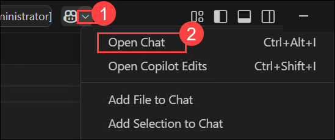
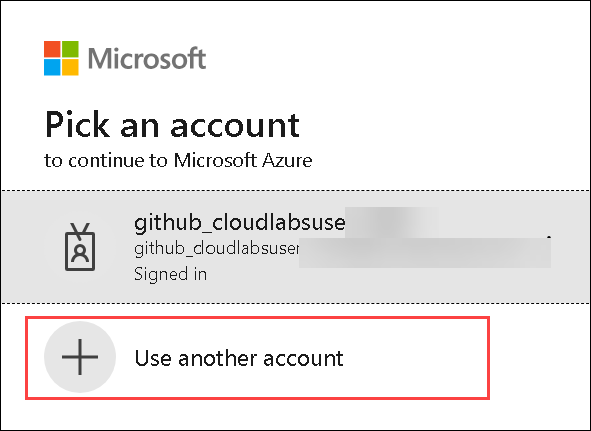
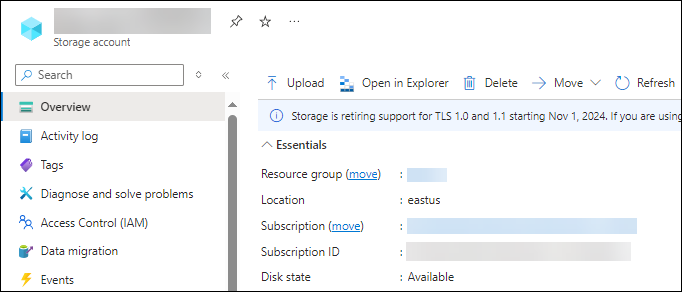
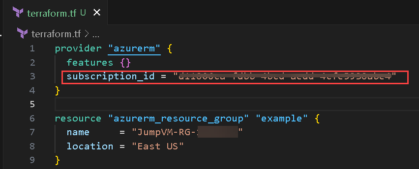
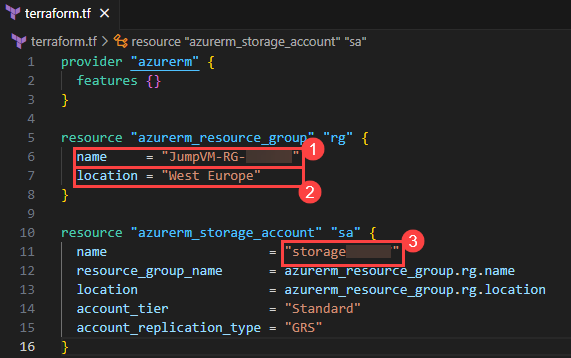
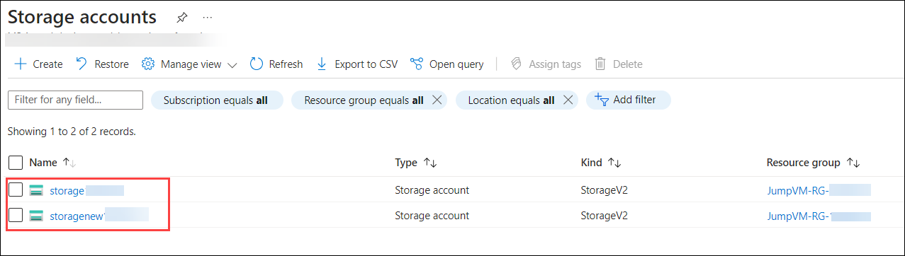

# Ejercicio 4: Usar GitHub Copilot Chat para generar código ARM y Terraform con Copilot

### Duración Estimada: 60 minutos

## Acerca de GitHub Copilot Chat y Visual Studio Code

GitHub Copilot Chat le permite hacer preguntas sobre codificación y recibir respuestas directamente en el IDE compatible. Copilot Chat puede ayudarle con una variedad de tareas relacionadas con la programación, como ofrecerle sugerencias de código, proporcionar descripciones en lenguaje natural de la funcionalidad y el propósito de un fragmento de código, generar pruebas unitarias para su código y proponer correcciones para errores en su código. Para obtener más información, consulte "[Acerca de GitHub Copilot Chat](https://docs.github.com/en/copilot/github-copilot-chat/about-github-copilot-chat)".

## Casos de uso de GitHub Copilot Chat

Hay varias situaciones en las que GitHub Copilot Chat puede ayudarle con la programación.

- Generar casos de pruebas unitarias
- Explicar el código
- Proponer correcciones de código
- Responder preguntas sobre codificación

En este ejercicio, utilizará Copilot para generar código en ARM, Terraform y PowerShell.

>**Descargo de responsabilidad**: GitHub Copilot sugerirá automáticamente todo el cuerpo de una función o código en texto gris. A continuación, se muestran ejemplos de lo que probablemente verá en este ejercicio, pero la sugerencia exacta puede variar.

>**Nota**: Si no puede ver ninguna sugerencia de GitHub Copilot en VS Code, reinicie VS Code una vez e intente nuevamente.

## Objetivos del laboratorio

Será capaz de completar las siguientes tareas:

- Tarea 1: Generar código mediante chat que use ARM para implementar recursos en Azure
- Tarea 2: Generar código mediante chat que use Terraform para implementar recursos en Azure
- Tarea 3: Generar código mediante chat que use PowerShell para implementar recursos en Azure

### Tarea 1: Generar código mediante chat que use ARM para implementar recursos en Azure

   >**Nota**: Si la extensión GitHub Copilot no está instalada, haga clic en Instalar.

1. En la barra de actividades de Visual Studio Code, haga clic en el ícono **GitHub Copilot Chat** **(1)** en la parte superior derecha. Haga clic en **Abrir Chat (2)** para abrir la ventana de GitHub Copilot Chat.

    

1. En la parte inferior de la ventana de GitHub Copilot Chat, en el cuadro de texto **Ask Copilot a question or type / for topics**, escriba una pregunta relacionada con la codificación y luego presione Enter. Por ejemplo, escriba `Write an ARM code for deploying a storage account to Azure with the code explanation.`.

    

1. GitHub Copilot Chat procesará su pregunta y proporcionará una respuesta, con sugerencias de código cuando corresponda, en la ventana de chat.

    

    > **Nota:** Este es un ejemplo de lo que es probable que vea; sin embargo, la recomendación precisa podría variar.

    > **Nota**: De manera opcional, si GitHub Copilot Chat sugiere una pregunta de seguimiento sobre el cuadro de texto **Ask Copilot a question or type / for topics**, haga clic en la pregunta de seguimiento para hacerla.

    > **Nota**: Si su pregunta está fuera del alcance de GitHub Copilot Chat, se le indicará y es posible que le sugiera una pregunta alternativa para hacer.
   
1. Puede ver la respuesta de GitHub Copilot en el chat. Para insertar código en un nuevo archivo, haga clic en los **puntos suspensivos (...)** y seleccione **Insert Into New File**.

   

   
   
1. Presiona `CTRL + S` para guardar el archivo. Asigne un nombre al archivo `arm.json` y haga clic en **Aceptar**

   

1. Después de guardar el archivo, abra el ícono del portal de Azure desde el escritorio.

       

1. Si la ventana se abre dentro de la sesión existente, haga clic en el ícono **Perfil** en la esquina superior derecha y seleccione **Sign in with a different account**.

       

1. Haga clic en **Use Another Account**.

       

1. En la pestaña **Sign in to Microsoft Azure**, verá una pantalla de inicio de sesión. Ingrese el siguiente correo electrónico/nombre de usuario y luego haga clic en **Next**.

   - **Correo electrónico/Nombre de usuario:** <inject key="AzureAdUserEmail"></inject>

1. Ahora, ingrese la siguiente contraseña y haga clic en **Sign In**.

   - **Contraseña:** <inject key="AzureAdUserPassword"></inject>

1. Si ve la ventana emergente **Stay Signed in?**, haga clic en **No**.

1. Seleccione **Cancel** en la página **Welcome to Azure**.

     

1. Busque **deploy(1)** y seleccione **Deploy a custom template(2)**.

     

1. Haga clic en **Select a template(1)** y haga clic en **Build your own template in the editor(2)**.

      

1. **Pegue(1)** el código que había guardado anteriormente en VS Code en la sección **Edit template** y haga clic en **Save(2)**.

      

1. En la sección de detalles del proyecto, agregue los siguientes detalles:

   - Suscripción - **Seleccione la suscripción predeterminada (1)**
   - Grupo de Recursos - **Seleccione JumpVM-RG-<inject key="Deployment-id" enableCopy="false"/> (2)**
   - Región - **Seleccione la región predeterminada. (3)**
   - Nombre de la Cuenta de Almacenamiento - **storage<inject key="Deployment-id" enableCopy="false"/> (4)**
   - Haga clic en **Review + Create (5)**

     

        > **Nota:** En caso de que se muestre un nombre de la cuenta de almacenamiento, utilice el valor predeterminado.

1. Haga clic en **Create**        
      
1. Haga clic en **Go to Resource**.

     

1. Verifique que la **cuenta de almacenamiento** se haya creado.

     

### Tarea 2: Generar código mediante chat que use Terraform para implementar recursos en Azure

1. En la barra de actividades de Visual Studio Code, haga clic en el ícono de GitHub Copilot Chat para abrir la ventana de GitHub Copilot Chat.

1. En la parte inferior de la ventana de GitHub Copilot Chat, en el cuadro de texto **Ask Copilot a question or type / for topics**, escriba una pregunta relacionada con la codificación y luego presione Enter. Por ejemplo, escriba `Write a Terraform code for deploying a storage account to Azure with the code explanation`.

1. GitHub Copilot Chat procesará su pregunta y proporcionará una respuesta, con sugerencias de código cuando corresponda, en la ventana de chat.

    

    > **Nota:** Este es un ejemplo de lo que es probable que vea; sin embargo, la recomendación precisa podría variar.
    
    > **Nota**: De manera opcional, si GitHub Copilot Chat sugiere una pregunta de seguimiento sobre el cuadro de texto **Ask Copilot a question or type / for topics**, haga clic en la pregunta de seguimiento para hacerla.

    > **Nota**: Si su pregunta está fuera del alcance de GitHub Copilot Chat, se le indicará y es posible que le sugiera una pregunta alternativa para hacer.
   
1. Puede ver la respuesta de GitHub Copilot en el chat. Para insertar código en un nuevo archivo, haga clic en los **puntos suspensivos (...)** **1** y seleccione **Insertar en nuevo archivo** **2**.
   
   

1. Copie y pegue `subscription_id = "<subscription_id>"` dentro de **provider "azurerm"** como se muestra en la siguiente captura de pantalla.

   

    >**Nota:** Reemplace `<subscription_id >` con el valor real. Para obtener el ID de suscripción, navegue a `portal.azure.com`, vaya a su grupo de recursos y copie el ID.

     

1. Complete los detalles a continuación para el campo correspondiente:

   - Nombre del Grupo de Recursos - **JumpVM-RG-<inject key="Deployment-id" enableCopy="false"/>** **(1)**
   - Región - **East US** **(2)**
   - Nombre de la Cuenta de Almacenamiento - **storagenew<inject key="Deployment-id" enableCopy="false"/>** **(3)**

       
     
1. Presione `CTRL + S` para guardar el archivo. Asigne un nombre al archivo `terraform.tf` y haga clic en **OK**
   
      

1. Haga clic en los **puntos suspensivos (...) (1)** en la parte superior, seleccione **Terminal (2)** y haga clic en **Nuevo terminal (3).**

1. Ejecute el siguiente comando para inicializar un directorio de trabajo y descargar los complementos y módulos del proveedor necesarios.

    ```
    terraform init
    ```   

1. Ejecute el siguiente comando para iniciar sesión en Azure

    ```
    az login
    ```
   * Nombre de usuario: <inject key="AzureAdUserEmail"></inject>

   * Contraseña: <inject key="AzureAdUserPassword"></inject>
       
1. Ejecute el siguiente comando para crear un plan de ejecución, el cual le permite obtener una vista previa de los cambios que Terraform planea realizar en su infraestructura.

    ```
    terraform plan
    ```   

1. Ejecute el siguiente comando para importar el grupo de recursos existente

    ```
    terraform import azurerm_resource_group.example /subscriptions/<subscription_id>/resourceGroups/JumpVM-RG-<Deployment-id>
    ```   

     >**Nota:** Reemplace `<subscription_id >` con el valor real. Para obtener el ID de suscripción, navegue a `portal.azure.com`, vaya a su grupo de recursos y copie el ID.

      

     > **Nota:** Reemplace `<Deployment-id >` con el ID real. Para obtener el Deployment-id, navegue a la pestaña **Detalles del entorno** en la máquina virtual y copie el DID.

     > **Nota:** Si recibe un error como éste: 
      **Prepared azurerm_resource_group for import
      Error: Resource already managed by Terraform. Terraform is already managing a remote object for azurerm_resource_group.example. To import to this address you must first remove the existing object from the state.**

      - Ejecute este comando `terraform state rm azurerm_resource_group.example`
      - Vuelva a ejecutar el comando de importación `terraform import azurerm_resource_group.example /subscriptions/<subscription_id>/resourceGroups/JumpVM-RG-<Deployment-id >`

1. Ejecute el siguiente comando para ejecutar acciones planificadas, creando o actualizando recursos de infraestructura.

    ```
    terraform apply
    ```   

     > **Nota:** Escriba **yes** cuando se le solicite.

1. Una vez que el comando **terraform apply** se haya ejecutado correctamente, navegue a `portal.azure.com`.

1. Busque **storage (1)** y seleccione **Storage Accounts (2)**.

    
  
1. Verifique que **storage<inject key="Deployment-id" enableCopy="false"/>** y **storagenew<inject key="Deployment-id" enableCopy="false"/>** se hayan creado.

    
   
### Tarea 3: Generar código mediante chat que use PowerShell para implementar recursos en Azure

1. En la barra de actividades de Visual Studio Code, haga clic en el ícono de GitHub Copilot Chat para abrir la ventana de GitHub Copilot Chat.

1. En la parte inferior de la ventana de GitHub Copilot Chat, en el cuadro de texto **Ask Copilot a question or type / for topics**, escriba una pregunta relacionada con la codificación y luego presione Enter. Por ejemplo, escriba `Write a PowerShell script for deploying a virtual machine to Azure`.

1. GitHub Copilot Chat procesará su pregunta y proporcionará una respuesta, con sugerencias de código cuando corresponda, en la ventana de chat.

    

    > **Nota:** Este es un ejemplo de lo que es probable que vea; sin embargo, la recomendación precisa podría variar.
    
    > **Nota**: De manera opcional, si GitHub Copilot Chat sugiere una pregunta de seguimiento sobre el cuadro de texto **Ask Copilot a question or type / for topics**, haga clic en la pregunta de seguimiento para hacerla.

    > **Nota**: Si su pregunta está fuera del alcance de GitHub Copilot Chat, se le indicará y es posible que le sugiera una pregunta alternativa para hacer.

1. Puede ver la respuesta de GitHub Copilot en el chat. Para insertar código en un nuevo archivo, haga clic en los **puntos suspensivos (...)** y seleccione **Insert Into New File**.

      

1. Presione `CTRL + S` para guardar el archivo y verá una recomendación para instalar la extensión `PowerShell`. Haga clic en Instalar. Nombre el archivo `powershell.ps1` y haga clic en **Aceptar**.

   

### Resumen

En este ejercicio, ha utilizado Copilot para automáticamente generar código en los lenguajes de programación ARM, Terraform y PowerShell.
