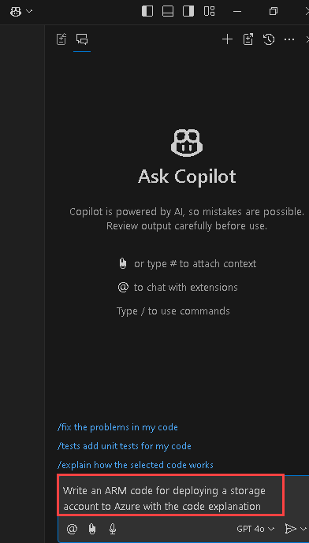

# Exercise 4: Using GitHub Copilot Chat to generate ARM and Terraform code with Copilot

### Estimated Duration: 60 minutes

### About GitHub Copilot Chat and Visual Studio Code

GitHub Copilot Chat allows you to ask coding questions and receive answers directly within the supported IDE. Copilot Chat can help you with a variety of coding-related tasks, like offering you code suggestions, providing natural language descriptions of a piece of code's functionality and purpose, generating unit tests for your code, and proposing fixes for bugs in your code. For more information, see "[About GitHub Copilot Chat](https://docs.github.com/en/copilot/github-copilot-chat/about-github-copilot-chat)."

### Use cases for GitHub Copilot Chat

There are several situations in which GitHub Copilot Chat can help with coding.

 - Generating unit test cases
 - Explaining code
 - Proposing code fixes
 - Answering coding questions

In this lab, you will utilize Copilot to generate code in ARM, Terraform, and PowerShell.

> **Disclaimer**: GitHub Copilot will automatically suggest an entire function body or code in gray text. Examples of what you'll most likely see in this exercise, but the exact suggestion may vary.

## Lab objectives

In this lab, you will complete the following tasks:
 
* Task 1: Generate code by chat that uses ARM to deploy resources to Azure
* Task 2: Generate code by chat that uses Terraform to deploy resources to Azure
* Task 3: Generate code by chat that uses PowerShell to deploy resources to Azure

### Task 1: Generate code by chat that uses ARM to deploy resources to Azure

   >**Note**: If the GitHub Copilot extension is not installed, click on Install.

1. In the Visual Studio Code activity bar, click the **GitHub Copilot Chat** icon **(1)** on the top right. Click on **Open Chat (2)** to open the GitHub Copilot Chat window.

    

1. At the bottom of the GitHub Copilot Chat window, in the **Ask Copilot a question or type / for topics** text box, type a coding-related question, then press Enter. For example, type `Write an ARM code for deploying a storage account with Standard_LRS SKU to Azure with the code explanation.`

    

1. GitHub Copilot Chat will process your question and provide an answer, with code suggestions when appropriate, in the chat window. 

    

    > **Note:** Here's an example of what you are likely to see; however, the precise recommendation could vary.

    > **Note**: Optionally, if GitHub Copilot Chat suggests a follow-up question above the **Ask Copilot a question or type / for topics** text box, click the follow-up question to ask it.

    > **Note**:  If your question is outside the scope of GitHub Copilot Chat, it will tell you and may suggest an alternative question to ask.
   
1. You can view the response from GitHub Copilot in the chat. To insert code into a new file, click on **Ellipsis (...)** and select **Insert Into New File**.

   

   
   
1. Press `CTRL + S` to save the file. Name the file `arm.json` and click on **OK**

   

1.  After saving the file, open the azure portal icon from the desktop.

       

1. On the **Sign in to Microsoft Azure tab**, you will see a login screen. Enter the following email/username and then click on **Next**.

   - **Email/Username:** <inject key="AzureAdUserEmail"></inject>

1. Now enter the following password and click on **Sign in**.

   - **Password:** <inject key="AzureAdUserPassword"></inject>

1. If you see the pop-up **Stay Signed in?**, click **No**.

1. Select **Cancel** on the **Welcome to Azure** page.

     

1. Search for **deploy(1)** and select **Deploy a custom template(2)**.

     

1. Click on **Select a template(1)** and click on **Build your own template in the editor(2)**.

      

1. Copy and **paste(1)** the code you had earlier saved in VS code in the **Edit template** section and click on **Save(2)**.

      

1. In the project details section, add the following details:

   - Subscription - **Select the default subscription (1)**
   - Resource Group - **Select JumpVM-RG-<inject key="Deployment-id" enableCopy="false"/> (2)**
   - Region - **Select the default region. (3)**
   - Storage Account Name - **storage<inject key="Deployment-id" enableCopy="false"/> (4)**
   - Click on **Review + create (5)**

     

        > **Note:** In case, the storage account name is already fetched, use the default.

1. Click on **Create**.      
      
1. Click on **Go to Resource**.

     

1. Verify the **Storage account** is created.

     

### Task 2: Generate code by chat that uses Terraform to deploy resources to Azure

1. In the Visual Studio Code activity bar, click the GitHub Copilot Chat icon to open the GitHub Copilot Chat window.

1. At the bottom of the GitHub Copilot Chat window, in the **Ask Copilot a question or type / for topics** text box, type a coding-related question, then press Enter. For instance, type `Write a Terraform code for deploying a storage account to Azure with the code explanation`.

1. GitHub Copilot Chat will process your question and provide an answer, with code suggestions when appropriate, in the chat window.

    

    > **Note:** Here's an example of what you are likely to see; however, the precise recommendation could vary.
    
    > **Note**: Optionally, if GitHub Copilot Chat suggests a follow-up question above the **Ask Copilot a question or type / for topics** text box, click the follow-up question to ask it.

    > **Note**:  If your question is outside the scope of GitHub Copilot Chat, it will tell you and may suggest an alternative question to ask.
   
1. You can view the response from GitHub Copilot in the chat. To insert code into a new file, click on **Ellipsis (...)** **(1)** and select **Insert Into New File** **(2)**.

   

1. Press `CTRL + S` to save the file. Name the file `terraform.tf` and click on **OK**
   
      
   
### Task 3: Generate code by chat that uses PowerShell to deploy resources to Azure

1. In the Visual Studio Code activity bar, click the **GitHub Copilot Chat icon** to open the GitHub Copilot Chat window.

1. At the bottom of the GitHub Copilot Chat window, in the **Ask Copilot a question or type / for topics** text box, type a coding-related question, then press Enter. For example, type `Write a PowerShell script for deploying a virtual machine to Azure.`

1. GitHub Copilot Chat will process your question and provide an answer, with code suggestions when appropriate, in the chat window. 

      

      > **Note:** Here's an example of what you are likely to see; however, the precise recommendation could vary.

      > **Note**: Optionally, if GitHub Copilot Chat suggests a follow-up question above the **Ask Copilot a question or type / for topics** text box, click the follow-up question to ask it.

      > **Note**:  If your question is outside the scope of GitHub Copilot Chat, it will tell you and may suggest an alternative question to ask.
   
1. You can view the response from GitHub Copilot in the chat. To insert code into a new file, click on **Ellipsis (...)** and select **Insert Into New File**.

      

1. Press `CTRL + S` to save the file, and you will see a recommendation to install the `PowerShell` extension. Click on Install. Name the file `powershell.ps1` and click on **OK**.

   

### Summary

In this lab, you have employed Copilot to automatically generate code in both ARM, Terraform, and PowerShell programming languages.

## You have successfully completed the lab. Click on **Next >>** to procced with next exercise.
