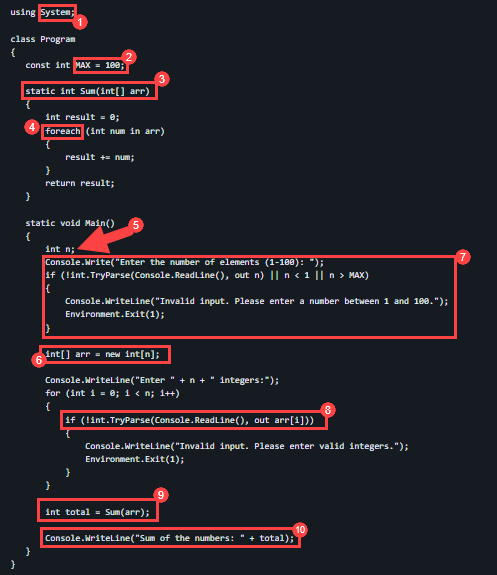

# Ejercicio 5: Usar GitHub Copilot para Refactorizar Código

### Duración Estimada: 20 minutos

La refactorización de código de GitHub se refiere al proceso de reestructurar y mejorar la calidad del código en un repositorio de GitHub sin cambiar su comportamiento externo. La refactorización de código tiene como objetivo mejorar la legibilidad, la mantenibilidad y el rendimiento, al tiempo que reduce la deuda técnica y los posibles errores.

En este ejercicio, participará en una actividad de aprendizaje o práctica con el objetivo principal de emplear GitHub Copilot para la refactorización de código en C#. Además, creará funciones de pruebas unitarias a través de GitHub Copilot Chat.

>**Descargo de responsabilidad**: GitHub Copilot sugerirá automáticamente todo el cuerpo de una función o código en texto gris. A continuación, se muestran ejemplos de lo que probablemente verá en este ejercicio, pero la sugerencia exacta puede variar.

>**Nota**: Si no puede ver ninguna sugerencia de GitHub Copilot en VS Code, reinicie VS Code una vez e intente nuevamente.

## Objetivos del laboratorio

Será capaz de completar las siguientes tareas:

- Tarea 1: Entender el código que ya está disponible para usted
- Tarea 2: Usar GitHub Copilot para refactorizar el código
- Tarea 3: Revisar el código refactorizado y entender cómo funciona
- Tarea 4: Usar GitHub Copilot Chat con código para refactorizar el código
- Tarea 5: Crear funciones de pruebas unitarias
- Tarea 6: Enviar código a su repositorio desde el codespace

## Tarea 1: Entender el código que ya está disponible para usted

### Instalando la extensión C Sharp (C#) en VS Code

1. Para instalar la extensión C Sharp (C#), se deben realizar los siguientes pasos dentro de Visual Studio Code:
    - Haga clic en el ícono **Extensiones** **(1)** en la barra de actividades presente en el lado izquierdo de la ventana de Visual Studio Code.
    - En el cuadro de búsqueda "Buscar extensiones en Marketplace", escriba y busque la extensión **C#** **(2)**.
    - Seleccione **C#** **(3)** de la lista de resultados que aparecen.
    - Haga clic en el botón **Instalar** **(4)**.

   

1. Para demostrar la refactorización del código de GitHub, tomemos un ejemplo de un código mal escrito y analicémoslo. El código a continuación está escrito con el lenguaje de programación C#.
    
   ```
   using System;

   class Program
   {
       const int MAX = 100;

        static int Sum(int[] arr, int n)
        {
            int result = 0;
            for (int i = 0; i < n; i++)
            {
                result += arr[i];
            }
            return result;
        }

        static void Main()
        {
            int n;
            Console.Write("Enter the number of elements (1-100): ");
            if (!int.TryParse(Console.ReadLine(), out n) || n < 1 || n > MAX)
            {
                Console.WriteLine("Invalid input. Please provide a digit ranging from 1 to 100.");
                Environment.Exit(1);
            }

            int[] arr = new int[n];

            Console.WriteLine("Enter " + n + " integers:");
            for (int i = 0; i < n; i++)
            {
                if (!int.TryParse(Console.ReadLine(), out arr[i]))
                {
                    Console.WriteLine("Invalid input. Please enter valid integers.");
                    Environment.Exit(1);
                }
            }

            int total = Sum(arr, n);

            Console.WriteLine("Sum of the numbers: " + total);

            // No need to free memory in C#, as it's managed by the runtime.
        }
    }      
   ```

1. Este código es un ejemplo mal escrito de un programa que solicita al usuario la cantidad de elementos a sumar y toma esos números enteros como entrada. Emplea una asignación de memoria dinámica para la matriz de números enteros y maneja los fallos de asignación con un mensaje de error. A continuación, se muestran algunas cuestiones relacionados con el código:
    - El código comienza con la inclusión del espacio de nombres System para operaciones de entrada y salida esenciales.
    - Define una constante MAX con un valor de 100 para representar la cantidad máxima de elementos permitidos.
    - El método Sum calcula la suma de elementos de una matriz.
    - En el método Main:
      - Solicita al usuario que ingrese la cantidad de elementos (entre 1 y 100) y valida la entrada.
      - Asigna una matriz 'arr' para almacenar los números enteros ingresados.
      - Solicita al usuario que ingrese la cantidad especificada de números enteros y valida cada entrada.
      - Calcula la suma de los números enteros ingresados ​​utilizando el método Sum.
      - Envía la suma a la consola.
      - No hay necesidad de liberar memoria manualmente en C# porque gestiona la memoria automáticamente.
  
## Tarea 2: Usar GitHub Copilot para refactorizar el código

1. Ahora, usemos la función **GitHub Copilot Chat** para refactorizar el código anterior.

1. Haga clic en el ícono de extensión **Chat** desde la barra de actividades en el panel de navegación izquierdo. Esto abre la ventana de GitHub Copilot Chat en la que se debe **pegar** el código anterior.

1. Escriba el prompt `Refactor the code` al final del código y luego presione **Enter**.

1. GitHub Copilot Chat dará la respuesta que se muestra a continuación.

   

## Tarea 3: Revisar el código refactorizado y entender cómo funciona

1. El código recién generado se verá como se muestra a continuación:

     ```
     using System;

     class Program
     {
        const int MAX = 100;

        static int Sum(int[] arr)
        {
            int result = 0;
            foreach (int num in arr)
            {
                result += num;
            }
            return result;
        }

        static void Main()
        {
            int n;
            Console.Write("Enter the number of elements (1-100): ");
            if (!int.TryParse(Console.ReadLine(), out n) || n < 1 || n > MAX)
            {
                Console.WriteLine("Invalid input. Please enter a number between 1 and 100.");
                Environment.Exit(1);
            }

            int[] arr = new int[n];

            Console.WriteLine("Enter " + n + " integers:");
            for (int i = 0; i < n; i++)
            {
                if (!int.TryParse(Console.ReadLine(), out arr[i]))
                {
                    Console.WriteLine("Invalid input. Please enter valid integers.");
                    Environment.Exit(1);
                }
            }

            int total = Sum(arr);

            Console.WriteLine("Sum of the numbers: " + total);
        }
    }
    ```

1. Ahora, analicemos los cambios realizados al código por GitHub Copilot Chat:
   - Esto incluye el espacio de nombres System para las operaciones de entrada y salida **(1)**.
   - Define una constante MAX con un valor de 100 para la cantidad máxima de elementos permitidos en una matriz **(2)**.
   - Aquí, GitHub Copilot eliminó el parámetro `n` del método Sum, ya que no es necesario. En su lugar, Copilot utilizó un ciclo for-each para iterar sobre la matriz. Como resultado, el código es más fácil de comprender y más conciso **(3)**.
   - El método Sum calcula la suma de elementos en una matriz de números enteros mediante un ciclo for-each **(4)**.
   - En el método Main:
     - Crea una matriz de números enteros para almacenar los valores ingresados ​​por el usuario **(5)**.
     - Pide al usuario que ingrese la cantidad de elementos y la valida **(6)**.
     - Solicita al usuario que ingrese números enteros, valida la entrada y los almacena en la matriz **(7)**.
     - Lee una línea de entrada, intenta convertirla en un número entero y almacena el resultado **(8)**.
     - Calcula la suma de los números enteros utilizando el método Sum **(9)**.
     - El código incluye validación de la entrada y proporciona la suma de los números enteros ingresados ​​por el usuario **(10)**.

        

1. Observe que ahora el código es más modular, legible y fácil de entender.

   >**Nota**: Es fundamental revisar detenidamente las sugerencias de Copilot antes de aplicarlas.

## Tarea 4: Usar GitHub Copilot Chat con código para refactorizar el código

En esta tarea, demostrará la función de chat con código de GitHub Copilot. Con esta función, los desarrolladores pueden participar en conversaciones en tiempo real con Copilot directamente a través de los comentarios de código, haciendo que se sientan como si estuvieran colaborando con un compañero de programación.

1. Desde el codespace en la ventana VS Code Explorer, cree un nuevo archivo.

    

1. Nombre el archivo `codechat.cs` y, si ve una recomendación para instalar la extensión `C#`, haga clic en Instalar.

   

1. Copie y pegue el código que se proporciona a continuación en el archivo recién creado, es decir, `codechat.cs`.

    ```
    using System;

    class Program
    {
        static void Main()
        {
            int health = 100;
            int score = 0;

            Console.WriteLine("Welcome to the Adventure Game!");
            Console.WriteLine("You are in a dark forest.");

            while (health > 0)
            {
                Console.WriteLine("\nOptions:");
                Console.WriteLine("1. Go deeper into the forest.");
                Console.WriteLine("2. Rest by the campfire.");
                Console.WriteLine("3. Quit the game.");

                int choice;
                Console.Write("Enter your choice: ");
                if (int.TryParse(Console.ReadLine(), out choice))
                {
                    switch (choice)
                    {
                        case 1:
                            Console.WriteLine("You go farther into the forest and discover a treasure chest!");
                            score += 10;
                            break;
                        case 2:
                            Console.WriteLine("You rest by the campfire and regain 20 health.");
                            health += 20;
                            break;
                        case 3:
                            Console.WriteLine($"Thanks for playing! Your score: {score}");
                            return;
                        default:
                            Console.WriteLine("Invalid choice. Try again.");
                            break;
                    }

                    health -= 10;
                    if (health <= 0)
                    {
                        Console.WriteLine($"Game over. Your score: {score}");
                    }
                }
                else
                {
                    Console.WriteLine("Invalid input. Please enter a valid number.");
                }
            }
        }
    }
    ```

1. Vamos a pedirle a Copilot que use sentencias if else en lugar de la sentencia switch.

1. Identifique la sección de código donde está presente la sentencia switch y selecciónela.

1. Haga clic derecho en la ventana de código y haga clic en la opción **Copilot** **(1)**. De la siguiente lista de opciones en Copilot, seleccione **Iniciar en el editor** **(2)**.
 
     

1. Ahora, escriba el prompt "Use if-else statements instead of the switch statement" **(1)** para que el código sea más comprensible y haga clic en `>` o presione `Enter` **(2)**. Copilot le dará una respuesta, y puede revisarla y hacer clic en **Aceptar** **(3)**. También puede **Descartar** la sugerencia como se muestra en la imagen a continuación.

    

     >**Nota:** Es esencial revisar cuidadosamente las sugerencias de Copilot antes de aplicarlas.

## Tarea 5: Crear funciones de pruebas unitarias

1. Desde el codespace en la ventana VS Code Explorer, cree un nuevo archivo.

    

1. Nombre el archivo `test.js` como se muestra a continuación:

   

1. Ahora, diríjase a GitHub Copilot Chat y proporcione el prompt **Compose a full JavaScript program for constructing a calculator**.

1. GitHub Copilot Chat generará el código como se muestra a continuación.

   

1. Copie y pegue el código en el archivo llamado **test.js** que acaba de crear.

1. Ahora, para generar casos de prueba para cada función, seleccione la función para la cual se debe generar el caso de prueba y, nuevamente en la ventana de GitHub Copilot Chat, escriba **/tests** y presione Enter.

   

1. Generará un caso de prueba para la función add.

   

### Tarea 6: Enviar código a su repositorio desde el codespace

1. Use la Terminal de VS Code para agregar archivos al repositorio. Abra la Terminal de VS Code si aún no está abierta.

1. Ejecute el siguiente comando para agregar los archivos `codechat.cs` y `test.js` al repositorio:

   ```
   git add codechat.cs test.js
   ```

1. A continuación, desde la Terminal de VS Code, confirme los cambios en el repositorio:

   ```
   git commit -m "Copilot commit"
   ```

1. Por último, desde la Terminal de VS Code, envíe el código al repositorio:

   ```
   git push
   ```

   

   >**Nota**: Espere unos 60 segundos y luego actualice la página de inicio de su repositorio para el siguiente paso.

1. Puede verificar los archivos `codechat.cs` y `test.js` disponibles en su repositorio de GitHub.

   

    <validation step="47cc69ce-53a3-4b94-98d6-ea29d747834b" />

## Resumen

En este ejercicio, ha utilizado GitHub Copilot con éxito para llevar a cabo tareas de refactorización de código y ha creado funciones de pruebas unitarias. La refactorización de código con la ayuda de Copilot hará que sus proyectos de codificación sean más eficientes y colaborativos.

### Ha completado el laboratorio con éxito
