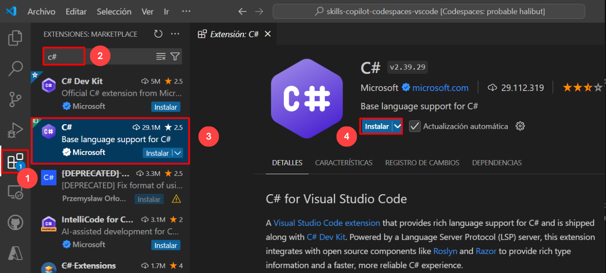

# Ejercicio 5: Usar GitHub Copilot para Refactorizar Código

### Duración Estimada: 30 minutos

La refactorización de código de GitHub se refiere al proceso de reestructurar y mejorar la calidad del código en un repositorio de GitHub sin cambiar su comportamiento externo. La refactorización de código tiene como objetivo mejorar la legibilidad, la mantenibilidad y el rendimiento, al tiempo que reduce la deuda técnica y los posibles errores.

En este ejercicio, participará en una actividad de aprendizaje o práctica con el objetivo principal de emplear GitHub Copilot para la refactorización de código en C#. Además, creará funciones de pruebas unitarias a través de GitHub Copilot Chat.

>**Descargo de responsabilidad**: GitHub Copilot sugerirá automáticamente todo el cuerpo de una función o código en texto gris. A continuación, se muestran ejemplos de lo que probablemente verá en este ejercicio, pero la sugerencia exacta puede variar.

>**Nota**: Si no puede ver ninguna sugerencia de GitHub Copilot en VS Code, reinicie VS Code una vez e intente nuevamente.

## Objetivos del laboratorio

Será capaz de completar las siguientes tareas:

- Tarea 1: Entender el código que ya está disponible para usted
- Tarea 2: Usar GitHub Copilot para refactorizar el código
- Tarea 3: Revisar el código refactorizado y entender cómo funciona
- Tarea 4: Usar GitHub Copilot Chat con código para refactorizar el código
- Tarea 5: Crear funciones de pruebas unitarias

## Tarea 1: Entender el código que ya está disponible para usted

### Instalando la extensión C Sharp (C#) en VS Code

1. Para instalar la extensión C Sharp (C#), se deben realizar los siguientes pasos dentro de Visual Studio Code:
    - Haga clic en el ícono **Extensiones** **(1)** en la barra de actividades presente en el lado izquierdo de la ventana de Visual Studio Code.
    - En el cuadro de búsqueda "Buscar extensiones en Marketplace", escriba y busque la extensión **C#** **(2)**.
    - Seleccione **C#** **(3)** de la lista de resultados que aparecen.
    - Haga clic en el botón **Instalar** **(4)** si está disponible, de otro modo, ignórelo.
    - Haga clic en el botón **Actualizar** si ya está instalado y no está actualizado.

      

   >**Nota**: Asegúrese de que lo instalemos también en Codespace.

    


1. Desde el codespace en la ventana de Explorador de VS Code, cree un nuevo archivo y nómbrelo **codechat.cs**.

      

      > **Nota**: Si ve alguna recomendación para instalar la extensión C#, haga clic en Instalar.

1. Para demostrar la refactorización del código de GitHub, tomemos un ejemplo de un código mal escrito y analicémoslo. El código a continuación está escrito con el lenguaje de programación C#. Pegue el código a continuación en el archivo.
    
   ```
   using System;

   class Program
   {
       const int MAX = 100;

        static int Sum(int[] arr, int n)
        {
            int result = 0;
            for (int i = 0; i < n; i++)
            {
                result += arr[i];
            }
            return result;
        }

        static void Main()
        {
            int n;
            Console.Write("Enter the number of elements (1-100): ");
            if (!int.TryParse(Console.ReadLine(), out n) || n < 1 || n > MAX)
            {
                Console.WriteLine("Invalid input. Please provide a digit ranging from 1 to 100.");
                Environment.Exit(1);
            }

            int[] arr = new int[n];

            Console.WriteLine("Enter " + n + " integers:");
            for (int i = 0; i < n; i++)
            {
                if (!int.TryParse(Console.ReadLine(), out arr[i]))
                {
                    Console.WriteLine("Invalid input. Please enter valid integers.");
                    Environment.Exit(1);
                }
            }

            int total = Sum(arr, n);

            Console.WriteLine("Sum of the numbers: " + total);

            // No need to free memory in C#, as it's managed by the runtime.
        }
    }      
   ```

1. Este código es un ejemplo mal escrito de un programa que solicita al usuario la cantidad de elementos a sumar y toma esos números enteros como entrada. Emplea una asignación de memoria dinámica para el arreglo de números enteros y maneja los fallos de asignación con un mensaje de error. A continuación, se muestran algunos problemas relacionados con el código:
    - El código comienza con la inclusión del espacio de nombres System para operaciones de entrada y salida esenciales.
    - Define una constante MAX con un valor de 100 para representar la cantidad máxima de elementos permitidos.
    - El método Sum calcula la suma de elementos de una matriz.
    - En el método Main:
      - Solicita al usuario que ingrese la cantidad de elementos (entre 1 y 100) y valida la entrada.
      - Asigna un arreglo 'arr' para almacenar los números enteros ingresados.
      - Solicita al usuario que ingrese la cantidad especificada de números enteros y valida cada entrada.
      - Calcula la suma de los números enteros ingresados ​​utilizando el método Sum.
      - Envía la suma a la consola.
      - No hay necesidad de liberar memoria manualmente en C# porque gestiona la memoria automáticamente.
  
## Tarea 2: Usar GitHub Copilot para refactorizar el código

1. Ahora, usemos la función **GitHub Copilot Chat** para refactorizar el código anterior.

1. Haga clic en el ícono **Chat** en la parte superior derecha. Esto abre la ventana de GitHub Copilot Chat en la que hay que **pegar** el código anterior.

1. Escriba el prompt debajo del código pegado, `#selection How can we refactor this code to adhere to coding best practices?` y a continuación presione **Enter**. GitHub Copilot Chat dará la respuesta que se muestra a continuación.

   

1. Pegue el código refactorizado en el archivo.

   
   
## Tarea 3: Revisar el código refactorizado y entender cómo funciona

1. El código recién generado se verá como se muestra a continuación:

     ```
     using System;

   class Program
   {
    const int MAX = 100;

    static int CalculateSum(int[] arr, int n)
    {
        int result = 0;
        for (int i = 0; i < n; i++)
        {
            result += arr[i];
        }
        return result;
    }

    static int GetNumberOfElements()
    {
        int n;
        Console.Write("Enter the number of elements (1-100): ");
        while (!int.TryParse(Console.ReadLine(), out n) || n < 1 || n > MAX)
        {
            Console.WriteLine("Invalid input. Please provide a digit ranging from 1 to 100.");
        }
        return n;
    }

    static int[] ReadIntegers(int n)
    {
        int[] arr = new int[n];
        Console.WriteLine("Enter " + n + " integers:");
        for (int i = 0; i < n; i++)
        {
            while (!int.TryParse(Console.ReadLine(), out arr[i]))
            {
                Console.WriteLine("Invalid input. Please enter a valid integer.");
            }
        }
        return arr;
    }

    static void Main()
    {
        int n = GetNumberOfElements();
        int[] arr = ReadIntegers(n);
        int sum = CalculateSum(arr, n);
        Console.WriteLine("The sum of the entered integers is: " + sum);
    }
    }     
    ```

1. Ahora, analicemos los cambios realizados al código por GitHub Copilot Chat:
    - Se cambió el nombre del método Sum a CalculateSum para describir mejor su funcionalidad.
    - Se creó un nuevo método GetNumberOfElements para manejar la lógica para obtener la cantidad de elementos del usuario. Este método asegura que la entrada esté dentro del rango válido (1-100) y proporciona mensajes de error apropiados.
    - Se creó otro método ReadIntegers para manejar la lógica para leer números enteros del usuario. Este método asegura que cada entrada sea un número entero válido y proporciona mensajes de error para entradas no válidas.
    - En GetNumberOfElements, se utilizó un ciclo while para solicitarle repetidamente al usuario hasta que se ingrese un número válido.
    - En ReadIntegers, se utilizó un ciclo while dentro del ciclo for para solicitarle repetidamente al usuario hasta que se ingrese un número entero válido para cada elemento.
    - Se movió la lógica para calcular la suma de los elementos del arreglo al método CalculateSum.
    - Se movió la lógica para obtener la cantidad de elementos y leer los números enteros a sus respectivos métodos.

1. Observe que ahora el código es más modular, legible y fácil de entender.

   >**Nota**: Es fundamental revisar detenidamente las sugerencias de Copilot antes de aplicarlas.

## Tarea 4: Usar GitHub Copilot Chat con código para refactorizar el código

En esta tarea, demostrará la función de chat con código de GitHub Copilot. Con esta función, los desarrolladores pueden participar en conversaciones en tiempo real con Copilot directamente a través de los comentarios de código, haciendo que se sientan como si estuvieran colaborando con un compañero de programación.

1. Elimine el código existente, copie y pegue el código que se proporciona a continuación en el archivo `codechat.cs`.

    ```
    using System;

   class Program
   {
    static void Main()
    {
        int health = 100;
        int score = 0;

        Console.WriteLine("Welcome to the Adventure Game!");
        Console.WriteLine("You are in a dark forest.");

        while (health > 0)
        {
            Console.WriteLine("\nOptions:");
            Console.WriteLine("1. Go deeper into the forest.");
            Console.WriteLine("2. Rest by the campfire.");
            Console.WriteLine("3. Quit the game.");

            int choice;
            Console.Write("Enter your choice: ");
            if (int.TryParse(Console.ReadLine(), out choice))
            {
                if (choice == 1)
                {
                    Console.WriteLine("You go farther into the forest and discover a treasure chest!");
                    score += 10;
                }
                else if (choice == 2)
                {
                    Console.WriteLine("You rest by the campfire and regain 20 health.");
                    health += 20;
                }
                else if (choice == 3)
                {
                    Console.WriteLine($"Thanks for playing! Your score: {score}");
                    return;
                }
                else
                {
                    Console.WriteLine("Invalid choice. Try again.");
                }

                health -= 10;
                if (health <= 0)
                {
                    Console.WriteLine($"Game over. Your score: {score}");
                }
            }
            else
            {
                Console.WriteLine("Invalid input. Please enter a valid number.");
            }
        }
    }
   }
    ```

1. Hagámosle a Copilot la siguiente pregunta para entender qué declaración condicional es una mejor opción en esta circunstancia. *Pegue el mismo código en el chat de Copilot y debajo del código, pegue el prompt que aparece a continuación.*

    ```
    In this scenario, is it more appropriate to use a switch statement or if-else statements?
    ```
   

1. Como la declaración switch es más legible y más fácil de mantener cuando se trata de múltiples opciones discretas, copiemos y peguemos el código en el archivo y hagamos clic en `Ctrl+S`.

   

## Tarea 5: Crear funciones de pruebas unitarias

1. Desde el codespace en la ventana VS Code Explorer, cree un nuevo archivo.

    

1. Nombre el archivo `test.js` como se muestra a continuación:

   

1. Ahora, diríjase a GitHub Copilot Chat y proporcione el prompt `Compose a full JavaScript program for constructing a calculator`.

1. GitHub Copilot Chat generará el código como se muestra a continuación.

   

1. Copie y pegue el código en el archivo llamado **test.js** que acaba de crear.

1. Ahora, para generar casos de prueba para todas las funciones en el archivo, navegue a la ventana de GitHub Copilot Chat asegurándose de que el archivo `test.js` esté seleccionado, escriba **/tests** y presione Enter dos veces.

   

1. Se generarán los casos de prueba para todas las funciones en un **nuevo archivo (1)**. Proceda a **conservar (2)** los casos de prueba generados.

   

## Resumen

En este ejercicio, ha utilizado GitHub Copilot con éxito para llevar a cabo tareas de refactorización de código y ha creado funciones de pruebas unitarias. La refactorización de código con la ayuda de Copilot hará que sus proyectos de codificación sean más eficientes y colaborativos.

### Ha completado el laboratorio con éxito. Haga clic en **Siguiente >>** para continuar con el siguiente ejercicio.
