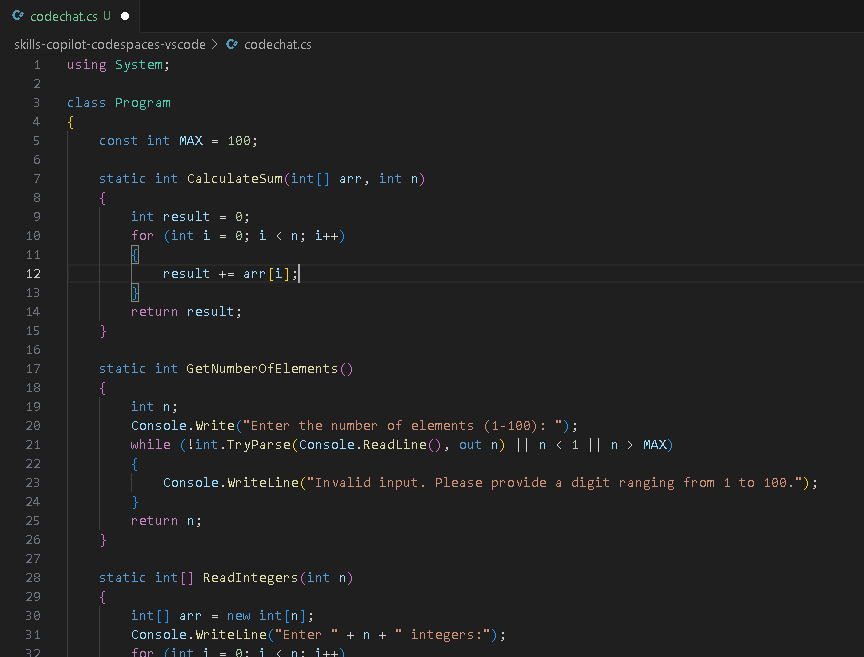
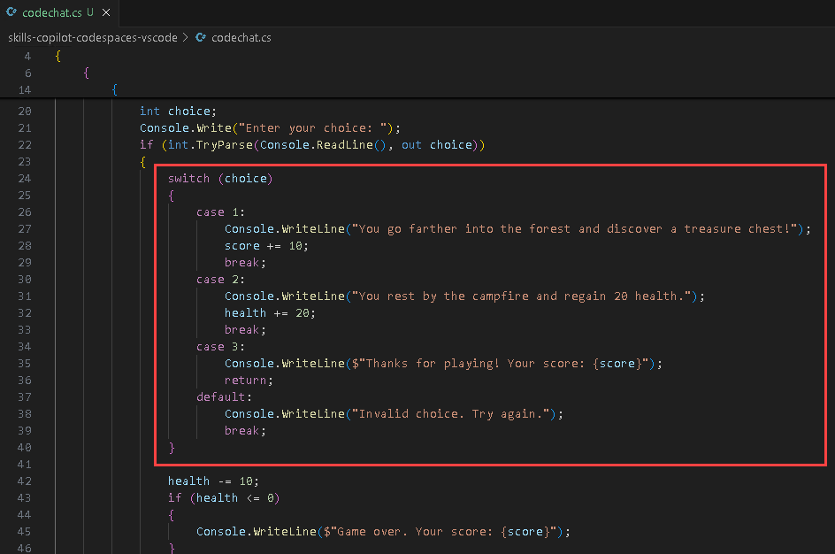
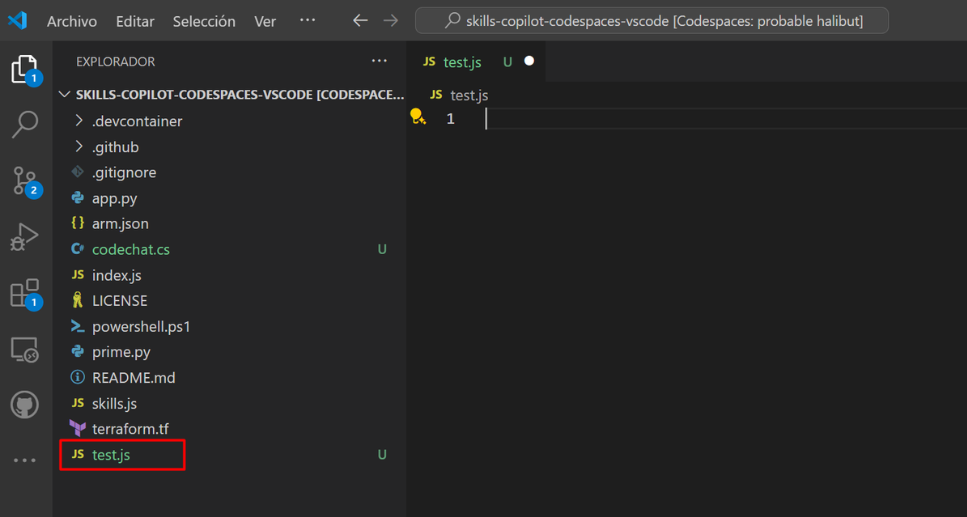

# Exercise 5: Using GitHub Copilot for Code Refactoring

### Estimated Duration: 30 minutes

GitHub code refactoring refers to the process of restructuring and improving the quality of code in a GitHub repository without changing its external behaviour. Code refactoring aims to enhance readability, maintainability, and performance while reducing technical debt and potential bugs. 

In this exercise, you will engage in a learning or practice activity with the primary objective of employing GitHub Copilot for code refactoring in C#. Additionally, you will be creating unit test functions through GitHub Copilot Chat.

>**Disclaimer**: GitHub Copilot will automatically suggest an entire function body or code in gray text. Examples of what you'll most likely see in this lab, but the exact suggestion may vary.

>**Note**: If you are unable to see any suggestions by GitHub Copilot in VS Code, please restart the VS Code once and try again. 

## Lab objectives

You will be able to complete the following tasks:

- Task 1: Understand the code already available for you
- Task 2: Use GitHub Copilot to refactor the code
- Task 3: Review the refactored code and understand how it works
- Task 4: Use GitHub Copilot Chat with code to refactor the code
- Task 5: Create unit test functions

## Task 1: Understand the code already available for you

### Installing C Sharp (C#) extension in VS Code

1. To install the C Sharp (C#) extension, the following steps are to be performed within Visual Studio Code:
    - Click on the **Extensions** **(1)** icon in the activity bar present on the left side of the Visual Studio Code Window.
    - In the "Search Extensions in Marketplace" search box, type and search for the **C#** **(2)** extension.
    - Select **C#** **(3)** from the list of results that show up.
    - Click on the **Install** **(4)** button, if it is available otherwise please ignore.
    - Click on the **Update** button if it is already installed and not updated.

   

    >**Note:** Ensure we install it in Codespace too.

1. From the codespace in the VS Code Explorer window, create a new file and name it as **codechat.cs**.

      

      > **Note**: If you notice any recommendation to install the C# extension. Click on Install.

1. To demonstrate the GitHub code refactor, let us take an example of a poorly written code and analyze it. The below code is written using the C# programming language. Paste the below code in the file.
    
   ```
   using System;

   class Program
   {
       const int MAX = 100;

        static int Sum(int[] arr, int n)
        {
            int result = 0;
            for (int i = 0; i < n; i++)
            {
                result += arr[i];
            }
            return result;
        }

        static void Main()
        {
            int n;
            Console.Write("Enter the number of elements (1-100): ");
            if (!int.TryParse(Console.ReadLine(), out n) || n < 1 || n > MAX)
            {
                Console.WriteLine("Invalid input. Please provide a digit ranging from 1 to 100.");
                Environment.Exit(1);
            }

            int[] arr = new int[n];

            Console.WriteLine("Enter " + n + " integers:");
            for (int i = 0; i < n; i++)
            {
                if (!int.TryParse(Console.ReadLine(), out arr[i]))
                {
                    Console.WriteLine("Invalid input. Please enter valid integers.");
                    Environment.Exit(1);
                }
            }

            int total = Sum(arr, n);

            Console.WriteLine("Sum of the numbers: " + total);

            // No need to free memory in C#, as it's managed by the runtime.
        }
    }      
   ```

1. This code is a poorly written example of a program that prompts the user for the number of elements to sum and takes those integers as input. It employs dynamic memory allocation for the integer array and handles allocation failures with an error message. Here are a few code-related issues:
    - The code begins with the inclusion of the System namespace for essential input and output operations.
    - It defines a constant MAX with a value of 100 to represent the maximum number of elements allowed.
    - The Sum method calculates the sum of elements in an array.
    - In the Main method:
      - It prompts the user to enter the number of elements (between 1 and 100) and validates the input.
      - Allocates an array 'arr' to store the entered integers.
      - Prompts the user to enter the specified number of integers and validates each input.
      - Calculates the sum of the entered integers using the Sum method.
      - Outputs the sum to the console.
      - There's no need to manually free memory in C# because it manages memory automatically.
  
## Task 2: Use GitHub Copilot to refactor the code

1. Now, let's use the **GitHub Copilot Chat** feature to refactor the above code.

1. Click on the **Chat** icon on the top right. This opens the GitHub Copilot Chat window into which the above code is to be **pasted**.

1. Type the prompt below the pasted code, `#selection How can we refactor this code to adhere to coding best practices?` then press **Enter**. The GitHub Copilot Chat will give the response as shown below.

   

1. Paste the refactored code in the file.

   

## Task 3: Review the refactored code and understand how it works

1. The newly generated code will look as shown below:

     ```
     using System;

   class Program
   {
    const int MAX = 100;

    static int CalculateSum(int[] arr, int n)
    {
        int result = 0;
        for (int i = 0; i < n; i++)
        {
            result += arr[i];
        }
        return result;
    }

    static int GetNumberOfElements()
    {
        int n;
        Console.Write("Enter the number of elements (1-100): ");
        while (!int.TryParse(Console.ReadLine(), out n) || n < 1 || n > MAX)
        {
            Console.WriteLine("Invalid input. Please provide a digit ranging from 1 to 100.");
        }
        return n;
    }

    static int[] ReadIntegers(int n)
    {
        int[] arr = new int[n];
        Console.WriteLine("Enter " + n + " integers:");
        for (int i = 0; i < n; i++)
        {
            while (!int.TryParse(Console.ReadLine(), out arr[i]))
            {
                Console.WriteLine("Invalid input. Please enter a valid integer.");
            }
        }
        return arr;
    }

    static void Main()
    {
        int n = GetNumberOfElements();
        int[] arr = ReadIntegers(n);
        int sum = CalculateSum(arr, n);
        Console.WriteLine("The sum of the entered integers is: " + sum);
    }
    }     
    ```

1. Now, let's analyze the changes made to the code by GitHub Copilot Chat

    - Changed the method name Sum to CalculateSum to better describe its functionality.
    - Created a new method GetNumberOfElements to handle the logic for getting the number of elements from the user. This method ensures that the input is within the valid range (1-100) and provides appropriate error messages.
    - Created another method ReadIntegers to handle the logic for reading integers from the user. This method ensures that each input is a valid integer and provides error messages for invalid inputs.
    - In GetNumberOfElements, used a while loop to repeatedly prompt the user until a valid number is entered.
    - In ReadIntegers, used a while loop inside the for loop to repeatedly prompt the user until a valid integer is entered for each element.
    - Moved the logic for calculating the sum of the array elements into the CalculateSum method.
    - Moved the logic for getting the number of elements and reading the integers into their respective methods.

1. Notice that now the code is more modular, readable, and easier to understand.

   >**Note**: It's essential to carefully review copilot suggestions before applying them.

## Task 4: Use GitHub Copilot Chat with code to refactor the code 

In this task, you will demonstrate the chat with code feature of GitHub Copilot. With this feature, developers can engage in real-time conversations with Copilot directly through code comments, making it feel like they are collaborating with a coding partner.

1. Delete the existing code, copy and paste the code given below in the `codechat.cs` file.

    ```
    using System;

   class Program
   {
    static void Main()
    {
        int health = 100;
        int score = 0;

        Console.WriteLine("Welcome to the Adventure Game!");
        Console.WriteLine("You are in a dark forest.");

        while (health > 0)
        {
            Console.WriteLine("\nOptions:");
            Console.WriteLine("1. Go deeper into the forest.");
            Console.WriteLine("2. Rest by the campfire.");
            Console.WriteLine("3. Quit the game.");

            int choice;
            Console.Write("Enter your choice: ");
            if (int.TryParse(Console.ReadLine(), out choice))
            {
                if (choice == 1)
                {
                    Console.WriteLine("You go farther into the forest and discover a treasure chest!");
                    score += 10;
                }
                else if (choice == 2)
                {
                    Console.WriteLine("You rest by the campfire and regain 20 health.");
                    health += 20;
                }
                else if (choice == 3)
                {
                    Console.WriteLine($"Thanks for playing! Your score: {score}");
                    return;
                }
                else
                {
                    Console.WriteLine("Invalid choice. Try again.");
                }

                health -= 10;
                if (health <= 0)
                {
                    Console.WriteLine($"Game over. Your score: {score}");
                }
            }
            else
            {
                Console.WriteLine("Invalid input. Please enter a valid number.");
            }
        }
    }
   }
    ```

1. Let's ask Copilot the below question to understand which conditional statement is a better choice in this circumstance. *Paste the same code in Copilot chat and below the code, paste the below prompt.*
   
    ```
    In this scenario, is it more appropriate to use a switch statement or if-else statements?
    ```

   

1. As the switch statement is more readable and easier to maintain when dealing with multiple discrete choices, let's copy and paste the code in the file and click on `Ctrl+S`.

   

## Task 5: Create unit test functions

1. From the codespace in the VS Code Explorer window, create a new file.

    

1. Name the file `test.js` as shown below:  

   

1. Now, navigate to the GitHub Copilot Chat and give the prompt `Compose a full JavaScript program for constructing a calculator`.

1. The GitHub Copilot Chat will generate the code as shown below.

   

1. Copy and paste the code in the file named **test.js** that you just created.

1. Now, to generate test cases for all the functions in the file, navigate to the GitHub Copilot Chat window ensuring the `test.js` file is selected, type **/tests** and hit enter twice.

   

1. It will generate the test cases for all the functions in a **new file (1)**. Proceed to **keep (2)** the generated test cases.

   

## Summary

In this exercise, you have successfully employed GitHub Copilot to carry out code refactoring tasks and created unit test functions. Code refactoring with Copilot's assistance will make your coding projects more efficient and collaborative.
