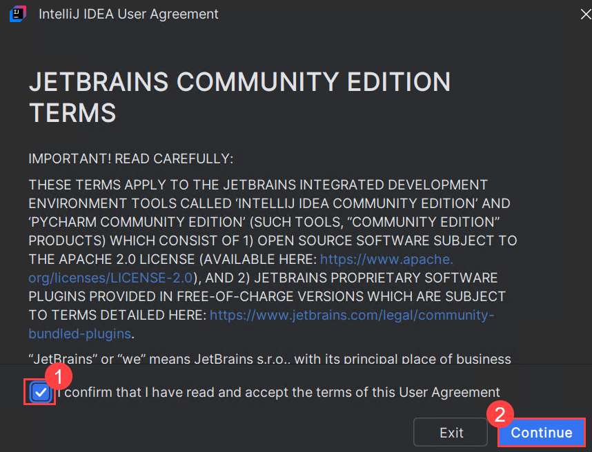
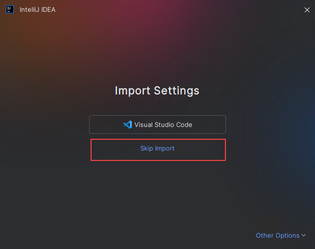
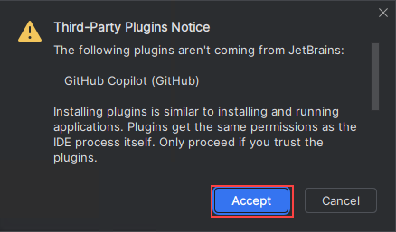
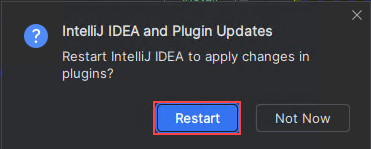
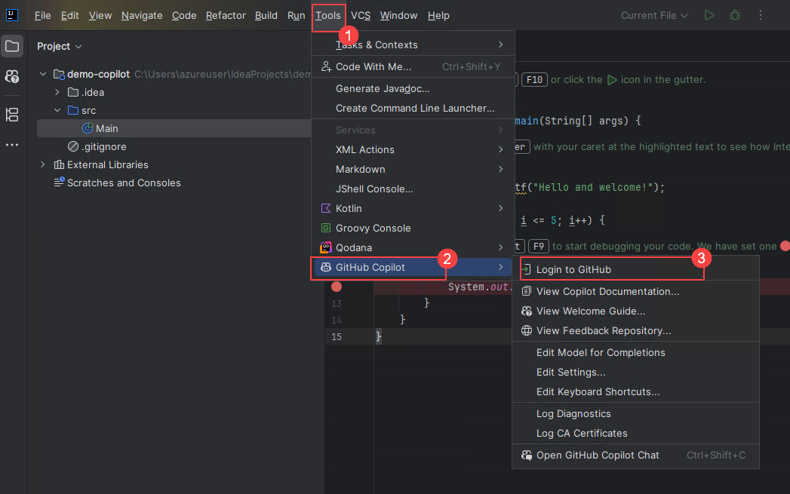
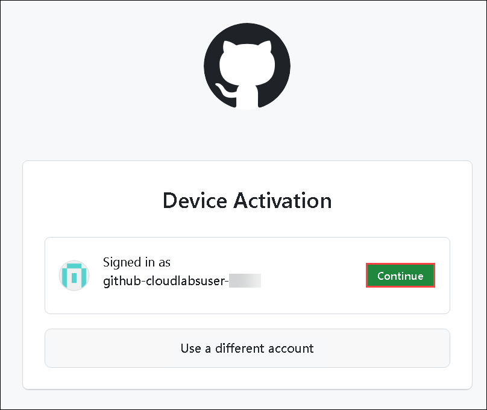
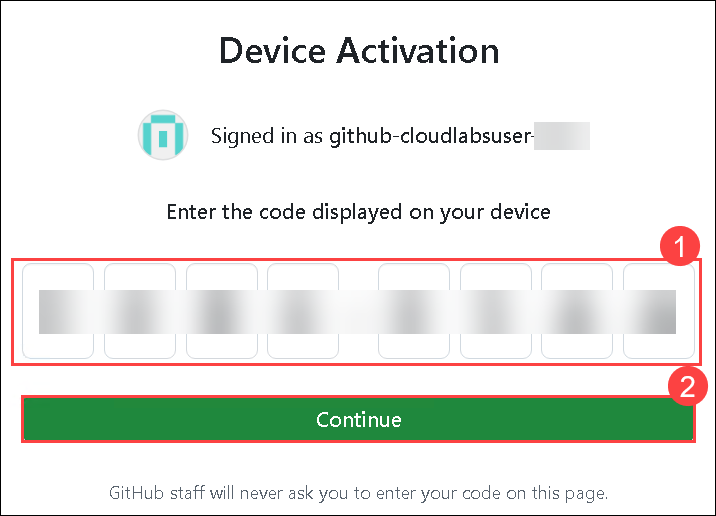
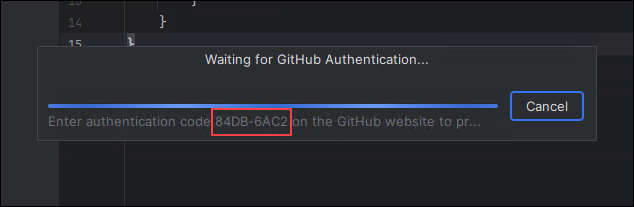
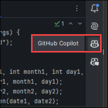

# Ejercicio 6: Usar IDEs como JetBrains IntelliJ para Java

### Duración Estimada: 20 minutos

IntelliJ IDEA es un entorno de desarrollo integrado (IDE) para Java y Kotlin diseñado para maximizar la productividad de los desarrolladores. Realiza las tareas rutinarias y repetitivas por usted al proporcionar completado de código inteligente, análisis de código estático y refactorizaciones, y le permite concentrarse en el lado positivo del desarrollo de software, lo que lo convierte no solo en una experiencia productiva sino también agradable.

GitHub Copilot, una innovadora herramienta de generación de código, se puede integrar con JetBrains IntelliJ, un IDE ampliamente utilizado para el desarrollo en Java. Esta integración mejora la experiencia de programación en Java proporcionando sugerencias de código inteligentes y autocompletado dentro de IntelliJ, aumentando la productividad y la calidad del código.

En este ejercicio, utilizará el IDE JetBrains IntelliJ Idea para Java. Instalará el complemento GitHub Copilot y creará un nuevo proyecto.

>**Descargo de responsabilidad**: GitHub Copilot sugerirá automáticamente todo el cuerpo de una función o código en texto gris. A continuación, se muestran ejemplos de lo que probablemente verá en este ejercicio, pero la sugerencia exacta puede variar.

>**Nota**: Si no puede ver ninguna sugerencia de GitHub Copilot en VS Code, reinicie VS Code una vez e intente nuevamente.

## Objetivos del laboratorio

Será capaz de completar las siguientes tareas:

- Tarea 1: Instalar el complemento GitHub Copilot y crear un nuevo proyecto en el IDE IntelliJ Idea
- Tarea 2: Crear un proyecto básico de Java
- Tarea 3: Obtener más sugerencias
- Tarea 4: Obtener código a partir de un comentario

## Tarea 1: Instalar el complemento GitHub Copilot y crear un nuevo proyecto en el IDE IntelliJ Idea

1. Vaya al escritorio y abra el IDE **IntelliJ IDEA Community**.

   

1. En el Acuerdo de IntelliJ IDEA, marque **I confirm that I have read and accept the terms of this User Agreement (1)** y haga clic en **Continue (2)**.

   

   >**Nota:** Cuando aparezca el cuadro para compartir datos, haga clic en **Don't Send**.

   

1. En la página **Import Settings**, haga clic en **Skip Import**.

   

1. En el menú de la izquierda, haga clic en **Plugins** **(1)** y seleccione **Marketplace** **(2)**. Busque **GitHub Copilot** **(3)** y, una vez que encuentre el complemento **GitHub Copilot**, haga clic en **Install** **(4)**.

   

   >**Nota**: En el aviso de Plugins de Terceros, haga clic en **Aceptar**.

   

1. Verifique que el complemento GitHub Copilot esté instalado. A continuación, debe reiniciar el IDE haciendo clic en **Restart IDE**. 

   .png)

   Haga clic en **Restart** en la ventana emergente una vez más para reiniciar el IDE.

   

1. Una vez que se reinicie el IDE **IntelliJ Idea Community**, seleccione **Projects** **(1)** en el menú de la izquierda y haga clic en **New Project** **(2)**.

   

1. En el panel de nuevo proyecto, ingrese el nombre del proyecto como **demo-copilot** **(1)**. Coloque el lenguaje como **Java** **(2)** y el sistema de compilación (Build system) como **IntelliJ** **(3)**. Para el JDK, seleccione el valor predeterminado **Download Oracle OpenJDK 24** **(4)** y haga clic en **Create** **(5)**.

   

1. Revise el proyecto **demo-copilot** creado como se muestra a continuación:

   

## Tarea 2: Crear un proyecto básico de Java

1. Haga clic en el **ícono** como se muestra en la siguiente imagen.

   

2. Haga clic en **Tools (1)**. Haga clic en **GitHub Copilot (2)**, y luego en **Login to GitHub**.

   


3. En el cuadro de diálogo **Sign in to GitHub**, para copiar el código del dispositivo y abrir la ventana de activación del dispositivo, haga clic en **Copy and Open**.

   

4. Haga clic en **Continue** en **Device Activation**.   

   

5. Se abrirá una ventana de activación del dispositivo en su navegador. Pegue el **código (1)** del dispositivo que copió en el paso anterior y luego haga clic en **Continue (2)**.

   

   >**Nota:** Si olvidó copiar el código del dispositivo, regrese a JetBrains IDE y copie el código como se muestra a continuación:

     


6. GitHub solicitará los permisos necesarios para GitHub Copilot. Para aprobar estos permisos, haga clic en **Authorize GitHub Copilot for JetBrains IDEs**.

   

7. Una vez que se hayan aprobado los permisos, su IDE de JetBrains mostrará una confirmación.

   

8. En su IDE de JetBrains, haga clic derecho en **src (1)**, seleccione **New (2)** y haga clic en **File (3)** para crear un nuevo archivo Java (*.java) denominado **Test.java**.

   

9. Cree una clase escribiendo class **class Test**. Copilot sugerirá un cuerpo de clase y puede presionar la tecla **Tab** para aceptar la sugerencia.

   

10. Debajo de la llave de la función main, escriba el siguiente encabezado de función:

   ```
   int calculateDaysBetweenDates(
   ```

11. GitHub Copilot sugerirá automáticamente todo el cuerpo de la función en texto gris, como se muestra a continuación. La sugerencia exacta puede variar.

   

12.   Presione **Tab** para aceptar la sugerencia.

      >**Nota:** Si recibe algún error o si necesita más sugerencias, navegue a **Github Co-pilot** desde el panel derecho. Actualícelo si es necesario. Acepte la solución más relevante.

       
      
         

      > **Felicitaciones** por completar la tarea. Ahora, es momento de validarla. Estos son los pasos:
      > - Presione el botón Validar para la tarea correspondiente. Si recibe un mensaje de éxito, puede continuar con la siguiente tarea.
      > - Si no es así, lea atentamente el mensaje de error y vuelva a intentar el paso, siguiendo las instrucciones de la guía de laboratorio.
      > - Si necesita ayuda, comuníquese con nosotros a cloudlabs-support@spektrasystems.com. Estamos disponibles las 24 horas, los 7 días de la semana para ayudarlo.

      <validation step="5055e2d4-be60-47f4-acab-c0dde92b4baa" />   
           
### Resumen

En este ejercicio, ha configurado con éxito JetBrains IntelliJ Idea IDE para Java, ha instalado el complemento GitHub Copilot y ha explorado código básico de Java que generó las sugerencias usando Copilot.

### Ha completado el laboratorio con éxito. Haga clic en **Siguiente >>** para continuar con el siguiente ejercicio.
