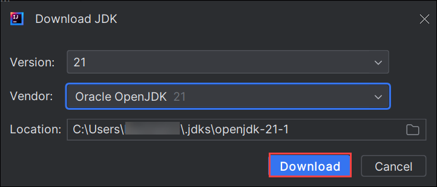
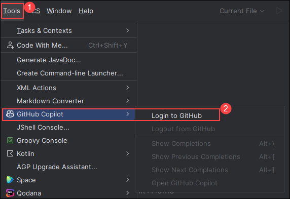

# Exercise 6: Using other IDEs like JetBrains IntelliJ for Java

GitHub Copilot, the innovative code generation tool, can be integrated into JetBrains IntelliJ, a widely-used IDE for Java development. This combination enhances Java coding by providing intelligent code suggestions and autocompletion within IntelliJ, boosting productivity and code quality.

In this exercise, you will be using JetBrains IntelliJ Idea IDE for Java. You will be installing GitHub Copilot Plugin and create new project.

>**Disclaimer**: GitHub Copilot will automatically suggest an entire function body or code in grayed text. Examples of what you'll most likely see in this exercise, but the exact suggestion may vary.

## Task 1: Install GitHub Copilot Plugin and Create New Project in IntelliJ Idea IDE

1. Navigate to Desktop and open **IntelliJ Idea Community** IDE.

1. From the left menu, click on **Plugins** **(1)** and select **Marketplace** **(2)**. Search **GitHub Copilot** **(3)** and once you find **GitHub Copilot** Plugin click on **Install** **(4)**.

   

1. Verify GitHub Copilot Plugin is installed, you need to Restart IDE by clicking on **Restart IDE**. Click on **Restart** in the pop-up once again to restart the IDE.

   

1. Once the **IntelliJ Idea Community** IDE is restarted. Select **Projects** **(1)** from left-menu and click on **New Project** **(2)**.

   

1. In the New Project pane, enter project name as **demo-copilot** **(1)**. Select Language as **Java** **(2)** and Build system as **IntelliJ** **(3)**. For JDK, click on drop-down **(4)** and click on **+ Add SDK** **(5)** then click on **Download JDK** **(6)**.

   

1. You will see a pop-up to download JDK, verify the location and click on **Download**.

   

1. Once JDK is downloaded, verify the downloaded JDK version **(1)** and click on **Create** **(2)**.

   

1. Review the created **demo-copilot** project as shown below:

   


## Task 2: Create basic java project

1. click the **Tools (1)** menu. Click GitHub Copilot, then click **Login to GitHub (2)**.

   

1. In the "Sign in to GitHub" dialog box, to copy the device code and open the device activation window, click **Copy and Open**.

   

1. A device activation window will open in your browser. Paste the device **code**, then click **Continue**.

   

1. GitHub will request the necessary permissions for GitHub Copilot. To approve these permissions, click **Authorize GitHub Copilot Plugin**.

1. After the permissions have been approved, your JetBrains IDE will show a confirmation. To begin using GitHub Copilot, click **OK**.

1. In your JetBrains IDE, right click on the **src (1)**, select **New (2)** nd click on **File (3)** to create a new Java (*.java) file named **Test.java**.

   

1. Create a class by typing **class Test**, Copilot will suggest a class body and press **tab** to accept the suggestion.

   

1. Below the bracket of the main function, type the following function header.

   ```
   int calculateDaysBetweenDates(
   ```

1. GitHub Copilot will automatically suggest an entire function body in grayed text, as shown below. The exact suggestion may vary.

   

1. Press **Tab** to accept the suggestion.

1. Click on **Next** from the bottom right to continue with the next exercies.

