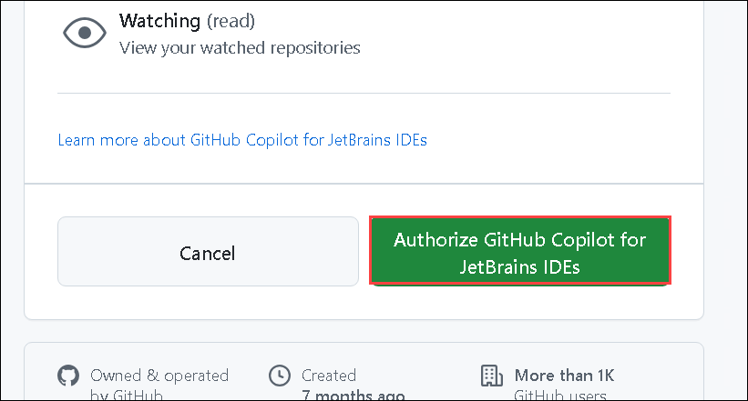

# Exercise 6: Using IDEs such as JetBrains IntelliJ for Java

### Estimated Duration: 20 minutes

IntelliJ IDEA is an Integrated Development Environment (IDE) for Java and Kotlin designed to maximize developer productivity. It does the routine and repetitive tasks for you by providing clever code completion, static code analysis, and refactorings, and lets you focus on the bright side of software development, making it not only productive but also an enjoyable experience.

GitHub Copilot, an innovative code generation tool, can be integrated with JetBrains IntelliJ, a widely used IDE for Java development. This integration enhances the Java coding experience by providing intelligent code suggestions and auto-completion within IntelliJ, boosting productivity and code quality.

In this exercise, you will use the JetBrains IntelliJ Idea IDE for Java. You will install the GitHub Copilot plugin and create a new project.

>**Disclaimer**: GitHub Copilot will automatically suggest an entire function body or code in gray text. Examples of what you'll most likely see in this exercise, but the exact suggestion may vary.

>**Note**: If you are unable to see any suggestions by GitHub Copilot in VS Code, please restart the VS Code once and try again.

## Lab objectives

You will be able to complete the following tasks:

- Task 1: Install the GitHub Copilot plugin and create a new project in the IntelliJ Idea IDE
- Task 2: Create a basic Java project
- Task 3: Getting more suggestions
- Task 4: Getting code from a comment

## Task 1: Install the GitHub Copilot plugin and create a new project in the IntelliJ Idea IDE

1. Navigate to the desktop and open the **IntelliJ IDEA Community** IDE.

   

1. In the IntelliJ IDEA Agreement, check **I confirm that I have read and accept the terms of this User Agreement (1)** and click on **Continue (2)**.

   

   >**Note:** When the data sharing box appears, click on **Don't Send**.

   

1. On the **Import Settings** page, click on **Skip Import**.

1. From the left menu, click on **Plugins** **(1)** and select **Marketplace** **(2)**. Search **GitHub Copilot** **(3)**, and once you find **GitHub Copilot** plugin, click on **Install** **(4)**.

   

   >**Note** : In the Third-Party Plugins notice, click **Accept**.

1. Verify the GitHub Copilot plugin is installed. Next, you need to restart the IDE by clicking on **Restart IDE**.

   .png)

1. Click on **Restart** in the pop-up once again to restart the IDE.   

1. Once the **IntelliJ Idea Community** IDE is restarted, select **Projects** **(1)** from the left menu and click on **New Project** **(2)**.

   

1. In the new project pane, enter the project name as **demo-copilot** **(1)**. Select language as **Java** **(2)** and build system as **IntelliJ** **(3)**. For JDK, select the default **Download Oracle OpenJDK 24** **(4)** and click on **Create** **(5)**.

   

1. Review the created **demo-copilot** project as shown below:

   

## Task 2: Create a basic Java project

1. Click the **icon** as shown in the below image. 

   

1. Click on **Tools (1)**. Click **GitHub Copilot (2)**, then click **Open GitHub Copilot Chat (3)**.

   

1. Click on **Sign in to GitHub Copilot**.

   

1. In the **Sign in to GitHub** dialog box, to copy the device code and open the device activation window, click **Copy and Open**.

   

1. Click on **Continue** on **Device Activation**.   

   

1. A device activation window will open in your browser. Paste the device **code (1)** which you have copied in the previous step, then click **Continue (2)**.

   

1. GitHub will request the necessary permissions for GitHub Copilot. To approve these permissions, click **Authorize GitHub Copilot for JetBrains IDEs**.

   

1. After the permissions have been approved, your JetBrains IDE will show a confirmation.

   

1. Click **Authorize** on Copilot Chat.

   

1. In the **Sign in to GitHub** dialog box, to copy the device code and open the device activation window, click **Copy and Open**.

    

1. A device activation window will open in your browser. Paste the device **code (1)** which you have copied in the previous step, then click **Continue (2)**.

     

1. Click on **Continue** on **Device Activation**.   

      

1. Click on **Authorize GitHub Copilot for JetBrains IDEs**.   

       

1. After the permissions have been approved, your JetBrains IDE will show a confirmation.

        

1. In your JetBrains IDE, right-click on the **src (1)**, select **New (2)** and click on **File (3)** and type **Test.java** in the window **New File** and press **Enter** to create a new Java (*.java) file named.

   

1. Create a class by typing **class Test**. Copilot will suggest a class body, and you can press **tab** to accept the suggestion.

   

1. Below the bracket of the main function, type the following function header:

   ```
   int calculateDaysBetweenDates(
   ```

1. GitHub Copilot will automatically suggest an entire function body in gray text, as shown below. The exact suggestion may vary.

   

1. Press **Tab** to accept the suggestion.

   >**Note:** If you recieve any errors or if you need more suggestions, navigate to the **Github Co-pilot** from the right pane. Refresh if needed. Accept the most relevent solution.

     

          


   > **Congratulations** on completing the task! Now, it's time to validate it. Here are the steps:
   > - Hit the Validate button for the corresponding task. If you receive a success message, you can proceed to the next task.
   > - If not, carefully read the error message and retry the step, following the instructions in the lab guide. 
   > - If you need any assistance, please contact us at cloudlabs-support@spektrasystems.com. We are available 24/7 to help you out.

      <validation step="5055e2d4-be60-47f4-acab-c0dde92b4baa" />
        
### Summary

In this exercise, you have successfully configured the JetBrains IntelliJ Idea IDE for Java, installed the GitHub Copilot plugin, and explored the basic Java code that produced the suggestions using Copilot.

## You have successfully completed the lab. Click on **Next >>** to procced with next exercise.