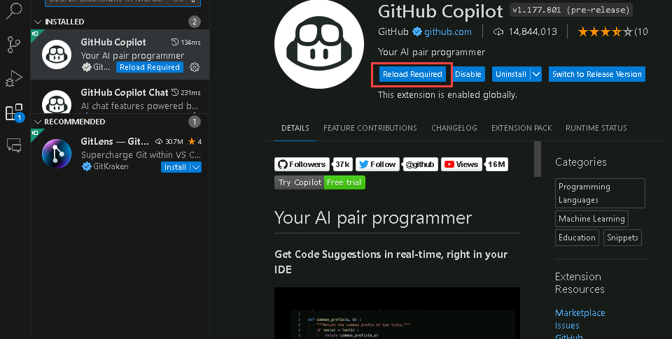

# Exercise 7: Using GitHub Copilot for T-SQL and YAML Code [Optional]

Duration: 20 minutes

In this exercise, the primary objective is to leverage the capabilities of GitHub Copilot, a powerful AI-assisted coding tool, to assist you in generating code for two distinct programming languages: T-SQL and YAML. You can leverage comments to generate Copilot suggestions!

>**Disclaimer**: GitHub Copilot will automatically suggest an entire function body or code in grayed text. Examples of what you'll most likely see in this exercise, but the exact suggestion may vary.

### Task 1: Generate a SQL query with GitHub Copilot using comments

1. Navigate back to Visual Studio Code, and from inside the codespace in the VS Code explorer window, create a new file.

    

1. Name the file `demo.sql` and type the below comment:

   ```
   -- Create a table for 5 products with product names and prices
   
   ```

   

1. To open a new tab with multiple synthesized solutions, press `Ctrl+Enter`. GitHub Copilot will synthesize around 10 different code suggestions in a new tab. You can view the solutions, and to accept a suggestion, you need to click on **Accept suggestion** below the solution and then save the file.

 >**Note**:  Incase of this error **CTRL + ENTER**: command '**github.copilot.generate**' not found , Please follow the below steps
- In the file Explorer Go to the path **%USERPROFILE%/AppData/Roaming/Code/CachedExtensionVSIXs (1)**

   
  
- **Delete all copilot files (2)** present in this path.
  
   
  
- reopen vsCode **reload the github copilot extenstion (3)** in vscode

   
  
- Then try **CTRL + ENTER**

   


1. After accepting the suggestion, review it carefully before applying it.

   

   >**Note**: You may not see the same suggestions as shown in the screenshot; exact suggestions may vary.

### Task 2: Generate YAML with GitHub Copilot using comments
   
1. From inside the codespace in the VS Code Explorer window, create a new file.

    

1. Name the file `deploy-app.yml` and type the below comment:

   ```
   # Create a GitHub action to email a report from a file at 6 a.m. daily
   ```

1. To open a new tab with multiple synthesized solutions, press `Ctrl+Enter`. GitHub Copilot will synthesize around 10 different code suggestions in a new tab. You can view the solutions, and to accept a suggestion, you need to click on **Accept suggestion** below the solution and then save the file.

   

1. After accepting the suggestion, review it carefully before applying it.

   

   >**Note**: You may not see the same suggestions as shown in the screenshot; exact suggestions may vary.

### Task 3: Push code to your repository from the codespace

1. Use the VS Code terminal to add files to the repository. Open VS Code Terminal if it's not opened yet.

1. Run the below command to add all the files to the repository:
   
   ```
   git add --all
   ```

1. Next, from the VS Code terminal stage, commit the changes to the repository:

   ```
   git commit -m "Copilot fourth commit"
   ```

1. Finally, from the VS Code terminal, push code to the repository:

   ```
   git push
   ```

   

   >**Note**: Wait about 60 seconds, then refresh your repository landing page for the next step.

1. You can verify the newly added files available in your GitHub repository.

   

### Summary

In this exercise, you have successfully generated code for SQL and YAML using comments with the help of GitHub Copilot.
