# Ejercicio 7: Mejorar la Accesibilidad Web con GitHub Copilot Chat y Accessibility Insights

### Duración Estimada: 35 minutos

**GitHub Copilot Chat** es una herramienta de completado de código impulsada por IA que ayuda a los desarrolladores sugiriendo fragmentos de código y soluciones en función del contexto. Esta herramienta puede acelerar significativamente el proceso de desarrollo al proporcionar sugerencias de código relevantes y automatizar tareas repetitivas.

**Accessibility Insights for Web** es una herramienta poderosa y fácil de usar para garantizar que el contenido web sea accesible para todos, incluidos aquellos con capacidades diversas. Al integrar esta herramienta en el proceso de desarrollo y prueba, los desarrolladores web pueden asegurarse de que sus sitios web cumplan con los estándares de accesibilidad, mejorando la usabilidad y la inclusión.

Accessible University (AU) es una página de inicio universitaria ficticia diseñada para demostrar una variedad de problemas comunes de diseño web que hacen que los visitantes con discapacidades no puedan acceder al contenido o las funciones.

Utilice el sitio de AU para:

1. Demostrar los principios comunes de accesibilidad web en capacitaciones, presentaciones y talleres sobre diseño web accesible.

1. Aprender los problemas comunes de accesibilidad web y sus soluciones de una manera fácil de entender.

En este ejercicio, utilizará Accessibility Insights for Web para identificar problemas de accesibilidad en un sitio web de muestra y, a continuación, empleará GitHub Copilot Chat para generar e implementar correcciones de código para estos problemas. El sitio web de destino, Accessible University (AU), es una página de inicio ficticia diseñada para mostrar problemas de diseño web comunes que dificultan la accesibilidad. Al finalizar este ejercicio, habrá mejorado la accesibilidad del sitio de AU, haciéndolo más fácil de usar para personas con discapacidades.

## Objetivos del laboratorio

Será capaz de completar las siguientes tareas:

- Tarea 1: Configurar la extensión Accessibility Insights for Web en Microsoft Edge
- Tarea 2: Verificar la extensión GitHub Copilot Chat y Clonar el Repositorio de GitHub Accessible University en VS Code

## Tarea 1: Configurar la extensión Accessibility Insights for Web en Microsoft Edge

1. Vaya a la página **Accessibility Insights para la Web** usando la URL proporcionada a continuación:
   
    ```
    https://accessibilityinsights.io/docs/web/overview/
    ```
     
1. Desde la página Accessibility Insights para la Web, haga clic en la opción **Download for Web**.

   

1. Haga clic en el botón **+ Add to Microsoft Edge** desde la página Download Accessibility Insights.

   

1. Seleccione la opción **Obtener**.
   
   

1. Aparecerá una ventana emergente. Seleccione la opción **Agregar extensión**. Comenzará a descargarse una extensión en su navegador web.

   

1. Haga clic en el ícono **Extensiones** **(1)** en la barra de herramientas del navegador. En Accessibility Insights for Web, seleccione la opción **(...)** **(2)** y haga clic en **Administrar extensión** **(3)**.
   
    

1. En la página **Administrar Extensión**, desplácese hacia abajo y haga clic en la casilla de verificación **Permitir el acceso a las direcciones URL de archivo**.

   

## Tarea 2: Verificar la extensión GitHub Copilot Chat y Clonar el Repositorio de GitHub Accessible University en VS Code

1. Inicie **Visual Studio Code** desde el escritorio.

    

     >**Nota**: Asegúrese de no abrir una instancia de Visual Studio Code que ya esté en ejecución; en su lugar, inicie una nueva desde el escritorio.

1. Haga clic en las tres líneas horizontales en la esquina superior izquierda **(1)**, haga clic en **Archivo (2)** y luego haga clic en **Nueva ventana (3)**.

   

1. Para verificar la extensión **GitHub Copilot Chat**, se deben realizar los siguientes pasos dentro de Visual Studio Code:
    - Haga clic en el ícono **Extensiones (1)** en la barra de actividades presente en el lado izquierdo de la ventana de Visual Studio Code.
    - En el cuadro de búsqueda **"Buscar extensiones en Marketplace"**, escriba y busque la extensión **GitHub Copilot Chat (2)**.
    - Seleccione **GitHub Copilot Chat (3)** de la lista de resultados que aparecen y verifique que **GitHub Copilot Chat** se encuentre instalado.
    - De lo contrario, haga clic en el botón **Instalar (4)**.

      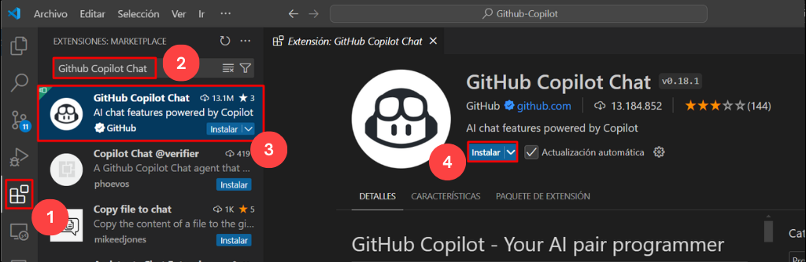

1. Una vez que se complete la instalación, en la parte superior derecha junto a la barra de búsqueda, podrá ver el ícono de GitHub Copilot Chat, como se muestra a continuación.

   

1. Vaya al paso 8 si ya ha iniciado sesión en una cuenta de GitHub en VS Code. Si no es así, siga los pasos 5 a 7.

1. Seleccione el ícono **Cuenta** en la parte inferior y haga clic en **Iniciar sesión con GitHub**.

    

1. Inicie sesión con las credenciales de GitHub y, en la página **Authorize GitHub for VS Code**, haga clic en **Authorize Visual-Studio-Code**.

    

1. Si aparece una ventana emergente, el sitio está intentando abrir Visual Studio Code. Haga clic en **Abrir**. Volverá a **Visual Studio**.

    

1. En la **Terminal de Visual Studio Code**, haga clic en **(...)** **(1)** para seleccionar el menú **Terminal** **(2)** y, a continuación, seleccione **Nuevo terminal** **(3)**. La ventana de la terminal suele abrirse en la mitad inferior de la pantalla.

    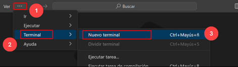
    
1. Ejecute el siguiente comando que se indica a continuación para clonar el repositorio de GitHub de Accessible University.

    ```
   git clone https://github.com/CloudLabsAI-Azure/AU.git
    ```

    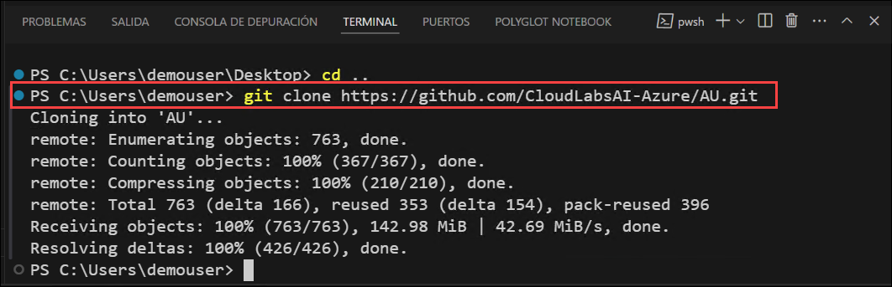

1. En la esquina superior izquierda, cambie al **Explorador**, seleccione **Abrir Carpeta**
   
   

1. Seleccione la carpeta que ha clonado **(1)** y haga clic en **Select Folder (2)**.

   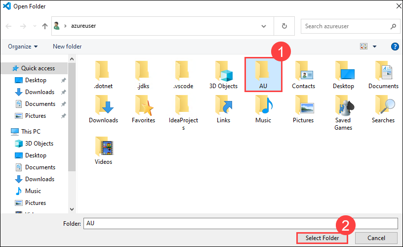

1. Seleccione **Sí, confío en los autores**.

   

1. Una vez que la carpeta esté abierta, seleccione el archivo `before.html`.

   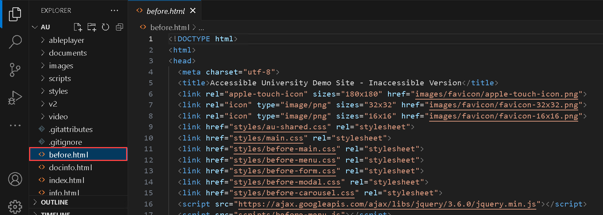

1. Diríjase al **Explorador de Archivos** y vaya a la ruta `C:\Users\azureuser\AU`, luego presione **Enter**.

   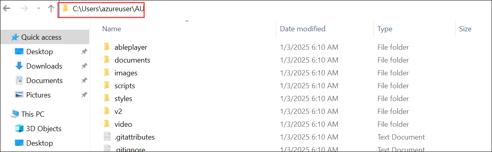

1. Se abrirá la carpeta que ha clonado. Desde allí, haga doble clic en el archivo html `before`. Se abrirá en su navegador web, donde ya ha agregado la extensión **Accessibility Insights for Web**.

   

   

1. Ahora haga clic en el botón **Extensiones (1)** de la barra de herramientas del navegador, seleccione **Accessibility Insights for Web (2)** y, a continuación, haga clic en **FastPass (3)**. Se abrirá en una nueva ventana emergente.

   - **FastPass**: [FastPass](https://accessibilityinsights.io/docs/web/getstarted/fastpass/) es un proceso ligero de dos pasos que ayuda a los desarrolladores a identificar problemas de accesibilidad comunes y de alto impacto en menos de cinco minutos.

     

     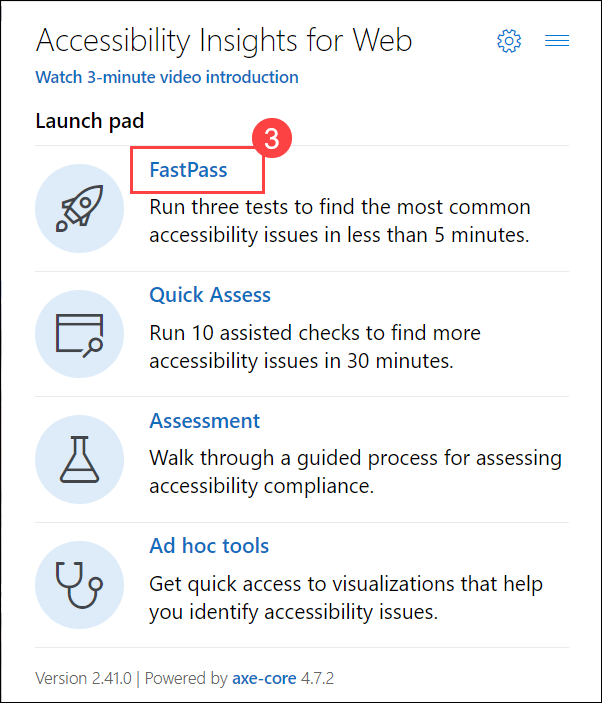

1. En la nueva ventana de **Accessibility Insights for Web**, verá la siguiente lista de verificación de tres pasos para FastPass.

   - **Automated checks**: La herramienta verifica automáticamente el cumplimiento de docenas de requisitos de accesibilidad. 

   - **Tab stops**: La herramienta proporciona instrucciones claras, automatización parcial y un asistente visual que facilita la identificación de problemas críticos de accesibilidad relacionados con el acceso mediante el teclado, como tabulaciones faltantes, trampas en el teclado y orden de tabulación incorrecto.

   - **Needs review**: La herramienta proporciona instancias que necesitan ser revisadas por un humano para determinar si pasan o no.

1. Expanda el problema de contraste de color para verificar los detalles de la falla.

   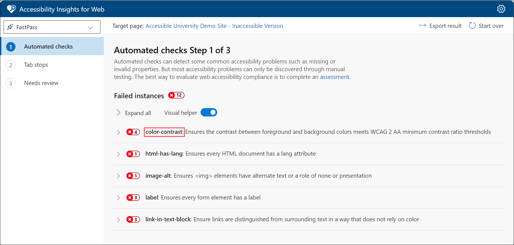

1. Vuelva a Visual Studio Code, abra el archivo **before-menu.css (2)** que se encuentra en la carpeta **styles (1)**.

   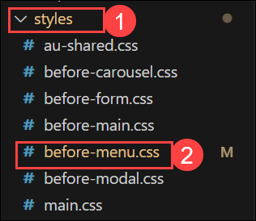

1. En el archivo **before-menu.css**, busque la sección CSS que aborda el contraste de color. Seleccione el fragmento de código dado, presione **Ctrl + I** para abrir el chat de GitHub Copilot, ingrese el prompt y presione Enter.

   ```
   Fix the colour contrast issue.
   ```

   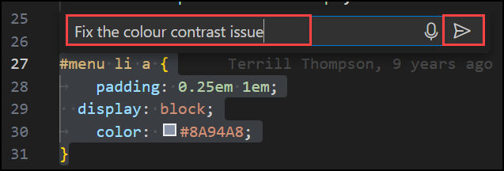

1. Revise la sugerencia de GitHub Copilot, la cual se generó en función del contexto proporcionado, asegúrese de que cumpla con sus requisitos y haga clic en la opción **Aceptar**.

   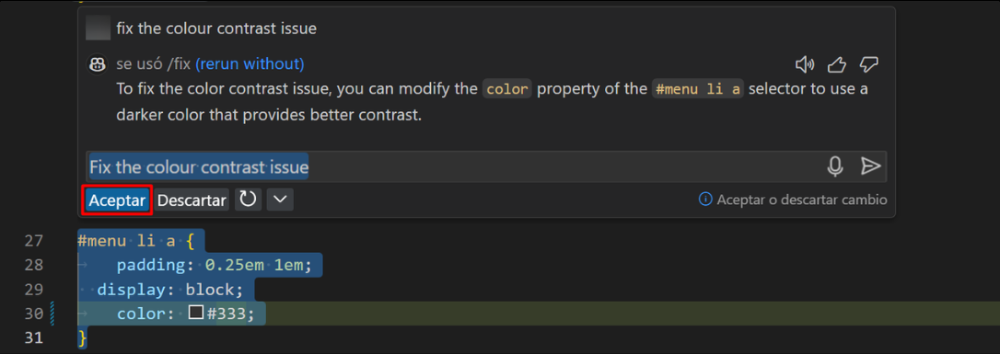

   >**Nota**: Debe tenerse en cuenta que las sugerencias de código que ofrece GitHub Copilot podrían no coincidir exactamente con las capturas de pantalla que se muestran en la guía de laboratorio. GitHub Copilot es una herramienta impulsada por IA que genera código en función del contexto y los patrones, y sus sugerencias pueden verse influenciadas por varios factores.

   >**Nota:** Si las sugerencias no aparecen, considere reiniciar Visual Studio Code y rehacer el proceso.

1. Al aceptar esto, se modificará el código.

   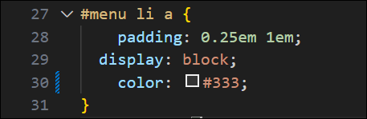

1. **Guarde** el archivo presionando **Ctrl + S**.

1. Ahora, actualice su página **Accessible University**. 

   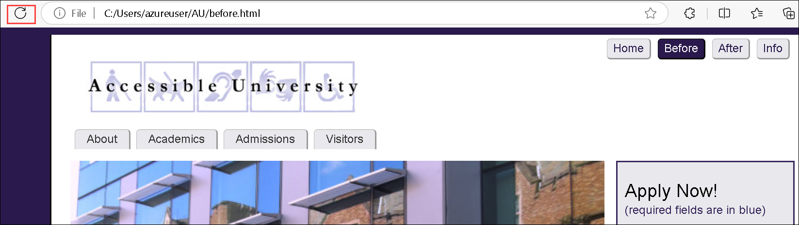

1. Haga clic en el botón **Start over** desde la página **Accessibility Insights for Web**. Ahora verá una reducción en el mensaje de error.

   

   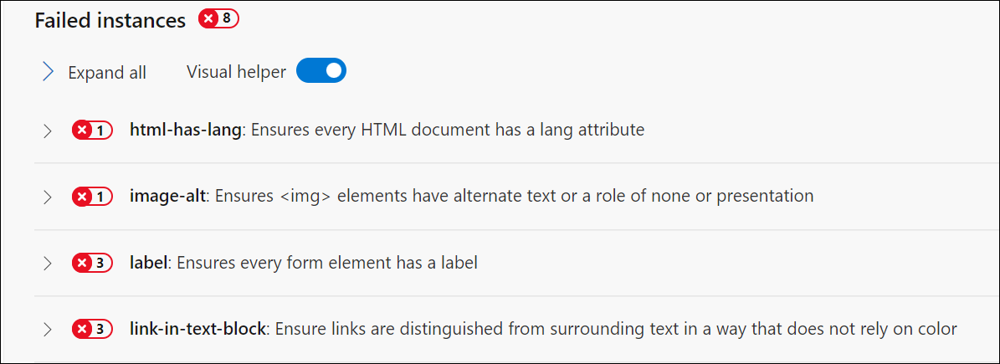

   >**Nota**: Realice el paso 14 si no se volvieron a cargar los datos.

1. Haga clic en **html-has-lang** para revisar el mensaje de error en detalle.

    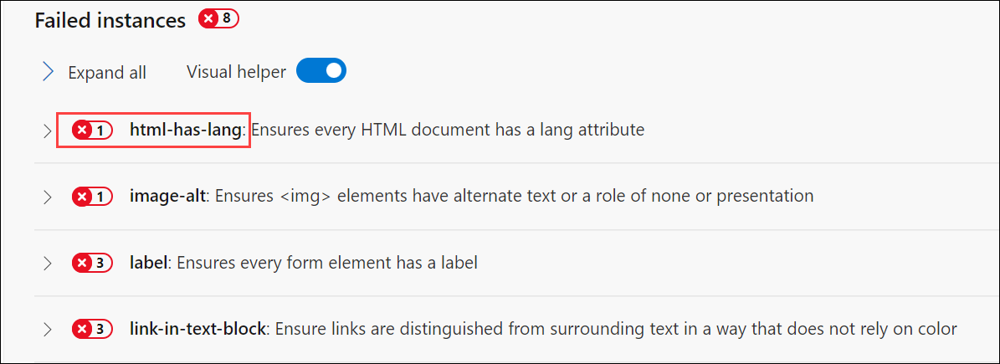

1. Vuelva de nuevo a VS Code, abra el archivo `before.html`.

1. Seleccione el código `html`, presione **Ctrl + I** para acceder al chat de GitHub Copilot, ingrese el prompt indicado y presione **Enter**.

   ```
   Add the html lang attribute
   ```

    

1. Revise la sugerencia de GitHub Copilot, que se generó en función del contexto proporcionado, y asegúrese de que cumpla con sus requisitos. Haga clic en la opción **Aceptar**.

   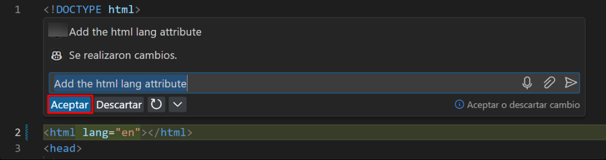

1. Al aceptar esto, se modificará el código.

   

1. **Guarde** el archivo presionando **Ctrl + S**.

1. Ahora, actualice su página **Accessible University**. 

   

1. Haga clic en el botón **Start over** desde la página **Accessibility Insights for Web**. Ahora verá una reducción en el mensaje de error.

   

1. Ahora, expanda **image-alt** para ver el mensaje de error.

1. Vuelva a VS Code, abra el archivo `before.html`.

1. En el archivo **before.html**, seleccione el código dado, presione **Ctrl + I** para abrir el chat de GitHub Copilot, ingrese el prompt dado y presione Enter.

   ```
   Fix the accessibility issue
   ```

   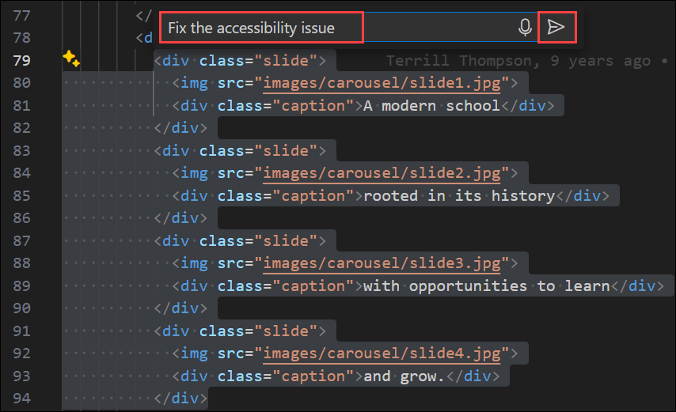

1. Revise la sugerencia de GitHub Copilot, que se generó en función del contexto proporcionado, y asegúrese de que cumpla con sus requisitos. Haga clic en la opción **Aceptar**. 

   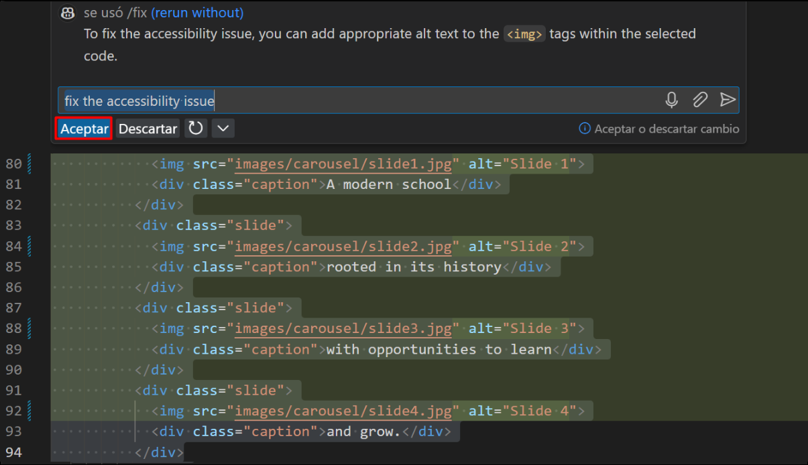

1. Al aceptar esto, se modificará el código.

    

1. **Guarde** el archivo presionando **Ctrl + S**.

1. Ahora, actualice su página **Accessible University**. Haga clic en el botón **Start over** desde la página **Accessibility Insights for Web**. Ahora verá una reducción en el mensaje de error.

   

   

1. Ahora, expanda **label** para verificar el mensaje de error a detalle.

1. Vuelva a VS Code, abra el archivo `before.html`.

1. En el archivo **before.html**, seleccione el código dado, presione **Ctrl + I** para abrir el chat de GitHub Copilot, ingrese el prompt dado y presione Enter.

   ```
   Add a label to the selected code
   ```

   

1. Revise la sugerencia de GitHub Copilot, que se generó en función del contexto proporcionado, y asegúrese de que cumpla con sus requisitos. Haga clic en la opción **Aceptar**.

   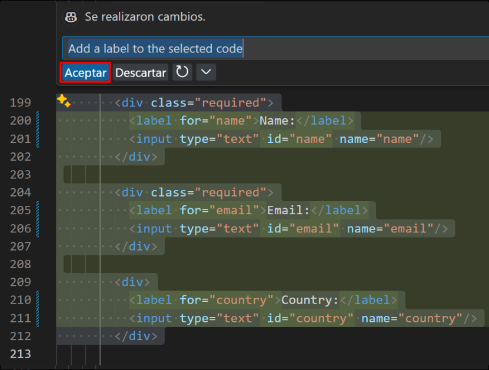 

1. Al aceptar esto, se modificará el código.

    

1. **Guarde** el archivo presionando **Ctrl + S**.

1. Actualice su página **Accessible University**. Haga clic en el botón **Start over** desde la página **Accessibility Insights for Web**. Ahora verá una reducción en el mensaje de error.

1. Expanda **link-in-text-block** para verificar el mensaje de error en detalle. 

   

1. Vuelva a VS Code.

1. En el archivo **before.html**, seleccione el código dado, presione **Ctrl + I** para abrir el chat de GitHub Copilot, ingrese el prompt dado y presione Enter.

   ```
   Fix for all: one of the following issues: improve link color contrast to at least 3:1 or add styling (e.g., underline) to distinguish it from surrounding text.
   ```

   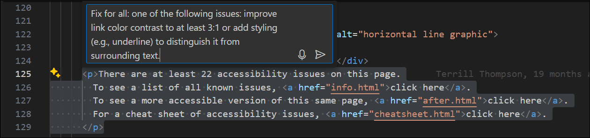

1. Revise la sugerencia de GitHub Copilot, que se generó en función del contexto proporcionado, y asegúrese de que cumpla con sus requisitos. Haga clic en la opción **Aceptar**.

   

1. Al aceptar esto, se modificará el código.

   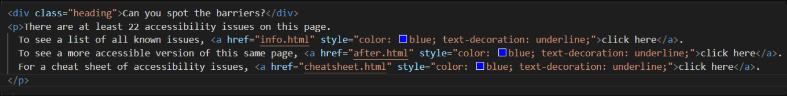 

1. **Guarde** el archivo presionando **Ctrl + S**.

1. Actualice su página **Accessible University**. Haga clic en el botón **Start over** desde la página **Accessibility Insights for Web**. Notará que no hay ningún problema pendiente.

   

### Resumen

En este ejercicio, ha integrado con éxito Accessibility Insights for Web en Microsoft Edge y lo ha utilizado para identificar problemas de accesibilidad en la página de inicio de AU. Aprovechando GitHub Copilot Chat en Visual Studio Code, ha generado e implementado soluciones de código para corregir estos problemas. Este proceso garantizó que el sitio web cumpliera con los estándares de accesibilidad, mejorando la usabilidad y la inclusión de todos los usuarios, incluidos aquellos con discapacidades. Consulte el enlace para obtener más información sobre [Accessible University](https://www.washington.edu/accesscomputing/AU/).

### Ha completado el laboratorio con éxito
