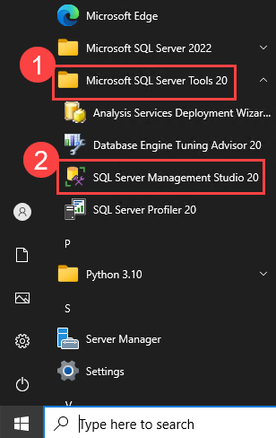

# Ejercicio 8: Usar GitHub Copilot para Código T-SQL y YAML [Opcional]

### Duración Estimada: 15 minutos

En este ejercicio, el objetivo principal es aprovechar las capacidades de GitHub Copilot, una poderosa herramienta de codificación asistida por IA, para ayudarlo a generar código para dos lenguajes de programación distintos: T-SQL y YAML. ¡Puede aprovechar los comentarios para generar sugerencias de Copilot!

>**Descargo de responsabilidad**: GitHub Copilot sugerirá automáticamente todo el cuerpo de una función o código en texto gris. A continuación, se muestran ejemplos de lo que probablemente verá en este ejercicio, pero la sugerencia exacta puede variar.

>**Nota**: Si no puede ver ninguna sugerencia de GitHub Copilot en VS Code, reinicie VS Code una vez e intente nuevamente.

## Objetivos del laboratorio

Será capaz de completar las siguientes tareas:

- Tarea 1: Generar una consulta SQL con GitHub Copilot usando comentarios
- Tarea 2: Generar YAML con GitHub Copilot usando comentarios

### Tarea 1: Generar una consulta SQL con GitHub Copilot usando comentarios

1. Vuelva a Visual Studio Code y, desde el codespace en la ventana Explorador de VS Code, cree un nuevo archivo.

    

1. Nombre el archivo `demo.sql`, escriba el siguiente comentario y presione **Enter**:

   ```
   -- create a table with 5 coloumns customer_id, customer_fname, customer_lname, customer_phone, customer_address
   ```

   

1. Observe cómo Copilot puede generar las siguientes líneas de código.

1. Haga clic en `Tab` y presione **Enter**.

1. Continúe con las filas. Escriba el siguiente comentario y presione **Enter**.

   ```
   -- fill in 5 rows in customers table
   ```

       

1. Haga clic en `Tab` y presione **Enter**.

1. Ejecute la consulta para mostrar la tabla. Escriba el comentario a continuación y presione **Enter**.

   ```
   -- show the data in customers table
   ```

       

1. Haga clic en Entrar y haga clic en `Tab` para seleccionar la sugerencia.

1. Presione `Ctrl+S` para guardar el archivo.

1. Haga clic en el icono de Inicio de Windows y expanda la carpeta **Microsoft SQL Server Tools 20 (1)** y seleccione **SQL Server Management Studio 20 (2)**.

   

1. Asegúrese de que se hayan agregado los siguientes detalles:

   - Nombre del servidor: **labvm-<inject key="Deployment-id" enableCopy="false"/>\SQLEXPRESS (1)**
   - Autenticación: **Autenticación de Windows (2)**
   - Encriptación: Marque la casilla **Confiar en el certificado del servidor (3)**
   - Haga clic en **Conectar (4)**

       
     
1. Una vez que esté conectado al servidor, haga clic en **Nueva consulta** en la parte superior.

   

1. Navegue hasta **Visual Studio Code** y copie todo el contenido que hemos obtenido en `demo.sql`.

1. Péguelo en la nueva página de consulta.

1. Seleccione cada **bloque de código (1)** y haga clic en **Ejecutar (2)**. Observe cómo cada bloque de código se ejecuta correctamente y produce el resultado esperado en la terminal.

   

   

   
   
1. Puede observar cómo procesa cada bloque de código y muestra la tabla Clientes.

      
   
### Tarea 2: Generar YAML con GitHub Copilot usando comentarios
   
1. Desde el codespace en la ventana Explorador de VS Code, cree un nuevo archivo llamado `report.yml`.

    

1. Presione `Ctrl + I`, escriba el comentario a continuación y presione enviar:

   ```
   # Create a GitHub action to email a report from a file at 6 a.m. daily
   ```
   

1. Haga clic en **Aceptar**.

   

      > **Nota**: Es posible que no vea las mismas sugerencias que se muestran en la captura de pantalla; Las sugerencias exactas pueden variar.

1. Abra GitHub Copilot Chat desde la parte superior y escriba `Explian the cron syntax in this code` y presione **enviar**.

      
   
1. Revise la respuesta y comprenda los usos de la sintaxis de cron.

      

1. Intente otra consulta: `How should a GitHub Actions YAML file be structured?` y evalúe la respuesta proporcionada.

   
   
### Resumen

En este ejercicio, ha generado código para SQL y YAML con éxito usando comentarios con la ayuda de GitHub Copilot.

### Ha completado el laboratorio con éxito
