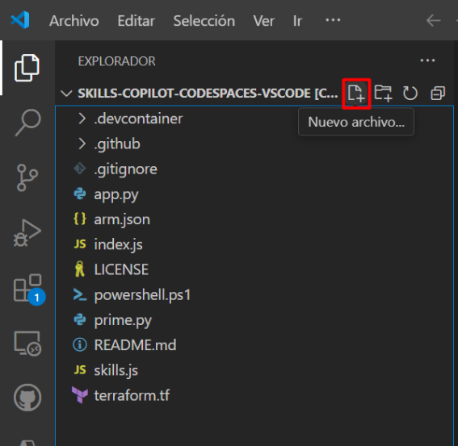
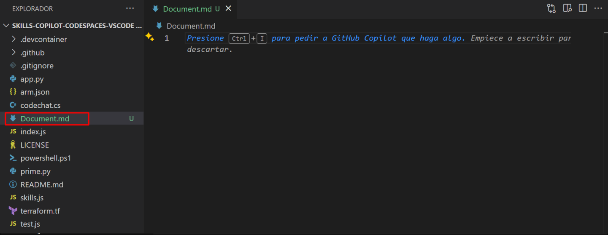
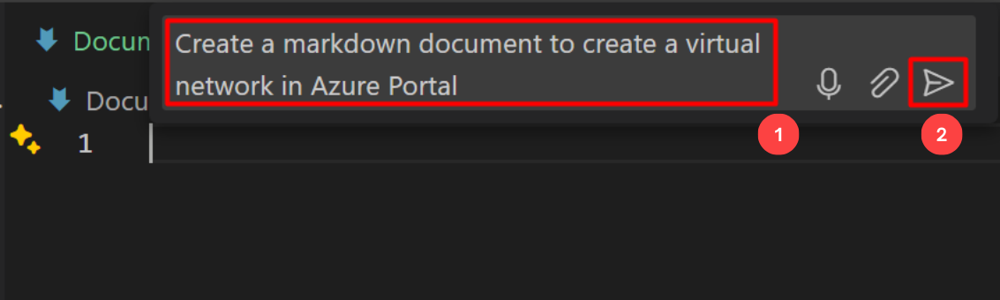
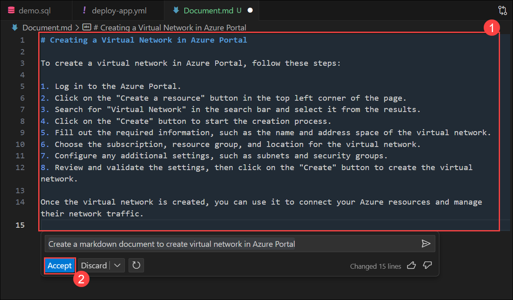

# Exercise 8: Generating Documentation using GitHub Copilot [Optional]

GitHub Copilot can help streamline the process of generating documentation for your software projects. It assists by auto-generating code comments, creating Markdown documentation, providing templates for common sections, ensuring grammar and style consistency, and cross-referencing code and documentation. This tool can save time and improve the quality of your project's documentation, making it more accessible and user-friendly.

In this exercise, you will be generating documentation using GitHub Copilot.

>**Disclaimer**: GitHub Copilot will automatically suggest an entire function body or code in grayed text. Examples of what you'll most likely see in this exercise, but the exact suggestion may vary.

1. From inside the codespace in the VS Code explorer window, create a new file.

    

1. Name the file `Document.md` and press `CTRL + I` to ask GitHub Copilot to do something.

   

1. Type the statement `Create a markdown document to create Virtual Network in Azure Portal` **(1)** and click on `>` or press `Enter` **(2)**.

   

1. Copilot will give a response and you can review it **(1)**, click **Accept** **(2)** and press `CTRL + S` to save the file. Also, you can Discard the suggestion as depicted in the image below.

   

## Summary

In this exercise, you have successfully generated document using GitHub Copilot Chat.
