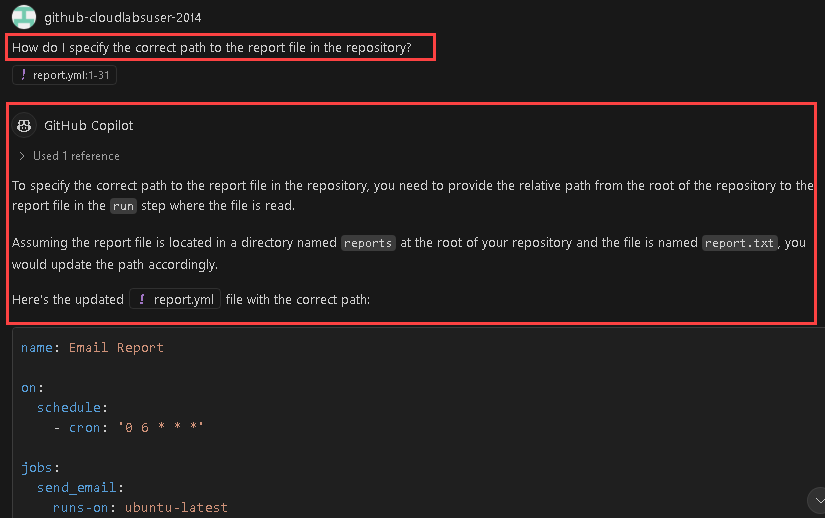

# Exercise 8: Using GitHub Copilot for T-SQL and YAML Code [Optional]

### Estimated Duration: 15 minutes

In this exercise, the primary objective is to leverage the capabilities of GitHub Copilot, a powerful AI-assisted coding tool, to assist you in generating code for two distinct programming languages: T-SQL and YAML. You can leverage comments to generate Copilot suggestions!

>**Disclaimer**: GitHub Copilot will automatically suggest an entire function body or code in grayed text. Examples of what you'll most likely see in this exercise, but the exact suggestion may vary.

>**Note**: If you are unable to see any suggestions by GitHub Copilot in VS Code, please restart the VS Code once and try again. 

## Lab objectives

You will be able to complete the following tasks:

- Task 1: Generate a SQL query with GitHub Copilot using comments
- Task 2: Generate YAML with GitHub Copilot using comments
- Task 3: Push code to your repository from the codespace

### Task 1: Generate a SQL query with GitHub Copilot using comments

1. Navigate back to Visual Studio Code, and from inside the codespace in the VS Code explorer window, create a new file.

    

1. Name the file `demo.sql` and type the below comment:

   ```
   -- create a table with 5 coloumns customer_id, customer_fname, customer_lname, customer_phone, customer_address
   ```
   
1. Notice how the Copilot is able to generate the next lines of code.

1. Click on `Tab` and press **Enter**.

1. Follow up with the rows. Type the below comment:

   ```
   -- fill in 5 rows in customers table
   ```
1. Click on `Tab` and press **Enter**.

1. Let's execute the query to show the table. Type the below comment:

   ```
   -- show the data in customers table
   ```

1. Click on Enter and click on `Tab` to select the suggestion.

1. Press Ctrl+S to save the file.


### Task 2: Generate YAML with GitHub Copilot using comments
   
1. From inside the codespace in the VS Code Explorer window, create a new file and name the file as `report.yml`

    

1. Press `Ctrl + I` , type the below comment and hit send:

   ```
   # Create a GitHub action to email a report from a file at 6 a.m. daily
   ```
   

1. Click on **Accept**.

   

      > **Note**: You may not see the same suggestions as shown in the screenshot; exact suggestions may vary.

1. Open GitHub Copilot Chat from the top and type `Explian the cron syntax in this code` and hit **send**.

      
   
1. Review the response and understand the uses of cron syntax.

      

1. Offer another query: `How should a GitHub Actions YAML file be structured?` and evaluate the provided response.

   
   
1. Provide additional cues to analyze and better understand the code.
   
### Summary

In this exercise, you have successfully generated code for SQL and YAML using comments with the help of GitHub Copilot.

### You have successfully completed the lab
