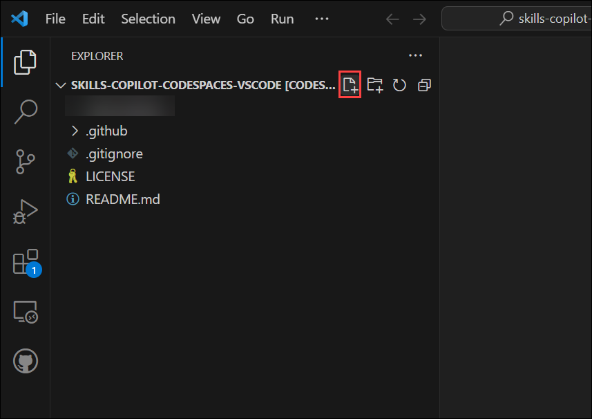

# Exercise 8: Working with the Copilot for Machine Learning [Optional]

Working with Copilot for machine learning involves leveraging GitHub Copilot, an AI-powered code completion tool developed by GitHub in collaboration with OpenAI. Here's a quick summary of the key steps and considerations:

Installation: Ensure you have GitHub Copilot installed as an extension in your integrated development environment (IDE), such as Visual Studio Code.

GitHub Integration: Link your IDE to your GitHub account to enable seamless integration. This allows Copilot to access your code repositories and provide context-aware suggestions.

Machine Learning Frameworks: Copilot supports various machine learning libraries and frameworks like TensorFlow, PyTorch, scikit-learn, and more. It can assist with code generation for tasks like data preprocessing, model building, and evaluation.

In this exercise, you will be cloning the git repository with required dataset into your environment. Here, you will be working with Copilot for Machine learning involves leveraging GitHub Copilot.

>**Disclaimer**: GitHub Copilot will automatically suggest an entire function body or code in grayed text. Examples of what you'll most likely see in this exercise, but the exact suggestion may vary.

>**Note**: Before proceeding with the exercise, make sure you have installed Python and pip-packages.

### Task 1: Pre-requisites and Injecting the required dataset into your environment

1. Open VS Code Terminal by clicking on **Ellipsis (...)** **(1)**, select **Terminal** **(2)** and click on **New Terminal** **(3)**.

   

1. Clone the below git repository in your environment.

   ```
   git clone https://github.com/CloudLabsAI-Azure/ml-copilot-workshop.git
   ```

1. Change the directory in terminal by running the below command:

   ```
   cd ml-copilot-workshop
   ```

1. To install all the required python dependencies in your environment, before working with copilot run the below command in your terminal:

   ```
   pip install -r requirements.txt
   ```

### Task 2: Auto Completion of Code with different experiments

1. From the VS Code explorer window, create a new file.

   

1. Name the file `Experiments.ipynb` and verify your new file looks as shown below:


