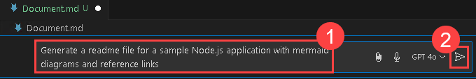
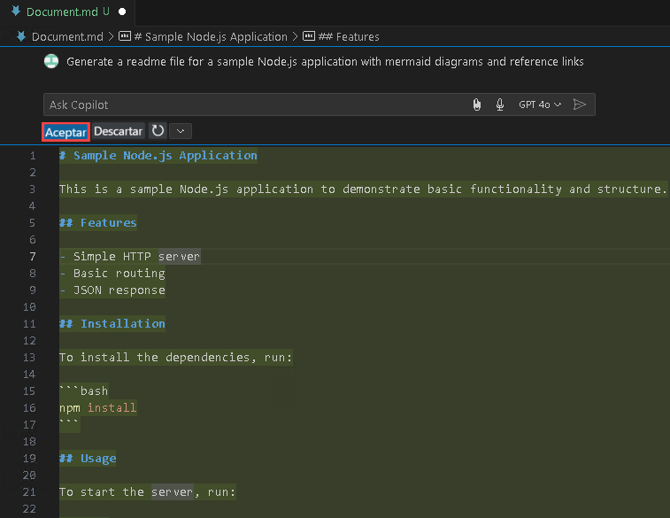
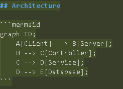
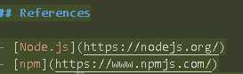

# Exercise 9: Generating Documentation Using GitHub Copilot [Optional]

### Estimated Duration: 10 minutes

GitHub Copilot can help streamline the process of generating documentation for your software projects. It assists by auto-generating code comments, creating Markdown documentation, providing templates for common sections, ensuring grammar and style consistency, and cross-referencing code and documentation. This tool can save time and improve the quality of your project's documentation, making it more accessible and user-friendly.

In this exercise, you will be generating documentation using GitHub Copilot.

>**Disclaimer**: GitHub Copilot will automatically suggest an entire function body or code in grayed text. Examples of what you'll most likely see in this exercise, but the exact suggestion may vary.

>**Note**: If you are unable to see any suggestions by GitHub Copilot in VS Code, please restart the VS Code once and try again. 

1. From inside the codespace in the VS Code Explorer window, create a new file and name the file as `Document.md`.

    

1. Press `CTRL + I` to provide statemets to Github Copilot.

1. Provide the below statement **(1)** for the GitHub Copilot to create a document that shows the creation of the sample Node.js application. Hit **Send (2)**.

    ```
    Create a markdown document for a sample Node.js application with mermaid diagrams and reference links
    ```

      

1.  Copilot will give a response, and you can review it , click **Accept**, and press `CTRL + S` to save the file.

       

1.  Observe how Copilot has generated the Mermaid diagrams and included the reference links as per our request.

       
    
       

1. Right-click on the **Document.md** file, and select **open the integrated terminal**.

1. Provide the below commands, to push the changes to GitHub.

    ```
    Git add .

    Git commit -m "files"

    Git Push
    ```
    
## Summary

In this exercise, you have successfully generated a document using GitHub Copilot Chat.

### You have successfully completed the lab
