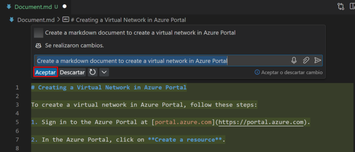

# Exercise 9: Generar Documentación con GitHub Copilot [Opcional]

### Duración Estimada: 10 minutos

GitHub Copilot puede ayudarle a agilizar el proceso de generación de documentación para sus proyectos de software. Ayuda generando automáticamente comentarios de código, creando documentación en Markdown, proporcionando plantillas para secciones comunes, garantizando la coherencia gramatical y de estilo, y haciendo referencias cruzadas entre el código y la documentación. Esta herramienta puede ahorrarle tiempo y mejorar la calidad de la documentación de su proyecto, haciéndola más accesible y fácil de usar.

En este ejercicio, generará documentación utilizando GitHub Copilot.

>**Descargo de responsabilidad**: GitHub Copilot sugerirá automáticamente todo el cuerpo de una función o código en texto gris. A continuación, se muestran ejemplos de lo que probablemente verá en este ejercicio, pero la sugerencia exacta puede variar.

>**Nota**: Si no puede ver ninguna sugerencia de GitHub Copilot en VS Code, reinicie VS Code una vez e intente nuevamente.

1. Desde el codespace en la ventana Explorador de VS Code, cree un nuevo archivo.

    

1. Nombre el archivo `Document.md` y presione `CTRL + I` para pedirle a GitHub Copilot que haga algo.

   

1. Escriba la instrucción `Create a markdown document to create a virtual network in Azure Portal` **(1)** y haga clic en `>` o presione `Enter` **(2)**.

   

1. Copilot le dará una respuesta y usted puede revisarla **(1)**, hacer clic en **Aceptar** **(2)** y presionar `CTRL + S` para guardar el archivo. También puede descartar la sugerencia como se muestra en la imagen a continuación.

   

## Resumen

En este ejercicio, ha generado con éxito un documento mediante GitHub Copilot Chat.

### Ha completado el laboratorio con éxito
