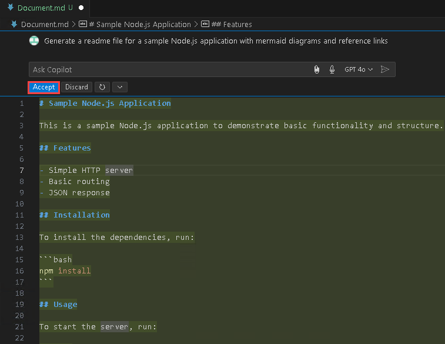

# Exercise 9: Generar Documentación con GitHub Copilot [Opcional]

### Duración Estimada: 10 minutos

GitHub Copilot puede ayudarle a agilizar el proceso de generación de documentación para sus proyectos de software. Ayuda generando automáticamente comentarios de código, creando documentación en Markdown, proporcionando plantillas para secciones comunes, garantizando la coherencia gramatical y de estilo, y haciendo referencias cruzadas entre el código y la documentación. Esta herramienta puede ahorrarle tiempo y mejorar la calidad de la documentación de su proyecto, haciéndola más accesible y fácil de usar.

En este ejercicio, generará documentación utilizando GitHub Copilot.

>**Descargo de responsabilidad**: GitHub Copilot sugerirá automáticamente todo el cuerpo de una función o código en texto gris. A continuación, se muestran ejemplos de lo que probablemente verá en este ejercicio, pero la sugerencia exacta puede variar.

>**Nota**: Si no puede ver ninguna sugerencia de GitHub Copilot en VS Code, reinicie VS Code una vez e intente nuevamente.

## Objetivos del laboratorio

Podrá completar las siguientes tareas:

- Tarea 1: Generar un archivo README con GitHub Copilot utilizando comentarios
- Tarea 2: Enviar código a su repositorio desde el codespace

### Tarea 1: Generar un archivo README con GitHub Copilot utilizando comentarios

1. Desde el codespace en la ventana Explorador de VS Code, cree un nuevo archivo y nombre el archivo como `Document.md`.

    

1. Presione `CTRL + I` para proporcionar instrucciones a GitHub Copilot.

1. Proporcione la siguiente instrucción **(1)** para que GitHub Copilot cree un documento que muestre la creación de la aplicación Node.js de muestra. Presione **Enviar (2)**.

    ```
    Create a markdown document for a sample Node.js application with mermaid diagrams and reference links
    ```

   

1. Copilot le dará una respuesta y usted puede revisarla, hacer clic en **Aceptar** y presionar `CTRL + S` para guardar el archivo. 

   

1. Observe cómo Copilot ha generado los diagramas de Mermaid e incluido los enlaces de referencia de acuerdo a nuestra solicitud.

    
    
    

### Tarea 2: Enviar código a su repositorio desde el codespace

1. Ejecute el siguiente comando para agregar los archivos:

    ```
    git add .
    ```

1. Ejecute el siguiente comando para confirmar los archivos:

    ```
    git commit -m "files"
    ```
1. Ejecute el siguiente comando para confirmar los archivos. Copie su correo electrónico de usuario de GitHub y péguelo entre comillas.

    ```
    git config --global user.email "<inject key="AzureAdUserEmail" enableCopy="true"/>""
    ```

1. Ejecute el siguiente comando para confirmar los archivos.

    ```
    git config --global user.name "<inject key="GitHub User Name" enableCopy="true"/>_clabs"
    ```

1. Ejecute el siguiente comando para enviar todos los archivos al repositorio:

    ```
    git push
    ```

## Resumen

En este ejercicio, ha generado con éxito un documento mediante GitHub Copilot Chat y ha enviado el código a su repositorio.

### Ha completado el laboratorio con éxito
