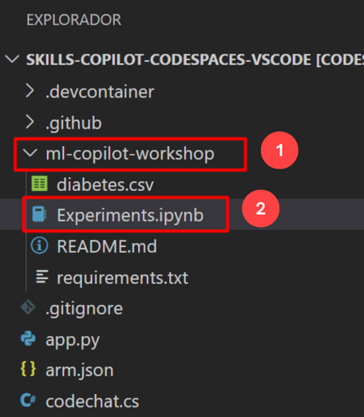

# Exercise 9: Working with the Copilot for Machine Learning [Optional]

Duration: 90 minutes

Working with Copilot for machine learning involves leveraging GitHub Copilot, an AI-powered code completion tool developed by GitHub in collaboration with OpenAI. Here's a quick summary of the key steps and considerations:

Installation: Ensure you have GitHub Copilot installed as an extension in your integrated development environment (IDE), such as Visual Studio Code.

GitHub Integration: Link your IDE to your GitHub account to enable seamless integration. This allows Copilot to access your code repositories and provide context-aware suggestions.

Machine Learning Frameworks: Copilot supports various machine learning libraries and frameworks like TensorFlow, PyTorch, scikit-learn, and more. It can assist with code generation for tasks like data preprocessing, model building, and evaluation.

In this exercise, you will be cloning the git repository with required dataset into your environment. Here, you will be working with Copilot for Machine learning involves leveraging GitHub Copilot.

>**Disclaimer**: GitHub Copilot will automatically suggest an entire function body or code in grayed text. Examples of what you'll most likely see in this exercise, but the exact suggestion may vary.

>**Note**: Before proceeding with the exercise, make sure you have installed Python and pip-packages.

### Task 1: Pre-requisites and Injecting the required dataset into your environment

1. Open VS Code Terminal by clicking on **Ellipsis (...)** **(1)**, select **Terminal** **(2)** and click on **New Terminal** **(3)**.

   

1. Clone the below git repository in your environment.

   ```
   git clone https://github.com/CloudLabsAI-Azure/ml-copilot-workshop.git
   ```

1. Change the directory in terminal by running the below command:

   ```
   cd ml-copilot-workshop
   ```

1. To install all the required python dependencies in your environment, before working with copilot run the below command in your terminal:

   ```
   pip install -r requirements.txt
   ```

### Task 2: Auto Completion of Code with different experiments

1. From the VS Code explorer window, right-click on the folder named **ml-copilot-workshop** **(1)** and click on **New File**. Name the file as `Experiments.ipynb` **(2)** and verify your new file looks as shown below:

   

1. Type the below comments to import all the libraries the copilot automatically prompts all the libraries press tab and then press enter to get the output. 

   ```
   # import libraries with respect to loading data and creating random forest model
   ```

   

1. Accept all the suggestions for importing libraries as shown in the below screenshot **(1)** and click **Run** **(2)** button to execute the cell. Click on `+ Code` **(3)** to add the new cell.

   

   >**Note**: While running the cell, you may need to install the required packages and select kernel.

1. Type the below comments to load the data using copilot prompt. Press enter to get into next line and review the suggestion and press Tab to accept the suggestion.

   ```
   # load the data from csv file and the name of the file is diabetes.csv
   ```

    

1. Now cli k on **+Code** and move on to next task.

   
### Task 3: Mathematical and machine Learning with different Examples

### Task 3.1: Mathematical Operations

1. Type the below comments to Perform the first mathematical experiment would be to generate the birth year from the age column present in the dataset, press tab and then press 
   enter. 

   ```
   # Mathematical operations on the dataset like generating the birth year from age
   ```

   

1. Type the below comment, press tab and then press enter to get the output similar to the below image. 

   ```
   # Show the new column
   ```

   

1. Type the below comments to convert the BMI column upto two decimal values, press tab and then press enter. 

   ```
   # convert the BMI column to two decimal values
   ```

   

1. In the same code cell type the below comment, press tab and then press enter to get the output similar to the below image. 

   ```
   # Show the new column only
   ```

   


### Task 3.2: Machine Learning

1. Type the below comments to Perform the data analysis and summary statistics on dataset, press tab and then press enter to get the output. 

   ```
   # Perform count, min, max, std, mean, 25%, 50%, 75% on the dataset
   ```

   

1. Once the cell run is completed, you will be getting the output similar to the below image.

   

1. Before building the model the main frame is to split the data into train test and split and this would be done by copilot itself. Type the below comments, press tab and run the cell.

   ```
   # Split the data into training and testing data and the column name Diabetic is the target column
   ```

   

   


### Task 4: Data Visualization and data Transformation

### Task 4.1: Data Visualization

1. Click on **+Code** to open the new cell and type the below comments to Perform the basic operations on dataset, press tab and then press enter to get the output. 

   ```
   # Perform univariate analysis on the dataset and plot the graphs
   ```

   

1. Once the cell run is completed, you will be getting the graphical representation output similar to the below image.

   

1. Now, type the below comments for specifying certain commonly used plots for visualizing, press tab and then press enter to get the output as below image.

   ```
   # Perform scatter plot on the dataset and plot the graphs
   ```

   

1. Type the below comments for performing Joint Plot or Grid (rarely used plots) for visualization, press tab and then press enter to get the output as below image.

   ```
   # Perform JointGrid plot on the dataset and plot the graphs
   ```

   

   

1. Type the below comments for performing visualization on all features of dataset, press tab and then press enter to get the output as below image.

   ```
   # Perform comparison on all features of the dataset and plot the graphs in a single plot using heatmap
   ```

   

   


### Task 4.2: Data Transformations

1. Click **+Code** to add a new cell and type the below comments for Standardization, the process of scaling and centring numeric features to have a mean of 0 and a standard deviation of 1, making them comparable and suitable for certain algorithms, press tab and then press enter.

   ```
   # Perform Standardization on the data
   ```

   

   

1. You will get the output as below image once the code cell finished the running.

   


### Task 5: Training the sample model

Training a sample model using Random Forest.

>**Note**: The model training is a continuation of train test split step to train the model run the train test split step first then continue with the model building.

1. Click **+Code** to add a new cell and type the below comments for creating the random forest model, press tab and then press enter.

   ```
   # Create a random forest model with 100 trees and the criterion is entropy
   ```

   

   

   

1. In a new cell type the below comments for calculating the accuracy of the model, press tab and then press enter to see the output.

   ```
   # Calculate the accuracy of the model
   ```

   

### Summary

In this exercise, you have successfully leveraged the GitHub Copilot for machine learning.
