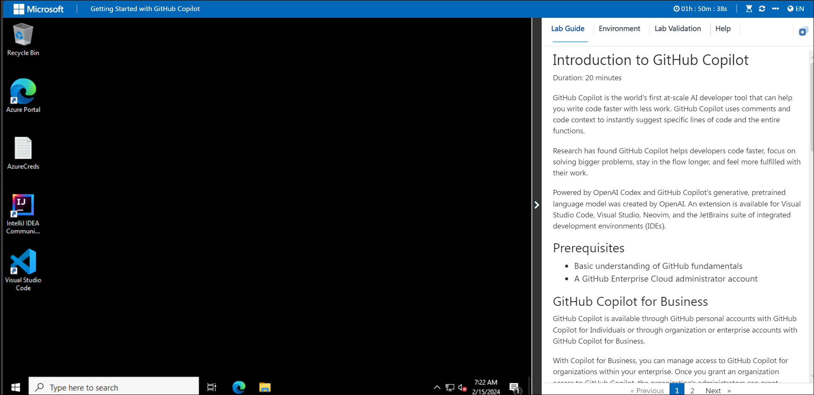

# **Lab 1: Getting Started with Github-Copilot**
 
Welcome to your Github-Copilot workshop! We've prepared a seamless environment for you to explore and learn about Azure services. Let's begin by making the most of this experience:
 
## **Accessing Your Lab Environment**
 
Once you're ready to dive in, your virtual machine and lab guide will be right at your fingertips within your web browser.
 
   

### **Virtual Machine & Lab Guide**
 
Your virtual machine is your workhorse throughout the workshop. The lab guide is your roadmap to success.
 
## **Exploring Your Lab Resources**
 
To get a better understanding of your lab resources and credentials, navigate to the **Environment Details** tab.
 
   
 
## **Utilizing the Split Window Feature**
 
For convenience, you can open the lab guide in a separate window by selecting the **Split Window** button from the Top right corner.
 
   
  
## Login to GitHub

1. In the LABVM desktop search for **Microsoft Edge** **(1)**, click on **Microsoft Edge** **(2)** browser.

   

1. Navigate to GitHub login page using the provided URL below:
   ```
   https://github.com/login
   ```
   
1. On the **Sign in to GitHub** tab, you will see the login screen. In that screen, enter the  **email** **(1)** and **password** **(2)**. Then click on **Sign in** **(3)**. 

   
          
   >**Note:** To view the GitHub credentials, access the lab named **GitHub Copilot Lab: GitHub Credentials**, which is present within the First learning path of this course.

      

   >**Note:** Once the lab has been deployed successfully, navigate to the **Environment** tab to view the key-value pairs of the **GitHub UserEmail**, and **GitHub Password**. You can use the copy buttons under the actions column to have the values copied instantly. Alternatively, it is suggested to have the values copied over onto a notepad for easy accessibility. 

        

1. Next, to get the authentication code, sign in to Outlook (https://outlook.office365.com/mail/) with the git credentials within the Environment tab from the previous step. Once you have logged into Outlook, find the recent email containing the verification code. Enter the verification code, and click on **Verify**.

   >**Note:** The email containing the verification code can somtimes creep into the archive/spam folders within your Outlook.

   

1. Right-click on the **Start course** given below, click on the **Copy link**, and navigate to the link inside LabVM in the Edge browser where you have logged into GitHub in the previous steps.

   <!-- For start course, run in JavaScript:
   'https://github.com/new?' + new URLSearchParams({
     template_owner: 'skills',
     template_name: 'copilot-codespaces-vscode',
     owner: '@me',
     name: 'skills-copilot-codespaces-vscode',
     description: 'My clone repository',
     visibility: 'public',
   }).toString()
   -->

   [](https://github.com/new?template_owner=skills&template_name=copilot-codespaces-vscode&owner=%40me&name=skills-copilot-codespaces-vscode&description=My+clone+repository&visibility=public)
   
1. In the new tab, most of the prompts will automatically fill in for you. Enter the  repository name as  **skills-copilot-codespaces-vscode-<inject key="DeploymentID	" enableCopy="false" />**, and leave the default for the owner, as you have already logged into GitHub to host the repository **(1)**. Select **Public** repository **(2)** and click the **Create repository** **(3)** button at the bottom of the form.

   

   >**Note**: If the repository is already exists, please delete the existing one and perform the above step again.

1. After your new repository is created, wait about 20 seconds and then refresh the page.

1. Once the repository is created, click on your profile picture and then select **Your organizations**.

   

1. In "Your organization", from the left navigation pane, select **Codespaces**.

   

1. Scroll down and make sure, **Visual Studio Code** is selected, under the **Editor preference** .

     

    > **Congratulations** on completing the lab! Now, it's time to validate it. Here are the steps:
    > - On GitHub, locate your profile photo at the top right corner of the screen.
    > - Copy your GitHub username.

     

    > - Navigate to the Lab Validation Page, from the upper right corner in the lab guide section.
    > - Hit the Validate button for the corresponding task. Paste your GitHub username into the required field and click on submit.

     

    > - If you receive a success message, you can proceed to the next task. 
    > - If not, carefully read the error message and retry the step, following the instructions in the lab guide.
    > - If you need any assistance, please contact us at labs-support@spektrasystems.com. We are available 24/7 to help you out.

Now you're all set to explore the powerful world of technology. Feel free to reach out if you have any questions along the way. Enjoy your workshop!
